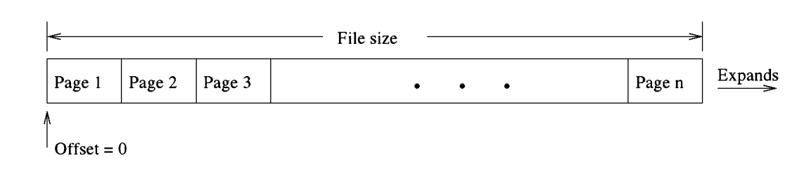
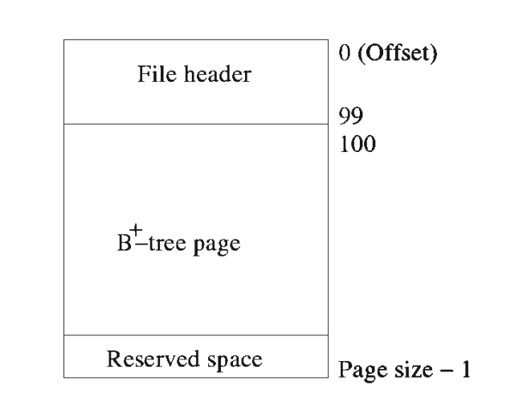
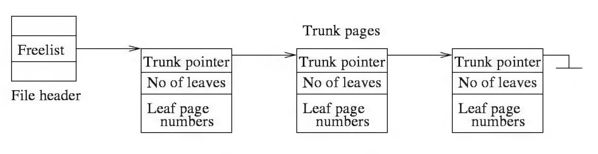
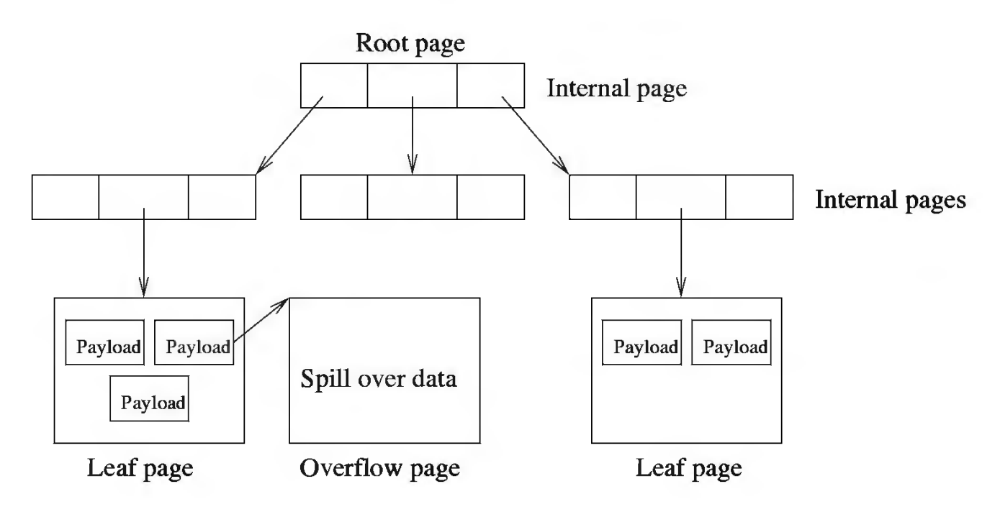
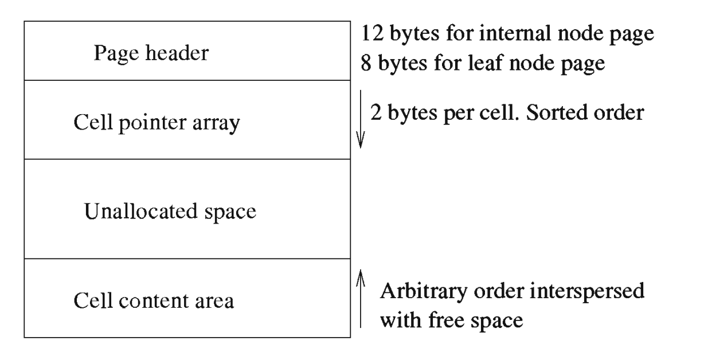
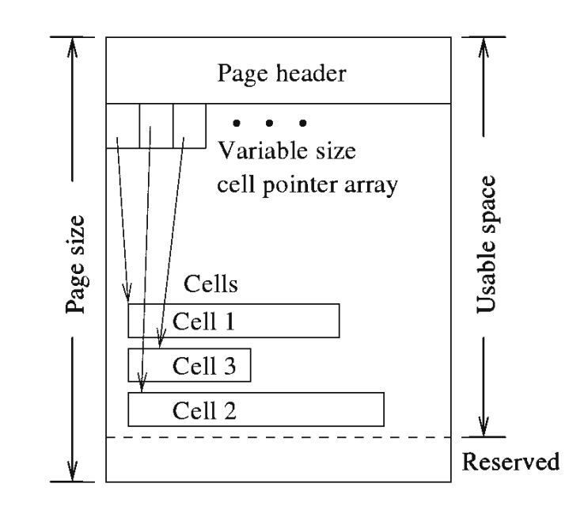
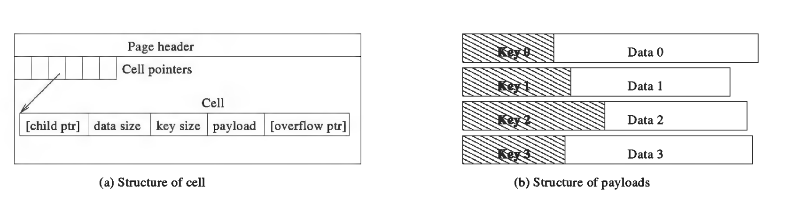

SQLite中有很多术语,我这里不太好直接翻译成中文,所以在这里列举一张对照表.

| 英文          | 说明                                                      |
| ------------- | --------------------------------------------------------- |
| cell          | 单元,翻译成记录更为恰当,它是SQLite文件page的重要组成部分. |
| entry         | 位于internal page或者leaf page中的cell                    |
| leaf entry    | 位于leaf page中的cell                                     |
| leaf page     | 叶子页面,存储实际的数据                                   |
| interior page | 内部页面,不存储实际数据                                   |
|               |                                                           |
|               |                                                           |

# 数据库页面组织

## Page

为了便于空间管理和从数据库文件中读取/写入数据,SQLite将每个数据库文件(包括内存数据库)切分为固定大小的区域,它们称之为database pages,或者简单地称之为pages.因此,数据库文件大小始终是pages的整数倍. pages是线性编号的,从 1 开始.第一页称为第 1 页,第二页称为第 2 页,依此类推. 页码0被视为 NULL 页面或"not a page"--该页面在物理上不存在.第1页和之后的页从文件偏移量0开始一个接一个地线性存储到数据库文件中,如下图所示. 你可以将数据库文件视为固定大小页面的可变大小数组,并且页码用作数组的索引以访问页面.(实际上,pager结构体正是这种抽象.)

## Database metadata

SQLite可以任意使用数据库中的页,除了第1页,第1页总是一个B+-tree内部页面,存储sqlite_master或sqlite_temp_master的根节点. 该页面还包含从文件偏移量0开始存储的长度为100字节文件头.

文件头描述了数据库文件的结构. 它记录数据库的各种参数值,又名元数据. SQLite 在创建文件的时候初始化文件头并使用第1页(包括文件头和 B+-树)作为稳定的锚点用以追踪文件中的其他页面. 文件头的格式如下表所示. 前两列的单位为字节.

| Offset | Size | Description                                                  |
| :----- | :--- | :----------------------------------------------------------- |
| 0      | 16   | The header string: "SQLite format 3"                         |
| 16     | 2    | The database page size in bytes. Must be a power of two between 512 and 32768 inclusive, or the value 1 representing a page size of 65536. |
| 18     | 1    | File format write version. 1 for legacy; 2 for [WAL](https://sqlite.org/wal.html). |
| 19     | 1    | File format read version. 1 for legacy; 2 for [WAL](https://sqlite.org/wal.html). |
| 20     | 1    | Bytes of unused "reserved" space at the end of each page. Usually 0. |
| 21     | 1    | Maximum embedded payload fraction. Must be 64.               |
| 22     | 1    | Minimum embedded payload fraction. Must be 32.               |
| 23     | 1    | Leaf payload fraction. Must be 32.                           |
| 24     | 4    | File change counter.                                         |
| 28     | 4    | Size of the database file in pages. The "in-header database size". |
| 32     | 4    | Page number of the first freelist trunk page.                |
| 36     | 4    | Total number of freelist pages.                              |
| 40     | 4    | The schema cookie.                                           |
| 44     | 4    | The schema format number. Supported schema formats are 1, 2, 3, and 4. |

+ Header String: 这是一个16字节字符串: UTF-8 格式的"SQLite format 3".
+ Page Size: 这是该数据库中每个页面的大小. 该值必须是 2 的幂,在 512 和 32,768 之间(包括两者),或1代表值65,536.如前所述,SQLite 在操作文件时使用这个页面大小.
+ File format: 偏移量为18和19的两个字节用于表示文件格式版本在当前版本的 SQLite 中它们都必须是 1 或 2,否则它是一个错误值. 值 1 用于之前的回滚日志记录(在 SQLite 3.7.0 之前发布)和 2 用于在 SQLite 3.7.0 版本中引入的 WAL 日志记录. 如果在将来文件格式再次更改,这些数字将增加用以标识新的文件格式版本号.
+ Embedded Payload：max embedded payload fraction(在偏移量21处)是标准B/B+-tree内部节点的单个条目(称为cell或record)在一个页面中所能使用的空间总量.值255表示100%.该值必为64(即 25%):它用于限制最大cell大小,以便在一个节点中至少有四个cell.如果一个cell的有效载荷大于最大值,则部分有效负载将溢出到溢出页面.一旦SQLite分配了一个溢出页,它会让尽可能多的字节进入溢出页面而不让cell大小低于min embedded leaf payload fraction(在文件头偏移22处).该值必为32,也就是12.5%.min embedded leaf payload fraction(在偏移量 23 处)类似于embedded payload fraction,除了它仅适用于 B+-tree 叶页.该值必须为 32,即 12.5%.叶节点的max payload fraction 值始终为 100%(或 255),并且因此未在文件头中指定. 
+ File Change Counter: 在文件头偏移量24处,由事务使用. 这计数器初始化为 0.每次成功写入数据库时,计数器值都会递增. 该值旨在指示数据库何时
  已更改,以便pager可以清除其page缓存. (这个计数器不使用时文件格式表示 WAL 日志记录.)
+ Database Size: 数据库当前保存的页的数目,存储在文件头偏移量28 处.
+ Freelist: 空闲页面所构成的freelist,它的第一个页面的偏移记录在文件头偏移量32处.总的空闲页面的数量存储在偏移量 36 处.

## freelist

在文件头部偏移32字节的位置,记录着freelist.freelist是由空闲page构成的链表.空闲page的总数记录在文件头部偏移36的位置.freelist的组织如下图所示.

freelist中的page分为两种类型,一种是trunk page,另外一种是leaf page.一个trunk page可以指向很多leaf page.

trunk page的格式如下:

1. 一个4字节的页码,用于指向下一个trunk page(如果为0,表示没有下一页).
2. 一个4字节的整数值,用于指示本页(page)中leaf page页码(指针)的总数.
3. 剩余的部分是指向leaf page的页码构成的数组,每个成员长度为4字节.

# 数据库逻辑组织

SQLite中的数据是通过B+tree组织起来的.

通过分配其根页面来创建一棵树. 根页面未重新定位. 每棵树都可以按其根页码来标识. 该编号存储在master catalog table之中,它的根始终位于第1页.

SQLite将树的节点(包括内部节点和叶子节点)存储在不同的页面之中 -- 一个节点对应一个page. 这些page相应地分别称为internal page和leaf page. 实际的数据记录部分驻留在叶页上,一部分驻留在溢出页上. SQLite可能不了解data或key的内部结构. 它将data和key的尺寸和内容存储在原始的字节串之中. 对于每个节点,任一记录的key和data组合在一起形成有效负载. 一个固定长度的有效负载直接存储在页面上. 该模块试图将尽可能多的有效载荷存放在单个叶页上. 如果有效负载大于数量,则SQLite会将溢出多余的字节放入一个或多个溢出页：多出的有效载荷按顺序存储在一个单独的溢出页面的链表.

每一个page都包含一个page header,page header偏移8的地方记录了一个right-most pointer,也就是右子节点的页号.

每一个page中可能会包含多个cell,非leaf page上的cell,前4个字节记录了左子节点的页号.这样一来,整个数据库其实就构成了一棵多叉树.一个page就是树中的一个节点.表中的数据都存储在叶子节点之上.

## Page

您可能还记得,每个数据库文件都分为若干个固定大小的页面. 树模块管理所有这些页面. 每个页面要么是tree page(内部页面、叶页面或溢出页面),要么是free page.

任何数据库页面都可以用于任何目的,除了第一页(Page 1)它始终是一个包含根节点的 B+ 树内部页面. 但是,第1页的前 100 个字节包含一个描述文件属性的特殊头部(称为“文件头”). 页面上的剩余空间用于 B+ 树根节点. 其他数据库页面都被完全消耗用以存储一个树节点或溢出内容.

在本节之中,节点和page其实是等价的.

每个internal/leaf page的逻辑内容被装入cell之中. 例如,对于一个B+树内部节点,一个cell由一个key值和指向子节点的指针组成,这些子节点中的cell的key值比父cell的key要小, 对于叶节点,一个cell包含(部分)有效载荷而且没有子指针. cell是leaf page上空间分配和释放的单位. 为了实现管理intermal page或leaf page的目的,它分为四个部分:

1. page头部
2. cell内容区域
3. cell指针数据
4. 未分配的空间

### page header

Page header仅包含该page的管理信息. header总是存储在page的开头(低地址). (第 页是一个例外,前100个字节包含文件头). 前两个列以字节为单位, 多字节整数以大端格式存储. 偏移处0的1字节定义了页面的格式(又名,leaf page的类型). 有四种可能性： 

(1) A table b-tree interior page (表b-tree内部页面);

(2) A table b-tree leaf page (表b-tree叶子页面);

(3) A index b-tree interior page (索引b-tree内部页面);

(4) A index b-tree leaf page (索引b-tree叶子页面).

对于内部页,它的page header偏移8字节的地方记录了右子节点的页号.

| Offset | Size | Description                                                  |
| :----- | :--- | :----------------------------------------------------------- |
| 0      | 1    | The one-byte flag at offset 0 indicating the b-tree page type.A value of 2 (0x02) means the page is an interior index b-tree page.A value of 5 (0x05) means the page is an interior table b-tree page.A value of 10 (0x0a) means the page is a leaf index b-tree page.A value of 13 (0x0d) means the page is a leaf table b-tree page.Any other value for the b-tree page type is an error. |
| 1      | 2    | The two-byte integer at offset 1 gives the start of the first freeblock on the page, or is zero if there are no freeblocks. |
| 3      | 2    | The two-byte integer at offset 3 gives the number of cells on the page. |
| 5      | 2    | The two-byte integer at offset 5 designates the start of the cell content area. A zero value for this integer is interpreted as 65536. |
| 7      | 1    | The one-byte integer at offset 7 gives the number of fragmented free bytes within the cell content area. |
| 8      | 4    | The four-byte page number at offset 8 is the right-most pointer. This value appears in the header of interior b-tree pages only and is omitted from all other pages. |

cells存储在页面的尾端(高地址),并且向页面的首端增长.cell数组从page header后的第一个字节开始,它包含0个或多个cell指针.数组中的元素个数存储在page header偏移量 3 处.每个cell指针都是一个 2 字节的整数,表示一个偏移量(从page开始处计算),指向实际的cell.cell指针的存储是有序的(按相应的键值),即使cell可能是无序存储的.左侧条目的键值小于右侧条目.cell不一定连续或者有序. SQLite 努力在最后一个cell指针之后保留空闲空间,以便无需对页面进行碎片整理即可添加新的cell.

由于页面上cell的随机插入和删除,页面可能有cell和空闲空间散布(在cell内容区域内).cell内容区域内未使用的空间是收集到空闲块的单链表中.列表中的块按它们地址的大小升序排列.指向列表的头指针(2 字节偏移量)存储在page header偏移量 1的地方.每个空闲块的大小至少为 4 个字节.每个空闲的前 4 个字节块存储控制信息：前 2 个字节用于存数指向下一个空闲块的指针(0表示没有下一个空闲块),另外 2 个字节为这个空闲块的大小(包括header).因为空闲块的大小必须至少为 4 个字节,任何 3 个或更少未使用字节的组cell内容区域中的(称为fragment)不能存在于自由区块链(free block chain)上.累积的所有fragment的大小记录在page header偏移量 7 处.(大小至多为255,达到最大值之前,SQlite会整理页面碎片).

cell内容区域的第一个字节被记录在page header偏移5的地方.如果值为0,它会被认为是65536.

## cell

cells是可变长度的字节串. 一个cell存储(的一部分)一个单一的有效载荷,它由一个key和可选的data组合而成. cell的结构在下面的表格中给出.
size列的值以字节为单位. var(1-9)是一个可变长度的整数,表示1到9个字节, 它将被称为variant.

| Size     | Description                                                  |
| -------- | ------------------------------------------------------------ |
| 4        | Page number of the left child. Omitted on leaf page          |
| var(1-9) | Number of bytes of data. Omitted on index-tree page or internal table-tree page |
| var(1-9) | Number of bytes of key. Or the key itself for table-tree page |
| *        | Payload                                                      |
| 4        | First page of the overflow chain . Omitted if no overflow    |

对于内部page,每个cell包含一个4字节的child pointer;对于叶子page,cell没有child pointers.

接下来是data以及key所占用的的字节数.(data和key不存在于内部表树页面(internal table-tree pages).key长度字节而是存储整数键值.

对于索引树,data不存在.因此:

(1) 表树的内部节点上的一个cell有一个4字节的left child page number和一个variant用于存储rowid；

(2) 表树的叶节点上的一个cell有一个variant用来存储table row记录的总长度,一个variant用于存储rowid的值,一部分的row记录,以及一个4字节的溢出页的页码；

(3) 索引树内部节点上的cell有一个4字节的left child page number,一个variant用于记录key值的总长度,一部分的key,以及一个4字节的溢出页的页码；

(4) 索引树叶子节点上的一个cell有一个variant用于记录key值的总长度,key的一部分,4字节溢出页的页码.

下图描述了cell的格式:

(a) 为cell的结构,(b)为有效载荷的结构.有效负载中可能不存在key或data,也有可能两者都不存在.

单个tree page可以存放多条小记录,但一个大记录可以跨越多个溢出页. 溢出页面(对于有效载荷)形成一个单向链表. 除最后一页外的每个溢出页会被填充页面可用空间减去四个字节的数据,溢出页的前四个字节用于存储下一个溢出页的页码. 最后一个溢出页可以只有一个字节数据. (页面上的剩余空间是内部碎片.)溢出页面从不存储来自两个有效载荷的内容.