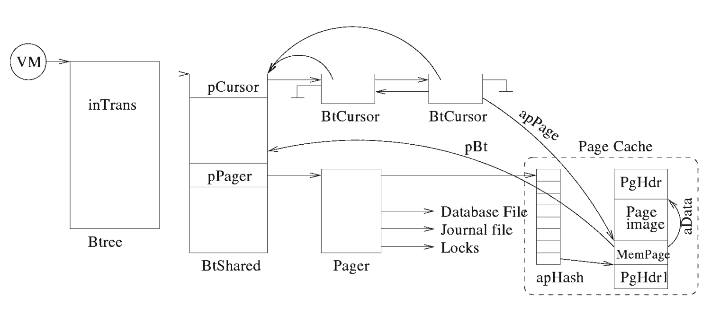

从btree模块开始,SQLite就开始疯狂地爆代码,完整地贴代码已经成了费力不讨好的事情了,所以我也并不打算这么干,之后的解析,大概会重讲解一下模块相关的数据结构,还有模块对外开放的api,顺带还会扯一些模块实现中使用的算法,想更加深入地了解细节的同学,可以自己去看本项目附带的源码,有很详细的注释.

就我个人的经历而言,了解代码细节用处或许并没有那么大,因为很快就会忘记,从一个更加宏观的层面来看SQLite模块的实现或许更好.

# 前置知识

## SQLite中B-tree的实现

B-tree在SQLite中占有举足轻重的地位.SQLite的结构图如图1所示.B-Tree位于虚拟机和页缓存之间.虚拟机负责执行程序,负责操纵数据库文件.数据库的存储用B树实现.B树向磁盘请求信息,以固定大小的块.系统默认的块的大小是1024字节,块大小应在512字节到65536字节之间.B树从页缓存中请求页,当修改页或者提交,或者回滚操作时,通知页缓存.修改页时,如果使用传统的回滚日志,pager首先将原始页复制到日志文件.同样,page在B-tree完成写操作时收到通知,并基于所处的事务状态决定如何处理.


## SQLite中的B-tree

SQLite中每个数据库完全存储在单个磁盘文件中,因为B树进行数据的查找、删除、添加速度快,所以这些数据以B树数据结构的形式存储在磁盘上(实现代码在btree.c源文件中).INGRES那样的DBMS,也用树结构(如B树)来实现存储,以支持借助于多级目录结构的按关键字存取.B树的典型结构如图2所示.B+树是应文件系统所需而出的一种B-树的变型树.B+树可以进行两种查找算法,第一种,从最小关键字起顺序查找;第二种,从根结点开始,进行随机查找.B-tree应用到数据库的每个表和索引中.所有B-tree存储在相同的磁盘文件中.


B-tree为SQLiteVDBE提供O(㏒N)级时间复杂度的查询和插入,通过遍历记录实现O(1)级时间复杂度的删除.B-tree是自平衡的,并能够对碎片清理和内存再分配进行自动管理.B-tree对如何读写磁盘没有限定,只是关注页之间的关系.    

 B-tree的职责就是排序,它维护着多个页之间错综复杂的关系,这些关系能够保证快速定位并找到一切有联系的数据.B-tree将页面组织成树状结构,这些组织结构很适合搜索,页面就是树的叶子.Pager帮助B-tree管理页面,它负责传输.B-tree是为查询而高度优化了的.它使用特殊的算法来预测将来要使用哪些页,从而让B-tree保存该页面以便尽可能快地工作.     

数据库中所有的页都是以1开始顺序编号的.一个数据库是由多个B-tree组成的——每张表以及每个索引各对应一个B-tree.数据库中每张表或索引都以根页面作为第一页.所有的索引和表的根页面都存储在sqlite_master表中.     

B-tree中的页由一系列B-tree记录组成,这些记录也称为有效载荷.这些记录不是传统的数据库记录(表中有多个列的那种格式),而是更为原始的格式.一个B-tree记录(有效载荷)仅由两个域组成:键值域和数据域.键值域是每个数据库表中所包含的ROWID值或主键值;在B-tree中,数据域可以包含任意类型的内容.最终,数据库的记录信息存储在数据域中.B-tree用来保持记录有序并方便记录的查询,同时,键值域能够完成B-tree的主要工作.此外,记录(有效载荷)的大小是可变的,这取决于内部键值域和数据域的大小.一般而言,每个页拥有多个有效载荷,但如果一个页的有效载荷超出了一个页的大小,将会出现跨越多个页的情况(包括blob类型的记录).     

B-tree记录按键值顺序存储.所有的键值在一个B-tree中必须唯一(由于键值对应于rowid主键,主键具有唯一性).表使用B+tree定义在内部页中,不包含表数据(数据库记录).图3为B+tree表示一个表的实例.


 B+tree的根页面和内部结点页都用于搜索导航.这些页中的数据域均指向下一层页,这些页只包含键值.所有的数据库记录都存储在叶子页中,在叶子页层,记录和页按键值顺序排列,以便B-tree游标能够遍历记录(水平遍历).

## SQLite层次化数据组织

基本上,具体的数据单元由堆栈中的各模块处理,如图4所示.自下而上,数据变得更加精确、详细.自上而下,数据变得更集中、模糊.具体地说,C API负责域值,VDBE负责处理记录,B-tree负责处理键值和数据,pager负责处理页,操作系统接口负责处理二进制数据和原始数据存储. 每个模块负责维护自身在数据库中对应的数据部分,然后依靠底层提供所需信息的初始数据,并从中提取需要的内容.


## 页面溢出

有效载荷及其内容可有不同的大小.然而,页面大小是固定不变的.因此,给定的有效载荷总有可能超出单页装载大小.这种情况发生时,额外的有效载荷将添加到溢出页面的链接链表上.由此看来,有效载荷将在有序的链接链表中显示,如图5所示.


图5中第4个有效载荷超出了当前页所能装载的大小.因此,B-tree模块创建了溢出页来装载.实际上,一个溢出页也不能装载,因此,又链接了第二个溢出页.这实际上就是处理二进制大对象的方法.使用真正的大字段时,最后都采用页链接链表来存储.如果blob字段太大,这种方式效率很低,此时,可考虑创建外部文件来存储blob数据,并将外部文件名保存在记录中.

## B-tree API

B-tree模块有自己的API,它们是独立于C API的.这些API主要是针对SQLite需求量身定做的,因此对于其他的数据库并不适用.要想更加了解SQLite内部机制,先了解这些API是很有必要的.B-tree的另一个优点是本身事务机制、pager处理事务、锁以及日志文件,并为B-tree模块提供支持.B-tree API根据目的大体划分成以下函数:存取及事务函数(如图6所示 ),表函数 (如图7所示 ),游标函数(如图8所示 ) ,记录函数(如图9所示 ),配置管理函数 (如图10所示 ).


# 数据结构

## Btree

```c
/* A Btree handle
**
** A database connection contains a pointer to an instance of
** this object for every database file that it has open.  This structure
** is opaque to the database connection.  The database connection cannot
** see the internals of this structure and only deals with pointers to
** this structure.
**
** For some database files, the same underlying database cache might be
** shared between multiple connections.  In that case, each connection
** has it own instance of this object.  But each instance of this object
** points to the same BtShared object.  The database cache and the
** schema associated with the database file are all contained within
** the BtShared object.
**
** All fields in this structure are accessed under sqlite3.mutex.
** The pBt pointer itself may not be changed while there exists cursors
** in the referenced BtShared that point back to this Btree since those
** cursors have to go through this Btree to find their BtShared and
** they often do so without holding sqlite3.mutex.
*/
struct Btree
{
    sqlite3 *db;       /* The database connection holding this btree */
    BtShared *pBt;     /* Sharable content of this btree */
    /* inTrans表示事务的类型 */
    u8 inTrans;        /* TRANS_NONE, TRANS_READ or TRANS_WRITE */
    u8 sharable;       /* True if we can share pBt with another db */
    u8 locked;         /* True if db currently has pBt locked */
    int wantToLock;    /* Number of nested calls to sqlite3BtreeEnter() */
    int nBackup;       /* Number of backup operations reading this btree */
    Btree *pNext;      /* List of other sharable Btrees from the same db */
    Btree *pPrev;      /* Back pointer of the same list */
#ifndef SQLITE_OMIT_SHARED_CACHE
    BtLock lock;       /* Object used to lock page 1 */
#endif
};
```

## BtShared

```c
/*
** An instance of this object represents a single database file.
**  此结构的一个实例代表一个单个数据库文件.
** A single database file can be in use at the same time by two
** or more database connections.  When two or more connections are
** sharing the same database file, each connection has it own
** private Btree object for the file and each of those Btrees points
** to this one BtShared object.  BtShared.nRef is the number of
** connections currently sharing this database file.
** 单个数据库文件可以在同时被2个或者多个连接使用,每个连接都有自己私有的Btree实例,
** 这些Btree实例共享一个BtShared实例. BtShared.nRef代表共享连接个数.
**
** Fields in this structure are accessed under the BtShared.mutex
** mutex, except for nRef and pNext which are accessed under the
** global SQLITE_MUTEX_STATIC_MASTER mutex.  The pPager field
** may not be modified once it is initially set as long as nRef>0.
** The pSchema field may be set once under BtShared.mutex and
** thereafter is unchanged as long as nRef>0.
**
** isPending:
**
**   If a BtShared client fails to obtain a write-lock on a database
**   table (because there exists one or more read-locks on the table),
**   the shared-cache enters 'pending-lock' state and isPending is
**   set to true.
**
**   The shared-cache leaves the 'pending lock' state when either of
**   the following occur:
**
**     1) The current writer (BtShared.pWriter) concludes its transaction, OR
**     2) The number of locks held by other connections drops to zero.
**
**   while in the 'pending-lock' state, no connection may start a new
**   transaction.
**
**   This feature is included to help prevent writer-starvation.
*/
struct BtShared /* BtShared代表Btree中可以共享的部分 */
{
    Pager *pPager;        /* The page cache */
    sqlite3 *db;          /* Database connection currently using this Btree */
    BtCursor *pCursor;    /* A list of all open cursors */
    MemPage *pPage1;      /* First page of the database */
    u8 openFlags;         /* Flags to sqlite3BtreeOpen() */
    u8 inTransaction;     /* Transaction state */
    u8 max1bytePayload;   /* Maximum first byte of cell for a 1-byte payload */
    u16 btsFlags;         /* Boolean parameters.  See BTS_* macros below */
    /* 非叶数据节点的最大payload */
    u16 maxLocal;         /* Maximum local payload in non-LEAFDATA tables */
    u16 minLocal;         /* Minimum local payload in non-LEAFDATA tables */
    u16 maxLeaf;          /* Maximum local payload in a LEAFDATA table */
    u16 minLeaf;          /* Minimum local payload in a LEAFDATA table */
    u32 pageSize;         /* Total number of bytes on a page */
    /* 每页中可用的字节数,和已经使用的字节数区别开来 */
    u32 usableSize;       /* Number of usable bytes on each page */
    int nTransaction;     /* Number of open transactions (read + write) */
    u32 nPage;            /* Number of pages in the database */
    void *pSchema;        /* Pointer to space allocated by sqlite3BtreeSchema() */
    void (*xFreeSchema)(void*);  /* Destructor for BtShared.pSchema */
    sqlite3_mutex *mutex; /* Non-recursive mutex required to access this object */
    Bitvec *pHasContent;  /* Set of pages moved to free-list this transaction */
#ifndef SQLITE_OMIT_SHARED_CACHE
    int nRef;             /* Number of references to this structure */
    BtShared *pNext;      /* Next on a list of sharable BtShared structs */
    BtLock *pLock;        /* List of locks held on this shared-btree struct */
    Btree *pWriter;       /* Btree with currently open write transaction */
#endif
    u8 *pTmpSpace;        /* BtShared.pageSize bytes of space for tmp use */
};
```

## BtLock

锁结构.

```c
/*
** A linked list of the following structures is stored at BtShared.pLock.
** Locks are added (or upgraded from READ_LOCK to WRITE_LOCK) when a cursor
** is opened on the table with root page BtShared.iTable. Locks are removed
** from this list when a transaction is committed or rolled back, or when
** a btree handle is closed.
*/
struct BtLock
{
    Btree *pBtree;        /* Btree handle holding this lock */
    /* 表的root page */
    Pgno iTable;          /* Root page of table */
    u8 eLock;             /* READ_LOCK or WRITE_LOCK */
    BtLock *pNext;        /* Next in BtShared.pLock list */
};
```

## MemPage

MemPage,顾名思义,磁盘page在内存之中的抽象,SQLite并不会直接操控磁盘的page,而是会操作MemPage的实例,最后将对MemPage的修改同步至磁盘.

```c
/*
** As each page of the file is loaded into memory, an instance of the following
** structure is appended and initialized to zero.  This structure stores
** information about the page that is decoded from the raw file page.
** 每加载文件一个页至内存,以下结构体的一个实例便会被创建,而且初始化为0.此结构体保存着页的相关信息.
**
** The pParent field points back to the parent page.  This allows us to
** walk up the BTree from any leaf to the root.  Care must be taken to
** unref() the parent page pointer when this page is no longer referenced.
** The pageDestructor() routine handles that chore.
** pParent字段指向父页(parent page),这个允许我们从btree的任意叶子节点遍历到根.
**
** Access to all fields of this structure is controlled by the mutex
** stored in MemPage.pBt->mutex.
** 访问此结构体的任意字段必须要加锁.
*/
struct MemPage
{
    u8 isInit;           /* True if previously initialized. MUST BE FIRST! */
    /* 存储在aCell[]数组中, overflow cell的个数 */
    u8 nOverflow;        /* Number of overflow cell bodies in aCell[] */
    u8 intKey;           /* True if intkey flag is set */
    /* 是否为叶子节点 */
    u8 leaf;             /* True if leaf flag is set */
    /* 此页是否存储数据 */
    u8 hasData;          /* True if this page stores data */
    /* 头部偏移,page1有一个100字节的文件头,其他page没有 */
    u8 hdrOffset;        /* 100 for page 1.  0 otherwise */
    u8 childPtrSize;     /* 0 if leaf==1.  4 if leaf==0 */
    u8 max1bytePayload;  /* min(maxLocal,127) */
    u16 maxLocal;        /* Copy of BtShared.maxLocal or BtShared.maxLeaf */
    u16 minLocal;        /* Copy of BtShared.minLocal or BtShared.minLeaf */
    /* cellOffset记录第一个cell pinter的偏移位置 */
    u16 cellOffset;      /* Index in aData of first cell pointer */
    /* page中可用空间大小 */
    u16 nFree;           /* Number of free bytes on the page */
    /* 本页中cell的个数 */
    u16 nCell;           /* Number of cells on this page, local and ovfl */
    u16 maskPage;        /* Mask for page offset */
    /* aiOvfl[i]个cell是overflow cell */
    u16 aiOvfl[5];       /* Insert the i-th overflow cell before the aiOvfl-th
                       ** non-overflow cell */
    /* apOvfl指向overflow cell的首部 */
    u8 *apOvfl[5];       /* Pointers to the body of overflow cells */
    BtShared *pBt;       /* Pointer to BtShared that this page is part of */
    /* 磁盘中的page数据 */
    u8 *aData;           /* Pointer to disk image of the page data */
    u8 *aDataEnd;        /* One byte past the end of usable data */
    u8 *aCellIdx;        /* The cell index area */
    DbPage *pDbPage;     /* Pager page handle */
    /* 本页号 */
    Pgno pgno;           /* Page number for this page */
};
```

## CellInfo

CellInfo用于描述cell的相关信息.parseCellPtr函数会解析磁盘中的cell,将相关信息填充到CellInfo之中.

```c
/*
** An instance of the following structure is used to hold information
** about a cell.  The parseCellPtr() function fills in this structure
** based on information extract from the raw disk page.
*/
typedef struct CellInfo CellInfo;
struct CellInfo
{
    i64 nKey;      /* The key for INTKEY tables, or number of bytes in key */
    u8 *pCell;     /* Pointer to the start of cell content */
    u32 nData;     /* Number of bytes of data */
    u32 nPayload;  /* Total amount of payload */
    /* cell 头部所占用的字节数目 */
    u16 nHeader;   /* Size of the cell content header in bytes */
    /* 本page所持有的数据量 */
    u16 nLocal;    /* Amount of payload held locally */
    /* cell在overflow page中的偏移量 */
    u16 iOverflow; /* Offset to overflow page number.  Zero if no overflow */
    /* cell在main b-tree page中占用的字节数 */
    u16 nSize;     /* Size of the cell content on the main b-tree page */
};
```
## BtCursor

BtCursor称之为b树游标,主要的作用是,记录当前已经访问到了b树的哪一个位置,更确切地说,是哪一个cell.

游标是对b树操作的一种抽象.一个游标不能在多个数据库连接中共享.

```c
/*
** A cursor is a pointer to a particular entry within a particular
** b-tree within a database file.
** 游标(cursor)是数据库文件中一个b-tree中的指针,指向数据库文件中的一个特殊entry
**
** The entry is identified by its MemPage and the index in
** MemPage.aCell[] of the entry.
**
** A single database file can be shared by two more database connections,
** but cursors cannot be shared.  Each cursor is associated with a
** particular database connection identified BtCursor.pBtree.db.
** 游标不能在不同连接中共享
**
** Fields in this structure are accessed under the BtShared.mutex
** found at self->pBt->mutex.
*/
struct BtCursor
{
    /* 游标所属的Btree */
    Btree *pBtree;            /* The Btree to which this cursor belongs */
    BtShared *pBt;            /* The BtShared this cursor points to */
    BtCursor *pNext, *pPrev;  /* Forms a linked list of all cursors */
    struct KeyInfo *pKeyInfo; /* Argument passed to comparison function */
    /* root页的页号 */
    Pgno pgnoRoot;            /* The root page of this tree */
    sqlite3_int64 cachedRowid; /* Next rowid cache.  0 means not valid */
    CellInfo info;            /* A parse of the cell we are pointing at */
    i64 nKey;        /* Size of pKey, or last integer key */
    void *pKey;      /* Saved key that was cursor's last known position */
    int skipNext;    /* Prev() is noop if negative. Next() is noop if positive */
    u8 wrFlag;                /* True if writable */
    /* 游标是否指向了表的最后一条记录(entry) */
    u8 atLast;                /* Cursor pointing to the last entry */
    /* 如果info.nKey有效,这个值为true */
    u8 validNKey;             /* True if info.nKey is valid */
    /* 游标状态 */
    u8 eState;                /* One of the CURSOR_XXX constants (see below) */
    u8 hints;                 /* As configured by CursorSetHints() */
    /* apPage[iPage]记录了游标现在处在数据库文件中的页 */
    i16 iPage;                /* Index of current page in apPage */
    /* 关于aiIdx以及apPage两个数组
    ** apPage[level]--游标在第level层,游标正处于apPage[level]所指示的page之中
    ** aiIdx[level]--在第level层,游标正指向第aiIdx[level]个cell
    */
    u16 aiIdx[BTCURSOR_MAX_DEPTH];        /* Current index in apPage[i] */
    /* apPage是一个数组,记录了游标从root page到current page所历经的页 */
    MemPage *apPage[BTCURSOR_MAX_DEPTH];  /* Pages from root to current page */
};
```

BtCursor有以下几种状态:

```c
/*
** Potential values for BtCursor.eState.
**
** CURSOR_VALID:
**   Cursor points to a valid entry. getPayload() etc. may be called.
**   游标指向一个有效的entry.
**
** CURSOR_INVALID:
**   Cursor does not point to a valid entry. This can happen (for example)
**   because the table is empty or because BtreeCursorFirst() has not been
**   called.
**   游标指向一个无效的entry,这可能是因为表为空,又或者是因为BtreeCursorFirst没有被调用.
**
** CURSOR_REQUIRESEEK:
**   The table that this cursor was opened on still exists, but has been
**   modified since the cursor was last used. The cursor position is saved
**   in variables BtCursor.pKey and BtCursor.nKey. When a cursor is in
**   this state, restoreCursorPosition() can be called to attempt to
**   seek the cursor to the saved position.
**   游标指向的表依然存在,但是自从游标上次使用之后,表发生了更改.游标的位置被存储在变量BtCursor.pKey
**   以及BtCursor.nKey之中.如果游标处于此种状态,调用restoreCursorPostion()会尝试将游标移动到
**   保存的位置.
**
** CURSOR_FAULT:
**   A unrecoverable error (an I/O error or a malloc failure) has occurred
**   on a different connection that shares the BtShared cache with this
**   cursor.  The error has left the cache in an inconsistent state.
**   Do nothing else with this cursor.  Any attempt to use the cursor
**   should return the error code stored in BtCursor.skip
**   一个不可恢复的错误发生了.
*/
#define CURSOR_INVALID           0
#define CURSOR_VALID             1
#define CURSOR_REQUIRESEEK       2
#define CURSOR_FAULT             3
```



# 实现细节

## sqlite3BtreeOpen

sqlite3BtreeOpen用于打开一个和数据库文件的连接.它通过调用sqlite3PagerOpen函数来打开文件,通过这个函数建立起文件和应用程序的连接.此函数一般供SQLite的虚拟机模块会调用.

```c
/*
** Open a database file.
**
** zFilename is the name of the database file.  If zFilename is NULL
** then an ephemeral database is created.  The ephemeral database might
** be exclusively in memory, or it might use a disk-based memory cache.
** Either way, the ephemeral database will be automatically deleted
** when sqlite3BtreeClose() is called.
**
** If zFilename is ":memory:" then an in-memory database is created
** that is automatically destroyed when it is closed.
**
** The "flags" parameter is a bitmask that might contain bits like
** BTREE_OMIT_JOURNAL and/or BTREE_MEMORY.
**
** If the database is already opened in the same database connection
** and we are in shared cache mode, then the open will fail with an
** SQLITE_CONSTRAINT error.  We cannot allow two or more BtShared
** objects in the same database connection since doing so will lead
** to problems with locking.
** 打开一个数据库文件,并返回B-tree对象
*/
int sqlite3BtreeOpen(
    sqlite3_vfs *pVfs,      /* VFS to use for this b-tree */
    const char *zFilename,  /* Name of the file containing the BTree database */
    sqlite3 *db,            /* Associated database handle */
    /* 调用此函数会返回一个Btree对应的指针 */
    Btree **ppBtree,        /* Pointer to new Btree object written here */
    int flags,              /* Options */
    int vfsFlags            /* Flags passed through to sqlite3_vfs.xOpen() */
);
```

## sqlite3BtreeClose

sqlite3BtreeClose关闭之前打开的数据库连接,并且销毁Btree实例,它最终会调用sqlite3PagerClose函数来销毁pager实例.

```c
/*
** Close an open database and invalidate all cursors.
*/
int sqlite3BtreeClose(Btree *p);
```


## sqlite3BtreeCreateTable

sqlite3BtreeCreateTable用于在数据库文件中创建一张表,在数据库中,一个表的数据往往以B树的形式来存储.

```c
/* 在数据库文件中创建一个空的B-tree表
 * @param piTable 新构建的b-tree表的root page的页号
 */
int sqlite3BtreeCreateTable(Btree *p, int *piTable, int flags);
```
1. 创建一个btree表格
2. 移动现有数据库为新表的根页面腾出空间
3. 用新根页更新映射寄存器和metadata
4. 新表根页的页号放入PgnoRoot并写入piTable

流程图如下:


## sqlite3BtreeDropTable

sqlite3BtreeDropTable用于在数据库文件中删除一张表.

```c
/* 在数据库文件中删除一张表
** @param iTable 表的root page
*/
int sqlite3BtreeDropTable(Btree *p, int iTable, int *piMoved);
```

1. 删除表中所有信息
2. 将表的根页放入自由列表
3. 游标不能为打开状态
4. 更新最大的根页

流程图如下:


## sqlite3BtreeFirst

```c
/* Move the cursor to the first entry in the table.  Return SQLITE_OK
** on success.  Set *pRes to 0 if the cursor actually points to something
** or set *pRes to 1 if the table is empty.
** 将游标移动到表(table)的第一个记录(entry)
*/
int sqlite3BtreeFirst(BtCursor *pCur, int *pRes);
```

## sqlite3BtreeLast

```c
/* Move the cursor to the last entry in the table.  Return SQLITE_OK
** on success.  Set *pRes to 0 if the cursor actually points to something
** or set *pRes to 1 if the table is empty.
** 将游标移动到table的最后一条记录(entry)
*/
int sqlite3BtreeLast(BtCursor *pCur, int *pRes);
```

## sqlite3BtreeNext

```c
/*
** Advance the cursor to the next entry in the database.  If
** successful then set *pRes=0.  If the cursor
** was already pointing to the last entry in the database before
** this routine was called, then set *pRes=1.
** 将游标移动到下一个leaf entry(或者说cell).如果成功,将*pRes设置为0,如果游标已将指向数据库的最后
** 一个entry,在调用此函数之前,将*pRes设置为1
** 这里的遍历是按照leaf entry的key值顺序来的,类似于中序遍历
*/
int sqlite3BtreeNext(BtCursor *pCur, int *pRes);
```

## sqlite3BtreePrevious

```c
/*
** Step the cursor to the back to the previous entry in the database.  If
** successful then set *pRes=0.  If the cursor
** was already pointing to the first entry in the database before
** this routine was called, then set *pRes=1.
** 将游标移动到数据库的前一条记录(entry),如果成功,那么设置*pRes为0,如果在本函数被调用之前,
** 游标早已指向第一条记录,那么将*pRes置为1
*/
int sqlite3BtreePrevious(BtCursor *pCur, int *pRes);
```

## sqlite3BtreeInsert

```c
/*
** Insert a new record into the BTree.  The key is given by (pKey,nKey)
** and the data is given by (pData,nData).  The cursor is used only to
** define what table the record should be inserted into.  The cursor
** is left pointing at a random location.
** 在BTree中插入一条记录,key通过(pKey, nKey),值通过(pData, nData)的方式给予.
** 游标只是用来指示,记录应当插入到哪张表.
**
** For an INTKEY table, only the nKey value of the key is used.  pKey is
** ignored.  For a ZERODATA table, the pData and nData are both ignored.
** 对于INTKEY表,只有nKey被使用,pKey被忽略,对于ZERODATA表,pData以及nData都被忽略.
**
** If the seekResult parameter is non-zero, then a successful call to
** MovetoUnpacked() to seek cursor pCur to (pKey, nKey) has already
** been performed. seekResult is the search result returned (a negative
** number if pCur points at an entry that is smaller than (pKey, nKey), or
** a positive value if pCur points at an etry that is larger than
** (pKey, nKey)).
** 如果seekResult不为0,表示已经调用过MovetoUnpacked函数,来查找(pKey, nKey)
**
** If the seekResult parameter is non-zero, then the caller guarantees that
** cursor pCur is pointing at the existing copy of a row that is to be
** overwritten.  If the seekResult parameter is 0, then cursor pCur may
** point to any entry or to no entry at all and so this function has to seek
** the cursor before the new key can be inserted.
*/
int sqlite3BtreeInsert(
    BtCursor *pCur,                /* Insert data into the table of this cursor */
    const void *pKey, i64 nKey,    /* The key of the new record */
    const void *pData, int nData,  /* The data of the new record */
    int nZero,                     /* Number of extra 0 bytes to append to data */
    int appendBias,                /* True if this is likely an append */
    int seekResult                 /* Result of prior MovetoUnpacked() call */
);
```

向Btree中插入一个新记录:

1. 关键字按照(pKey,nKey)给定,数据按照(pData,nData)给定.
2. 找到结点插入位置
3. 分配内存空间
4. 插入结点

流程图如下:


## sqlite3BtreeDelete

```c
/*
** Delete the entry that the cursor is pointing to.  The cursor
** is left pointing at a arbitrary location.
** 删除游标指向的记录(entry),删除执行之后,游标可能会位于删除记录左侧的任意一个位置
*/
int sqlite3BtreeDelete(BtCursor *pCur);
```

## allocateSpace

allocateSpace从pPage所指示的page中分配nByte的内存.
page内部通过链表的形式来管理空闲内存块,此函数先查找空闲内存块满足分配需求,如果不满足,则需要先整理内存,将多个空闲内存块合并成一个,再来进行内存分配.

```c
/*
** Allocate nByte bytes of space from within the B-Tree page passed
** as the first argument. Write into *pIdx the index into pPage->aData[]
** of the first byte of allocated space. Return either SQLITE_OK or
** an error code (usually SQLITE_CORRUPT).
** 在B-Tree page中分配n个字节的空间
**
** The caller guarantees that there is sufficient space to make the
** allocation.  This routine might need to defragment in order to bring
** all the space together, however.  This routine will avoid using
** the first two bytes past the cell pointer area since presumably this
** allocation is being made in order to insert a new cell, so we will
** also end up needing a new cell pointer.
** 调用者保证page拥有足够的空间来分配,函数可能需要整理碎片来满足分配需求.
*/
static int allocateSpace(MemPage *pPage, int nByte, int *pIdx)
```

## freeSpace

freeSpace从pPage指示的page中释放从start偏移处开始的,长度为size的内存.

在page内部是通过链表的形式来管理空闲内存块的.

page的page header偏移1的2个字节记录了page内部第一个空闲块的偏移.

空闲块的头2个字节是下一个空闲块的偏移.

```c
/*
** Return a section of the pPage->aData to the freelist.
** The first byte of the new free block is pPage->aDisk[start]
** and the size of the block is "size" bytes.
**
** Most of the effort here is involved in coalesing adjacent
** free blocks into a single big free block.
** 在page中释放从start开始长度为size的空间
*/
static int freeSpace(MemPage *pPage, int start, int size);
```
