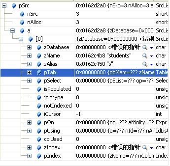
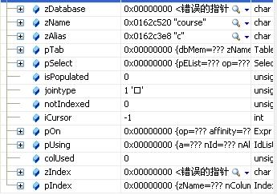
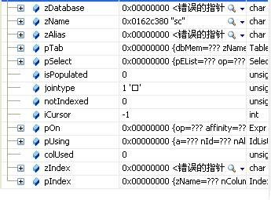
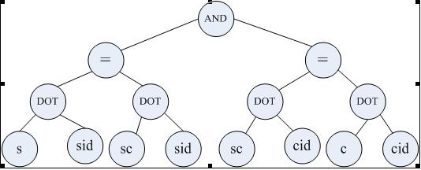
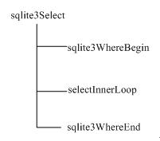

第五部分是代码生成,SQLite的代码生成其实就是编译器了,编译器的实现形式多种多样,最为核心的还是这么几步:

+ 语法分析,将原始sql语句解析为一棵多叉树
+ 代码翻译,遍历多叉树的节点,进行操作码的生成即可.

试图通过这里的代码来学习编译器的实现,难度过大,个人也不推荐.

本篇文章尝试介入代码生成中最为复杂的部分,那就是查询的优化.明白了SQLite的查询优化算法,我们才能写出更加高效的sql语句.

至于其他功能的代码生成,比如插入,删除等.如果感兴趣,读者可自行去揣摩(实际并不复杂).我个人并不想花费过多的时间也并不推荐大家花费太多时间在这个上面.

# 浅谈SQLite -- 查询处理以及优化

查询处理及优化是关系数据库得以流行的根本原因,也是关系数据库系统最核心的技术之一.SQLite的查询处理模块非常的精致,而且很容易移植到不支持SQL的存储引擎,Berkeley DB最新的版本已经将其完整的移植过来.本文将简要的讨论一下SQLite的查询处理及优化.

查询处理一般来说,包括词法分析、语法分析、语义分析、生成执行计划以及计划的执行几个部分.SQLite的词法分析器是手工写的,语法分析器由Lemon生成,语义分析主要的进行语义方面的一些检查,比如table是否存在等.而执行计划的生成及执行是最核心的两部分,也是相对比较复杂、有点技术含量的东西.SQLite的执行计划采用了虚拟机的思想,实际上,这种基于虚拟机的思想并非SQLite所独有,但是,SQLite将其发挥到了极致,它生成的执行计划非常详细,而且很容易读(在这里,我不得不佩服D. Richard Hipp在编译理论方面的功底).

## 1.语法分析——语法树

词法分析本身比较简单,这里就不谈了.语法分析的主要任务就是对用户输入的SQL语句进行语法检查,然后生成一个包含所有信息的语法树.对于SELECT语句,这个语法树最终由结构体Select表示:

```c
struct Select {
  ExprList *pEList;      /* The fields of the result */
  u8 op;                 /* One of: TK_UNION TK_ALL TK_INTERSECT TK_EXCEPT */
  char affinity;         /* MakeRecord with this affinity for SRT_Set */
  u16 selFlags;          /* Various SF_* values */
  SrcList *pSrc;         /* The FROM clause */
  Expr *pWhere;          /* The WHERE clause */
  ExprList *pGroupBy;    /* The GROUP BY clause */
  Expr *pHaving;         /* The HAVING clause */
  ExprList *pOrderBy;    /* The ORDER BY clause */
  Select *pPrior;        /* Prior select in a compound select statement */
  Select *pNext;         /* Next select to the left in a compound */
  Select *pRightmost;    /* Right-most select in a compound select statement */
  Expr *pLimit;          /* LIMIT expression. NULL means not used. */
  Expr *pOffset;         /* OFFSET expression. NULL means not used. */
  int iLimit, iOffset;   /* Memory registers holding LIMIT & OFFSET counters */
  int addrOpenEphm[3];   /* OP_OpenEphem opcodes related to this select */
};
```

该结构体比较简单,但要注意几个字段.pEList输出结果列的语法树;pSrc为FROM子句语法树;pWhere为WHERE部分的语法树.

select语法分析在最终在sqlite3SelectNew中完成:

```c
/*
** Allocate a new Select structure and return a pointer to that
** structure.
** 分配一个新的select结构,并且返回新结构的指针
*/
Select *sqlite3SelectNew(
    Parse *pParse,        /* Parsing context */
    /* 结果中需要哪些列 */
    ExprList *pEList,     /* which columns to include in the result */
    /* from子句 */
    SrcList *pSrc,        /* the FROM clause -- which tables to scan */
    Expr *pWhere,         /* the WHERE clause */
    ExprList *pGroupBy,   /* the GROUP BY clause */
    Expr *pHaving,        /* the HAVING clause */
    ExprList *pOrderBy,   /* the ORDER BY clause */
    int isDistinct,       /* true if the DISTINCT keyword is present */
    Expr *pLimit,         /* LIMIT value.  NULL means not used */
    Expr *pOffset         /* OFFSET value.  NULL means no offset */
)
{
    Select *pNew;
    Select standin;
    sqlite3 *db = pParse->db;
    pNew = sqlite3DbMallocZero(db, sizeof(*pNew));
    if (pNew == 0)
    {
        pNew = &standin;
        memset(pNew, 0, sizeof(*pNew));
    }
    if (pEList == 0)
    {
        pEList = sqlite3ExprListAppend(pParse, 0, sqlite3Expr(db, TK_ALL, 0));
    }
    pNew->pEList = pEList;
    if (pSrc == 0) pSrc = sqlite3DbMallocZero(db, sizeof(*pSrc));
    pNew->pSrc = pSrc;
    pNew->pWhere = pWhere;
    pNew->pGroupBy = pGroupBy;
    pNew->pHaving = pHaving;
    pNew->pOrderBy = pOrderBy;
    pNew->selFlags = isDistinct ? SF_Distinct : 0;
    pNew->op = TK_SELECT; /* select类型 */
    pNew->pLimit = pLimit;
    pNew->pOffset = pOffset;
    pNew->addrOpenEphm[0] = -1;
    pNew->addrOpenEphm[1] = -1;
    pNew->addrOpenEphm[2] = -1;
    if (db->mallocFailed)
    {
        clearSelect(db, pNew);
        if (pNew != &standin) sqlite3DbFree(db, pNew);
        pNew = 0;
    }
    else
    {
        assert(pNew->pSrc != 0 || pParse->nErr > 0);
    }
    assert(pNew != &standin);
    return pNew;
}
```

它主要就是将之前得到的各个子语法树汇总到Select结构体,并根据该结构,进行接下来语义分析及生成执行计划等工作.

来看个例子,这个例子贯穿于全文:

```shell
# 这里说明一下,sc是一张联系表, student是学生表
explain select s.sname,c.cname,sc.grade from students s join sc join course c on s.sid=sc.sid and sc.cid = c.cid;
addr  opcode         p1    p2    p3    p4             p5  comment      
----  -------------  ----  ----  ----  -------------  --  -------------
 0    Trace          0     0     0                    00
 1    Goto           0     35    0                    00
 //////////////////////////(1)////////////////////////////
 2    OpenRead       0     3     0      2             00  students # 打开students表,root-page为3,游标0
 3    OpenRead       1     7     0      3             00  sc       # 打开sc表,root-page为7,游标1
 4    OpenRead       3     8     0      keyinfo(2,BINARY,BINARY)
                                                      00  sqlite_autoindex_sc_1 # 打开sc的索引,root-page为8,游标3
 5    OpenRead       2     5     0      2             00  course   # 打开course表,root-page为5,游标2
 6    OpenRead       4     6     0      keyinfo(1,BINARY)
                                                      00  sqlite_autoindex_course_1 # 打开course的索引,root-page为6,游标4
 //////////////////////////(2)//////////////////////////////
 7    Rewind         0     29    0                    00  # 将游标0定位到students表的第一条记录
 8    Column         0     0     1                    00  students.sid # 取出第0列,写到寄存器1
 9    IsNull         1     28    0                    00  # 判断寄存器1的值是否为NULL,是的话,跳转到指令28
 10   Affinity       1     1     0      d             00  # 忽略,影响不大
 11   SeekGe         3     28    1      1             00  # 将游标3定位到sc索引的>=寄存器1(s.sid) 
                                                          # (寻找满足s.sid=sc.sid的记录),找不到,跳转到28
 12   IdxGE          3     28    1      1             01  # 寄存器1的值构(s.sid)x,和游标3指向的值(sc.sid)y比较
                                                          # 如果y>=x+1(注意参数p5),跳转到28执行,否则继续执行
 13   IdxRowid       3     2     0                    00  # 将游标3指向记录的rowid写入寄存器2
 14   Seek           1     2     0                    00  # 在sc表中,根据寄存器2中的rowid让游标1移动到对应记录
 15   Column         3     1     3                    00  sc.cid # 读取sc.cid到寄存器3
 16   IsNull         3     27    0                    00  # 判断寄存器3的值是否为NULL,是的话跳转到指令27
 17   Affinity       3     1     0      d             00  
 18   SeekGe         4     27    3      1             00  # 将游标4定位到course索引的>=寄存器3(sc.cid)的记录处
 19   IdxGE          4     27    3      1             01  # 寄存器3中的值(sc.cid)x和游标4指向的值y相比较,
                                                          # 如果y>=x+1(注意参数P5),跳转到27,否则继续执行
 20   IdxRowid       4     4     0                    00  # 将游标4指向记录的rowid写入寄存器4
 21   Seek           2     4     0                    00  # 在course表中,根据寄存器4中的rowid定位到相关的course记录.
 ///////////////////////////(3)//////////////////////////////
 22   Column         0     1     5                    00  students.sname # 从游标0取出第1列(sname) -- student
 23   Column         2     1     6                    00  course.cname   # 从游标2取出第1列(cname) -- course
 24   Column         1     2     7                    00  sc.grade       # 从游标1取出第2列(grade) -- sc
 25   ResultRow      5     3     0                    00
 ///////////////////////////(4)///////////////////////////////
 26   Next           4     19    0                    00  # 移动游标4(在course表的索引上)到下一条记录
                                                          # 如果不是最后一条记录,跑到19处执行
 27   Next           3     12    0                    00  # 移动游标3(在sc的索引上)到下一条记录
                                                          # 如果不是最后一条记录,跑到12处执行
 28   Next           0     8     0                    01  # 移动游标1(在student表上)到下一条记录
                                                          # 如果不是最后一条记录,跑到8处执行
 29   Close          0     0     0                    00
 30   Close          1     0     0                    00
 31   Close          3     0     0                    00
 32   Close          2     0     0                    00
 33   Close          4     0     0                    00
 //////////////////////////(5)//////////////////////////////////
 34   Halt           0     0     0                    00
 35   Transaction    0     0     0                    00
 36   VerifyCookie   0     7     0                    00
 37   TableLock      0     3     0        students    00
 38   TableLock      0     7     0        sc          00
 39   TableLock      0     5     0        course      00
 40   Goto           0     2     0                    00 
```

来看看该SQL语句生成的语法树:

FROM部分:
第一个表项:




表名zName ="stduents",zAlias="s",jointype = 0.

第二个表项:



注意,jointype = 1(JT_INNER).

第三个表项:



注意,jointype = 1(JT_INNER).
WHERE部分(结点类型为Expr的一棵二叉树):



## 2.生成执行计划(语法树到OPCODE)

Select的执行计划在sqlite3Select中完成:

```c
int sqlite3Select(
  Parse *pParse,         /* The parser context */
  Select *p,             /* SELECT语法树 */
  SelectDest *pDest      /* 如果处理结果集 */
)
```

其实,该函数先对SQL语句进行语义分析,然后再进行优化,最后生成执行计划.

对于上面要SQL语句,生成的执行计划(虚拟机opcode)大致分成5部分,前4部分都在sqlite3Select()中生成,它主要调用了以下几个函数:



其中(1)、(2)在sqlite3WhereBegin()中生成,(2)即所谓的查询优化处理;

(3)在selectInnerLoop中生成;

(4)在sqlite3WhereEnd中生成;

(5)是sqlite3FinishCoding中完成的.后续章节,我将分别分析每一部分.

## 3. sqlite3WhereBegin

该函数是查询处理最为核心的函数,它主要完成where部分的优化及相关opcode的生成.

```c
WhereInfo *sqlite3WhereBegin(
    Parse *pParse,        /* The parser context */
    /* 待扫描的table */
    SrcList *pTabList,    /* A list of all tables to be scanned */
    /* where子句 */
    Expr *pWhere,         /* The WHERE clause */
    /* order by子句 */
    ExprList **ppOrderBy, /* An ORDER BY clause, or NULL */
    /* distinct子句 */
    ExprList *pDistinct,  /* The select-list for DISTINCT queries - or NULL */
    u16 wctrlFlags,       /* One of the WHERE_* flags defined in sqliteInt.h */
    int iIdxCur           /* If WHERE_ONETABLE_ONLY is set, index cursor number */
)
```

pTabList是由分析器对FROM部分生成的语法树,它包含FROM中表的信息;

pWhere是WHERE部分的语法树,它包含WHERE中所有表达式的信息;

ppOrderBy对应ORDER BY子句(暂不考虑).

Sqlite的查询优化做得简单又精致.在一个简单的sqlite3WhereBegin函数中,完成所有的优化处理.查询优化的基本理念就是嵌套循环(nested loop),select语句的FROM子句的每个表对应一层循环(INSERT和UPDATE对应只有一个表SELECT语句).

例如:
```sql
SELECT * FROM t1, t2, t3 WHERE ...;
```
进行如下操作:

```shell
foreach row1 in t1 do       \    Code generated
  foreach row2 in t2 do      |-- by sqlite3WhereBegin()
    foreach row3 in t3 do   /
      ...
    end                     \    Code generated
  end                        |-- by sqlite3WhereEnd()
end                         /
```

而对于每一层的优化,基本的理念就是对于该层循环的表,分析WHERE子句中是否有表达式能够使用其索引.

Sqlite有三种基本的扫描策略:

(1)全表扫描,这种情况通常出现在没有WHERE子句时;

(2)基于索引扫描,这种情况通常出现在表有索引,而且WHERE中的表达式又能够使用该索引的情况;

(3)基本rowid的扫描,这种情况通常出现在WHERE表达式中含有rowid的条件.该情况实际上也是对表进行的扫描.可以说,Sqlite以rowid为聚簇索引.

 

第一种情况比较简单,第三种情况与第二种情况没有什么本质的差别.所以,这里只对第二种情况进行详细讨论.

先来看看sqlite3WhereBegin的代码(去掉了一些无关紧要的代码):

```c
/*
** 为where子句的处理生成循环的前段代码,返回值是一个指针,指向一个透明的结构体,包含终止循环的信息.
** 之后,调用此函数应该调用sqlite3WhereEnd(),用此函数返回的指针,来完成完整的where子句处理过程.
**
** If an error occurs, this routine returns NULL.
**
** 基本的思想是做内置的循环,为select语句的from子句中的每一张表做一层循环(insert以及update语句基本和只有
** 单张表的select语句类似).举个例子:
**
**       SELECT * FROM t1, t2, t3 WHERE ...;
**
** 生成的代码类似于下面:
**
**      foreach row1 in t1 do       \    Code generated
**        foreach row2 in t2 do      |-- by sqlite3WhereBegin()
**          foreach row3 in t3 do   /
**            ...
**          end                     \    Code generated
**        end                        |-- by sqlite3WhereEnd()
**      end                         /
** 值得注意的是,循环可能并不按照它们在from子句中的顺序嵌套,这只是为了更好地使用索引而已.
** 当IN操作符出现在where子句中时,它可能会导致额外的嵌套循环,需要扫描在IN的右边子句产生的所有值.
**
** 每张表都有一个Btree游标与之关联,t1使用pTabList->a[0].iCursor, t2 -> pTabList->a[1].iCursor
** 此段程序产生代码打开游标,sqlite3WhereEnd()产生代码,用于关闭游标.
**
** sqlite3WhereBegin()产生的代码使得pTabList中指示的游标指向它们对应的位置. [...]
** 对应的代码可以使用OP_Column以及OP_Rowid操作符以及这些游标,从loop的表中抽取出需要的数据
**
** 如果WHERE子句为空,foreach loop需要扫描整张表,复杂度会达到O(N^3)数量级,如果表有索引,
** 而且where子句中一些条目可以使用索引,可以使得代码跑得更快.这个函数中的大部分代码都是在检查,是否
** 可以使用索引.
**
** Terms of the WHERE clause are also used to limit which rows actually
** make it to the "..." in the middle of the loop.  After each "foreach",
** terms of the WHERE clause that use only terms in that loop and outer
** loops are evaluated and if false a jump is made around all subsequent
** inner loops (or around the "..." if the test occurs within the inner-
** most loop)
** 由于WHERE子句也使用limit来限定,使得loop中央的[...].
** 在每一轮foreach
**
** OUTER JOINS
**
** An outer join of tables t1 and t2 is conceptally coded as follows:
** 表t1以及t2的outer join可能会产生如下的代码:
**
**    foreach row1 in t1 do
**      flag = 0
**      foreach row2 in t2 do
**        start:
**          ...
**          flag = 1
**      end
**      if flag==0 then
**        move the row2 cursor to a null row
**        goto start
**      fi
**    end
**
** ORDER BY CLAUSE PROCESSING
**
** *ppOrderBy is a pointer to the ORDER BY clause of a SELECT statement,
** if there is one.  If there is no ORDER BY clause or if this routine
** is called from an UPDATE or DELETE statement, then ppOrderBy is NULL.
** *ppOrderBy是一个指向select语句的order by子句的指针,如果有的话.
**
** If an index can be used so that the natural output order of the table
** scan is correct for the ORDER BY clause, then that index is used and
** *ppOrderBy is set to NULL.  This is an optimization that prevents an
** unnecessary sort of the result set if an index appropriate for the
** ORDER BY clause already exists.
**
**
** If the where clause loops cannot be arranged to provide the correct
** output order, then the *ppOrderBy is unchanged.
*/
WhereInfo *sqlite3WhereBegin(
    Parse *pParse,        /* The parser context */
    /* 待扫描的table */
    SrcList *pTabList,    /* A list of all tables to be scanned */
    /* where子句 */
    Expr *pWhere,         /* The WHERE clause */
    /* order by子句 */
    ExprList **ppOrderBy, /* An ORDER BY clause, or NULL */
    /* distinct子句 */
    ExprList *pDistinct,  /* The select-list for DISTINCT queries - or NULL */
    u16 wctrlFlags,       /* One of the WHERE_* flags defined in sqliteInt.h */
    int iIdxCur           /* If WHERE_ONETABLE_ONLY is set, index cursor number */
)
{
    int i;                     /* Loop counter */
    int nByteWInfo;            /* Num. bytes allocated for WhereInfo struct */
    /* pTabList中元素的个数 */
    int nTabList;              /* Number of elements in pTabList */
    WhereInfo *pWInfo;         /* Will become the return value of this function */
    Vdbe *v = pParse->pVdbe;   /* The virtual database engine */
    Bitmask notReady;          /* Cursors that are not yet positioned */
    WhereMaskSet *pMaskSet;    /* The expression mask set */
    WhereClause *pWC;               /* Decomposition of the WHERE clause */
    struct SrcList_item *pTabItem;  /* A single entry from pTabList */
    WhereLevel *pLevel;             /* A single level in the pWInfo list */
    int iFrom;                      /* First unused FROM clause element */
    int andFlags;              /* AND-ed combination of all pWC->a[].wtFlags */
    sqlite3 *db;               /* Database connection */

    /* The number of tables in the FROM clause is limited by the number of
    ** bits in a Bitmask
    */
    if (pTabList->nSrc > BMS) /* 要连接起来的表的个数最多为BMS个 */
    {
        sqlite3ErrorMsg(pParse, "at most %d tables in a join", BMS);
        return 0;
    }

    /* This function normally generates a nested loop for all tables in
    ** pTabList.  But if the WHERE_ONETABLE_ONLY flag is set, then we should
    ** only generate code for the first table in pTabList and assume that
    ** any cursors associated with subsequent tables are uninitialized.
    ** 这个函数为pTabList中的所有表生成嵌套的循环,但是如果WHERE_ONETABLE_ONLY标记被设定的话,
    ** 我们仅仅应当为pTabList中的一张表生成代码,并且假定接下来的表的任意游标都是未初始化过的.
    */
    nTabList = (wctrlFlags & WHERE_ONETABLE_ONLY) ? 1 : pTabList->nSrc;

    db = pParse->db;
    nByteWInfo = ROUND8(sizeof(WhereInfo) + (nTabList - 1) * sizeof(WhereLevel));
    pWInfo = sqlite3DbMallocZero(db,
                                 nByteWInfo +
                                 sizeof(WhereClause) +
                                 sizeof(WhereMaskSet));
    if (db->mallocFailed)
    {
        sqlite3DbFree(db, pWInfo);
        pWInfo = 0;
        goto whereBeginError;
    }
    pWInfo->nLevel = nTabList;
    pWInfo->pParse = pParse;
    pWInfo->pTabList = pTabList;
    pWInfo->iBreak = sqlite3VdbeMakeLabel(v);
    pWInfo->pWC = pWC = (WhereClause *) & ((u8 *)pWInfo)[nByteWInfo];
    pWInfo->wctrlFlags = wctrlFlags;
    pWInfo->savedNQueryLoop = pParse->nQueryLoop;
    pMaskSet = (WhereMaskSet*)&pWC[1];

    if (db->flags & SQLITE_DistinctOpt) pDistinct = 0;

    /* 将where子句分解为子表达式,每一个表达式被AND分割开 */
    initMaskSet(pMaskSet);
    /* 接下来需要为where语句做优化 */
    whereClauseInit(pWC, pParse, pMaskSet, wctrlFlags);
    sqlite3ExprCodeConstants(pParse, pWhere);
    /* 将pWhere语句中的每一条分支都放入pWC->a[]数组之中,用and作为分割符 */
    whereSplit(pWC, pWhere, TK_AND);   /* IMP: R-15842-53296 */

    if (pWhere && (nTabList == 0 || sqlite3ExprIsConstantNotJoin(pWhere)))
    {
        sqlite3ExprIfFalse(pParse, pWhere, pWInfo->iBreak, SQLITE_JUMPIFNULL);
        pWhere = 0;
    }

    for (i = 0; i < pTabList->nSrc; i++) /* 遍历表以及子查询 */
    {
        /* 表的游标在某种程度上也可以代表一张表,这里隐含了一个条件:
        ** 数据库中所有表的游标值不可能重复
        */
        createMask(pMaskSet, pTabList->a[i].iCursor); /* 构建好映射关系 */
    }

    /* 分析全部的子表达式. 其实是查询重写,做了部分优化. */
    exprAnalyzeAll(pTabList, pWC);
    if (db->mallocFailed)
    {
        goto whereBeginError;
    }

    /* 检查distinct限定符,如果它是多余的,将pDistinct设置为NULL */
    if (pDistinct && isDistinctRedundant(pParse, pTabList, pWC, pDistinct))
    {
        pDistinct = 0;
        pWInfo->eDistinct = WHERE_DISTINCT_UNIQUE;
    }

    /* 
    ** 为from子句中每一张表选择最优的索引
    **
    ** 下面的循环填充下面的字段
    **
    **   pWInfo->a[].pIdx      The index to use for this level of the loop. -- 使用的索引
    **   pWInfo->a[].wsFlags   WHERE_xxx flags associated with pIdx
    **   pWInfo->a[].nEq       The number of == and IN constraints          -- ==以及IN限定的个数
    **   pWInfo->a[].iFrom     Which term of the FROM clause is being coded -- 需要翻译哪一个from条目
    **   pWInfo->a[].iTabCur   The VDBE cursor for the database table       -- 表的VDBE游标
    **   pWInfo->a[].iIdxCur   The VDBE cursor for the index                -- 索引的VDBE游标
    **   pWInfo->a[].pTerm     When wsFlags==WO_OR, the OR-clause term
    ** 此函数推算出计算的顺序,怎样遍历表,才能更加高效.
    */
    notReady = ~(Bitmask)0;
    andFlags = ~0;
    WHERETRACE(("*** Optimizer Start ***\n"));
    for (i = iFrom = 0, pLevel = pWInfo->a; i < nTabList; i++, pLevel++) /* 一般而言,几张表就要循环几层 */
    { /* i为0,表示从最里层的循环开始 */
        /* 当前遇到过的最优的查询计划 */
        WhereCost bestPlan;         /* Most efficient plan seen so far */
        Index *pIdx;                /* Index for FROM table at pTabItem */
        int j;                      /* For looping over FROM tables */
        int bestJ = -1;             /* The value of j */
        Bitmask m;                  /* Bitmask value for j or bestJ */
        int isOptimal;              /* Iterator for optimal/non-optimal search */
        int nUnconstrained;         /* Number tables without INDEXED BY */
        /* 不能使用索引的表的掩码 */
        Bitmask notIndexed;         /* Mask of tables that cannot use an index */

        memset(&bestPlan, 0, sizeof(bestPlan));
        bestPlan.rCost = SQLITE_BIG_DBL; /* 默认设置为最大的开销 */
        WHERETRACE(("*** Begin search for loop %d ***\n", i));

        nUnconstrained = 0;
        notIndexed = 0; /* 确定每一层之前,都要重置notIndexed */
        for (isOptimal = (iFrom < nTabList - 1); isOptimal >= 0 && bestJ < 0; isOptimal--)
        {
            Bitmask mask;             /* Mask of tables not yet ready */
            for (j = iFrom, pTabItem = &pTabList->a[j]; j < nTabList; j++, pTabItem++) /* 遍历表 */
            {
                /* 如果为true的话,扫描表的顺序不应当被调整 */
                int doNotReorder;    /* True if this table should not be reordered */
                WhereCost sCost;     /* Cost information from best[Virtual]Index() */
                ExprList *pOrderBy;  /* ORDER BY clause for index to optimize */
                ExprList *pDist;     /* DISTINCT clause for index to optimize */
               /* 判断是否不需要记录此张表 */
                doNotReorder = (pTabItem->jointype & (JT_LEFT | JT_CROSS)) != 0;
                if (j != iFrom && doNotReorder) break;
                m = getMask(pMaskSet, pTabItem->iCursor);
                if ((m & notReady) == 0)
                {
                    if (j == iFrom) iFrom++;
                    continue;
                }
                mask = (isOptimal ? m : notReady);
                pOrderBy = ((i == 0 && ppOrderBy) ? *ppOrderBy : 0);
                pDist = (i == 0 ? pDistinct : 0);
                if (pTabItem->pIndex == 0) nUnconstrained++; /* sql语句中没有用indexed by限定所使用的索引 */

                WHERETRACE(("=== trying table %d with isOptimal=%d ===\n", j, isOptimal));
                {
                    /* 找到最优的索引 */
                    bestBtreeIndex(pParse, pWC, pTabItem, mask, notReady, pOrderBy,
                                   pDist, &sCost);
                }

                if (isOptimal &&
                    (sCost.plan.wsFlags & WHERE_NOT_FULLSCAN) == 0) /* 需要全表扫描 */
                {
                    /* 处理完一张表之后,只要最终结果不是全表扫描,它的默认索引(大概是rowid构建的索引)
                    ** 就会被加入notIndexed位图
                    ** 告诉后续处理,不允许再使用这个索引
                    */
                    notIndexed |= m; /* 无需使用此索引 */
                }

                /* Conditions under which this table becomes the best so far:
                **
                **   (1) The table must not depend on other tables that have not
                **       yet run. -- 不需要依赖我们暂时还未处理过的其他表的表
                **
                **   (2) A full-table-scan plan cannot supercede indexed plan unless
                **       the full-table-scan is an "optimal" plan as defined above.
                **       全表扫描计划不能取代索引计划,除非全表扫描最优
                **
                **   (3) All tables have an INDEXED BY clause or this table lacks an
                **       INDEXED BY clause or this table uses the specific
                **       index specified by its INDEXED BY clause.  This rule ensures
                **       that a best-so-far is always selected even if an impossible
                **       combination of INDEXED BY clauses are given.  The error
                **       will be detected and relayed back to the application later.
                **       The NEVER() comes about because rule (2) above prevents
                **       An indexable full-table-scan from reaching rule (3).
                **
                **   (4) The plan cost must be lower than prior plans or else the
                **       cost must be the same and the number of rows must be lower.
                */
                if ((sCost.used & notReady) == 0                   /* (1) */
                    && (bestJ < 0 || (notIndexed & m) != 0         /* (2) */
                        || (bestPlan.plan.wsFlags & WHERE_NOT_FULLSCAN) == 0 /* 最优计划需要做全表扫描 */
                        || (sCost.plan.wsFlags & WHERE_NOT_FULLSCAN) != 0) /* 当前计划无需做全表扫描 */
                    && (nUnconstrained == 0 || pTabItem->pIndex == 0 /* (3) */
                        || NEVER((sCost.plan.wsFlags & WHERE_NOT_FULLSCAN) != 0))
                    && (bestJ < 0 || sCost.rCost < bestPlan.rCost  /* (4) */
                        || (sCost.rCost <= bestPlan.rCost
                            && sCost.plan.nRow < bestPlan.plan.nRow))
                   )
                {
                    /* 先扫描哪一张表最好 */
                    WHERETRACE(("=== table %d is best so far"
                                " with cost=%g and nRow=%g\n",
                                j, sCost.rCost, sCost.plan.nRow));
                    bestPlan = sCost; /* 当前开销更小 */
                    bestJ = j;
                }
                if (doNotReorder) break;
            }
        }
        WHERETRACE(("*** Optimizer selects table %d for loop %d"
                    " with cost=%g and nRow=%g\n",
                    bestJ, pLevel - pWInfo->a, bestPlan.rCost, bestPlan.plan.nRow));
        /* The ALWAYS() that follows was added to hush up clang scan-build */
        if ((bestPlan.plan.wsFlags & WHERE_ORDERBY) != 0 && ALWAYS(ppOrderBy))
        {
            *ppOrderBy = 0;
        }
        if ((bestPlan.plan.wsFlags & WHERE_DISTINCT) != 0)
        {
            assert(pWInfo->eDistinct == 0);
            pWInfo->eDistinct = WHERE_DISTINCT_ORDERED;
        }
        andFlags &= bestPlan.plan.wsFlags;
        pLevel->plan = bestPlan.plan; /* 记录每一层需要使用查询计划 */
        testcase(bestPlan.plan.wsFlags & WHERE_INDEXED);
        testcase(bestPlan.plan.wsFlags & WHERE_TEMP_INDEX);
        if (bestPlan.plan.wsFlags & (WHERE_INDEXED | WHERE_TEMP_INDEX))
        {
            if ((wctrlFlags & WHERE_ONETABLE_ONLY)
                && (bestPlan.plan.wsFlags & WHERE_TEMP_INDEX) == 0
               )
            {
                pLevel->iIdxCur = iIdxCur;
            }
            else
            {
                pLevel->iIdxCur = pParse->nTab++;
            }
        }
        else
        {
            pLevel->iIdxCur = -1;
        }
        /* notReady位图中移除pTabList->a[bestJ]这张表,表示这张表已经处理过了 */
        notReady &= ~getMask(pMaskSet, pTabList->a[bestJ].iCursor);
        pLevel->iFrom = (u8)bestJ;
        if (bestPlan.plan.nRow >= (double)1)
        {
            pParse->nQueryLoop *= bestPlan.plan.nRow;
        }

        /* Check that if the table scanned by this loop iteration had an
        ** INDEXED BY clause attached to it, that the named index is being
        ** used for the scan. If not, then query compilation has failed.
        ** Return an error.
        */
        pIdx = pTabList->a[bestJ].pIndex;
        if (pIdx)
        {
            if ((bestPlan.plan.wsFlags & WHERE_INDEXED) == 0)
            {
                sqlite3ErrorMsg(pParse, "cannot use index: %s", pIdx->zName);
                goto whereBeginError;
            }
            else
            {
                /* If an INDEXED BY clause is used, the bestIndex() function is
                ** guaranteed to find the index specified in the INDEXED BY clause
                ** if it find an index at all. */
                assert(bestPlan.plan.u.pIdx == pIdx);
            }
        }
    }
    WHERETRACE(("*** Optimizer Finished ***\n"));
    if (pParse->nErr || db->mallocFailed)
    {
        goto whereBeginError;
    }
    /* 优化完成之后,就是代码生成部分 */
    /* If the total query only selects a single row, then the ORDER BY
    ** clause is irrelevant.
    */
    if ((andFlags & WHERE_UNIQUE) != 0 && ppOrderBy)
    {
        *ppOrderBy = 0;
    }

    if ((wctrlFlags & WHERE_ONEPASS_DESIRED) != 0 && (andFlags & WHERE_UNIQUE) != 0)
    {
        pWInfo->okOnePass = 1;
        pWInfo->a[0].plan.wsFlags &= ~WHERE_IDX_ONLY;
    }

    /* Open all tables in the pTabList and any indices selected for
    ** searching those tables.
    ** 打开pTabList中涉及的所有表,以及所有被选中的索引.
    */
    sqlite3CodeVerifySchema(pParse, -1); /* Insert the cookie verifier Goto */
    notReady = ~(Bitmask)0;
    pWInfo->nRowOut = (double)1;
    for (i = 0, pLevel = pWInfo->a; i < nTabList; i++, pLevel++) /* 根据level来生成循环 */
    {
        Table *pTab;     /* Table to open */
        int iDb;         /* Index of database containing table/index */

        pTabItem = &pTabList->a[pLevel->iFrom];
        pTab = pTabItem->pTab; /* 表 */
        pLevel->iTabCur = pTabItem->iCursor;
        pWInfo->nRowOut *= pLevel->plan.nRow;
        iDb = sqlite3SchemaToIndex(db, pTab->pSchema);
        if ((pTab->tabFlags & TF_Ephemeral) != 0 || pTab->pSelect)
        {
            /* Do nothing */
        }
        else if ((pLevel->plan.wsFlags & WHERE_IDX_ONLY) == 0 /* 需要从原始表中获取数据 */
                    && (wctrlFlags & WHERE_OMIT_OPEN_CLOSE) == 0)
        {
            /* 打开原始表 */
            int op = pWInfo->okOnePass ? OP_OpenWrite : OP_OpenRead;
            sqlite3OpenTable(pParse, pTabItem->iCursor, iDb, pTab, op);
            if (!pWInfo->okOnePass && pTab->nCol < BMS)
            {
                Bitmask b = pTabItem->colUsed;
                int n = 0;
                for (; b; b = b >> 1, n++) {}
                sqlite3VdbeChangeP4(v, sqlite3VdbeCurrentAddr(v) - 1,
                                    SQLITE_INT_TO_PTR(n), P4_INT32);
            }
        }
        else
        {
            sqlite3TableLock(pParse, iDb, pTab->tnum, 0, pTab->zName);
        }
        if ((pLevel->plan.wsFlags & WHERE_INDEXED) != 0)
        {
            Index *pIx = pLevel->plan.u.pIdx;
            KeyInfo *pKey = sqlite3IndexKeyinfo(pParse, pIx);
            int iIndexCur = pLevel->iIdxCur;
            /* 打开索引 */
            sqlite3VdbeAddOp4(v, OP_OpenRead, iIndexCur, pIx->tnum, iDb,
                              (char*)pKey, P4_KEYINFO_HANDOFF);
            VdbeComment((v, "%s", pIx->zName));
        }
        sqlite3CodeVerifySchema(pParse, iDb);
        notReady &= ~getMask(pWC->pMaskSet, pTabItem->iCursor);
    }
    pWInfo->iTop = sqlite3VdbeCurrentAddr(v);
    if (db->mallocFailed) goto whereBeginError;

    /* 为查找生成代码 */
    notReady = ~(Bitmask)0;
    for (i = 0; i < nTabList; i++)
    {
        pLevel = &pWInfo->a[i];
        explainOneScan(pParse, pTabList, pLevel, i, pLevel->iFrom, wctrlFlags);
        notReady = codeOneLoopStart(pWInfo, i, wctrlFlags, notReady);
        pWInfo->iContinue = pLevel->addrCont;
    }

    /* Record the continuation address in the WhereInfo structure.  Then
    ** clean up and return.
    */
    return pWInfo;

    /* Jump here if malloc fails */
whereBeginError:
    if (pWInfo)
    {
        pParse->nQueryLoop = pWInfo->savedNQueryLoop;
        whereInfoFree(db, pWInfo);
    }
    return 0;
}
```

### 查询重写

首先是查询重写exprAnalyzeAll,需要完成3件事情:

1. 填充每一个WhereTerm的以下字段:
 + prereqAll(记录条目使用的所有表);
 + prereqLeft(记录条目左操作数使用的表);
 + prereqRight(记录条目右操作数使用的表);
 + leftCursor(如果条目形式类似于X \<op> \<exprt>,leftCursor记录获取X的值所使用的游标的索引);
 + leftColumn(如果条目形式类似于X \<op> \<exprt>,leftColumn记录获取X所在的列在表中的偏移值).

2. 改写WhereTerm, 如果WhereTerm形式类似于 "\<expr> \<op> X",那么会被转换为标准形式"X \<op> \<expr>".
3. 改写WhereTerm, 如果WhereTerm形式类似于 "X \<op> Y",一个新的term "Y \<op> X",会被加入到WHERE caluse中,并且打上TERM_DYNAMIC以及TERM_VIRTUAL的标记.原本的term的nChild设置为1,这里的转换是等价的,只是为了方便后续处理.

```c
/*
** 交换比较运算符, "X op Y" -> "Y op X"
**
** If a collation sequence is associated with either the left or right
** side of the comparison, it remains associated with the same side after
** the commutation. So "Y collate NOCASE op X" becomes
** "X collate NOCASE op Y". This is because any collation sequence on
** the left hand side of a comparison overrides any collation sequence
** attached to the right. For the same reason the EP_ExpCollate flag
** is not commuted.
** 如果一个collation sequence与比较符的左侧或者右侧相关联,那么在交换之后,它仍然保持着关联.
** "Y collate NOCASE op X" -> "X collate NOCASE op Y"
** 这是因为,任何在比较操作符左侧的collation sequence覆盖右侧,处于同样的原因,EPExpCollate标记
** 不被交换
*/
static void exprCommute(Parse *pParse, Expr *pExpr)
{
    u16 expRight = (pExpr->pRight->flags & EP_ExpCollate);
    u16 expLeft = (pExpr->pLeft->flags & EP_ExpCollate);
    pExpr->pRight->pColl = sqlite3ExprCollSeq(pParse, pExpr->pRight);
    pExpr->pLeft->pColl = sqlite3ExprCollSeq(pParse, pExpr->pLeft);
    SWAP(CollSeq*, pExpr->pRight->pColl, pExpr->pLeft->pColl);
    pExpr->pRight->flags = (pExpr->pRight->flags & ~EP_ExpCollate) | expLeft;
    pExpr->pLeft->flags = (pExpr->pLeft->flags & ~EP_ExpCollate) | expRight;
    SWAP(Expr*, pExpr->pRight, pExpr->pLeft);
    if (pExpr->op >= TK_GT)
    {
        pExpr->op = ((pExpr->op - TK_GT) ^ 2) + TK_GT;
    }
}

/* 这个函数准确来说,已经算是代码优化,查询重写了.
** 此函数的输入是一个WhereTerm结构体(也就是where条目),只填充了pExpr字段,此函数的任务是分析子表达式,并且
** 将WhereTerm结构体中其它字段填充完整.
**
** 如果表达式是 "<expr> <op> X"的形式,那么会被转换为标准形式"X <op> <expr>"
** 如果表达式是"X <op> Y"的形式,X和Y都是列,原来的表达式保持不变,一个新的term "Y <op> X"
** 被加入到WHERE caluse中,并且打上TERM_DYNAMIC以及TERM_VIRTUAL的标记.
** 原本的term的nChild设置为1,这里的转换是等价的,只是为了方便后续处理.
*/
static void exprAnalyze(
    SrcList *pSrc,            /* the FROM clause */
    WhereClause *pWC,         /* the WHERE clause */
    /* 带分析的term的索引 */
    int idxTerm               /* Index of the term to be analyzed */
)
{
    /* 待分析的term */
    WhereTerm *pTerm;                /* The term to be analyzed */
    WhereMaskSet *pMaskSet;          /* Set of table index masks */
    Expr *pExpr;                     /* The expression to be analyzed */
    Bitmask prereqLeft;              /* Prerequesites of the pExpr->pLeft */
    Bitmask prereqAll;               /* Prerequesites of pExpr */
    Bitmask extraRight = 0;          /* Extra dependencies on LEFT JOIN */
    Expr *pStr1 = 0;                 /* RHS of LIKE/GLOB operator */
    int isComplete = 0;              /* RHS of LIKE/GLOB ends with wildcard */
    int noCase = 0;                  /* LIKE/GLOB distinguishes case */
    int op;                          /* Top-level operator.  pExpr->op */
    Parse *pParse = pWC->pParse;     /* Parsing context */
    sqlite3 *db = pParse->db;        /* Database connection */

    if (db->mallocFailed)
    {
        return;
    }
    pTerm = &pWC->a[idxTerm];
    pMaskSet = pWC->pMaskSet;
    pExpr = pTerm->pExpr; /* 表达式 */
    prereqLeft = exprTableUsage(pMaskSet, pExpr->pLeft); /* 左表达式使用了哪些表 */
    op = pExpr->op;
    /* 计算右表达式中使用了哪些表 */
    if (op == TK_IN) /* IN操作符 */
    {
        assert(pExpr->pRight == 0);
        /* in (select ...) */
        if (ExprHasProperty(pExpr, EP_xIsSelect))
        {
            /* <expr> IN (<select>) */
            pTerm->prereqRight = exprSelectTableUsage(pMaskSet, pExpr->x.pSelect);
        }
        else
        {
            /* <expr> IN (<expr-list>) */
            pTerm->prereqRight = exprListTableUsage(pMaskSet, pExpr->x.pList);
        }
    }
    else if (op == TK_ISNULL) /* 判空 */
    {
        pTerm->prereqRight = 0;
    }
    else
    {
        pTerm->prereqRight = exprTableUsage(pMaskSet, pExpr->pRight);
    }
    prereqAll = exprTableUsage(pMaskSet, pExpr); /* 整个where条目所使用的表,包含prereqRight以及prereqLeft */
    if (ExprHasProperty(pExpr, EP_FromJoin))
    {
        Bitmask x = getMask(pMaskSet, pExpr->iRightJoinTable);
        prereqAll |= x;
        extraRight = x - 1;  /* ON clause terms may not be used with an index
                       ** on left table of a LEFT JOIN.  Ticket #3015 */
    }
    pTerm->prereqAll = prereqAll;
    pTerm->leftCursor = -1;
    pTerm->iParent = -1;
    pTerm->eOperator = 0;
    if (allowedOp(op) &&
        (pTerm->prereqRight & prereqLeft) == 0) /* 左表达式和右表达式引用的表没有交集 */
    {
        Expr *pLeft = pExpr->pLeft;
        Expr *pRight = pExpr->pRight;
        if (pLeft->op == TK_COLUMN) /* 获取row中列的值 */
        {
            pTerm->leftCursor = pLeft->iTable; /* 左表达式需要使用的表索引的编号 */
            pTerm->u.leftColumn = pLeft->iColumn; /* 列的索引 */
            pTerm->eOperator = operatorMask(op);
        }
        if (pRight && pRight->op == TK_COLUMN) /* 获取表的值 */
        {
            WhereTerm *pNew;
            Expr *pDup;
            if (pTerm->leftCursor >= 0) /* 游标值大于0,表示表达式左侧类似于X(获取row中列的值) */
            { /* 整个表达式类似于 X <op> Y,插入一个新的表达式 Y <op> X */
                int idxNew;
                pDup = sqlite3ExprDup(db, pExpr, 0); /* 拷贝一个表达式 */
                if (db->mallocFailed)
                {
                    sqlite3ExprDelete(db, pDup);
                    return;
                }
                /* 创建一个虚拟的term */
                idxNew = whereClauseInsert(pWC, pDup, TERM_VIRTUAL | TERM_DYNAMIC);
                if (idxNew == 0) return;
                pNew = &pWC->a[idxNew];
                pNew->iParent = idxTerm;
                pTerm = &pWC->a[idxTerm];
                pTerm->nChild = 1; /* 存在一个child */
                pTerm->wtFlags |= TERM_COPIED;
            }
            else
            {
                pDup = pExpr; /* Expr* */
                pNew = pTerm; /* WhereTerm */
            }
            exprCommute(pParse, pDup); /* 交换表达式的左右操作数 */
            pLeft = pDup->pLeft;
            pNew->leftCursor = pLeft->iTable;
            pNew->u.leftColumn = pLeft->iColumn;
            pNew->prereqRight = prereqLeft | extraRight;
            pNew->prereqAll = prereqAll;
            pNew->eOperator = operatorMask(pDup->op);
        }
    }
    pTerm->prereqRight |= extraRight;
}

/*
** Call exprAnalyze on all terms in a WHERE clause.
** 对于WHERE clause中的所有term进行分析
*/
static void exprAnalyzeAll(
    SrcList *pTabList,       /* the FROM clause */
    WhereClause *pWC         /* the WHERE clause to be analyzed */
)
{
    int i;
    for (i = pWC->nTerm - 1; i >= 0; i--) /* 遍历每一个term,进行分析 */
    {
        exprAnalyze(pTabList, pWC, i);
    }
}
```

### 确定表的遍历顺序

举一个简单的例子,``select ... from A,B,C``,先遍历A表,还是B表,还是C表,这个需要根据遍历的开销来进行确定.

下面的代码,做的就是这种事情.

WhereInfo结构体中有一个WhereLevel数组(代码中的pWinfo),在确定了最终的结果之后.结果将会放入WhereLevel结构体中(对应代码中的pLevel).

SQLite用一个简单的贪心算法来确定表的遍历顺序(结果是相对最优,并不一定是全局最优).

先确定最里层inner应当遍历的表1,表1满足这样的条件: 遍历表1的开销最小.

然后确定inner+1层应当遍历的表2,表2满足这样的条件: 在第inner层遍历表1的情况下,然后在遍历表2的开销最小;

...

以下是一些重要的变量:

+ notReady(Bitmask类型) -- 记录那些还没有确定遍历次序的表
+ bestJ(int类型) -- 记录在第inner+i层,当前最优的策略应当遍历的表
+ notIndexed(Bitmask类型) -- 记录那些不能使用索引的表

```c
    /* 
    ** 为from子句中每一张表选择最优的索引
    **
    ** 下面的循环填充下面的字段
    **
    **   pWInfo->a[].pIdx      The index to use for this level of the loop. -- 使用的索引
    **   pWInfo->a[].wsFlags   WHERE_xxx flags associated with pIdx
    **   pWInfo->a[].nEq       The number of == and IN constraints          -- ==以及IN限定的个数
    **   pWInfo->a[].iFrom     Which term of the FROM clause is being coded -- 需要翻译哪一个from条目
    **   pWInfo->a[].iTabCur   The VDBE cursor for the database table       -- 表的VDBE游标
    **   pWInfo->a[].iIdxCur   The VDBE cursor for the index                -- 索引的VDBE游标
    **   pWInfo->a[].pTerm     When wsFlags==WO_OR, the OR-clause term
    ** 此函数推算出计算的顺序,怎样遍历表,才能更加高效.
    */
    notReady = ~(Bitmask)0; /* 开始循环之前,所有表的遍历次序都没有确定 */
    andFlags = ~0;
    WHERETRACE(("*** Optimizer Start ***\n"));
    for (i = iFrom = 0, pLevel = pWInfo->a; i < nTabList; i++, pLevel++) /* 一般而言,几张表就要循环几层 */
    { /* i为0,表示从最里层的循环开始 */
        WhereCost bestPlan;         /* 当前遇到过的最优的查询计划 */
        Index *pIdx;                /* Index for FROM table at pTabItem */
        int j;                      /* For looping over FROM tables */
        int bestJ = -1;             /* The value of j */
        Bitmask m;                  /* Bitmask value for j or bestJ */
        int isOptimal;              /* Iterator for optimal/non-optimal search */
        int nUnconstrained;         /* Number tables without INDEXED BY */
        /* 不能使用索引的表 */
        Bitmask notIndexed;         /* Mask of tables that cannot use an index */
        memset(&bestPlan, 0, sizeof(bestPlan));
        bestPlan.rCost = SQLITE_BIG_DBL; /* 默认设置为最大的开销 */
        WHERETRACE(("*** Begin search for loop %d ***\n", i));

        nUnconstrained = 0;
        notIndexed = 0; /* 确定每一层之前,都要重置notIndexed */
        for (isOptimal = (iFrom < nTabList - 1); isOptimal >= 0 && bestJ < 0; isOptimal--)
        {
            Bitmask mask;             /* Mask of tables not yet ready */
            for (j = iFrom, pTabItem = &pTabList->a[j]; j < nTabList; j++, pTabItem++) /* 遍历表 */
            {
                /* 尝试将pTabItem作为第i层循环要遍历的表 */
                /* 如果为true的话,扫描表的顺序不应当被调整 */
                int doNotReorder;    /* True if this table should not be reordered */
                WhereCost sCost;     /* Cost information from best[Virtual]Index() */
                ExprList *pOrderBy;  /* ORDER BY clause for index to optimize */
                ExprList *pDist;     /* DISTINCT clause for index to optimize */
                /* 判断是否不需要记录此张表 */
                doNotReorder = (pTabItem->jointype & (JT_LEFT | JT_CROSS)) != 0;
                if (j != iFrom && doNotReorder) break;
                m = getMask(pMaskSet, pTabItem->iCursor); /* 注意:m在这里可以唯一代表表pTabItem */
                if ((m & notReady) == 0) /* 表pTabItem的遍历次序已经确定好了,忽略这张表 */
                {
                    if (j == iFrom) iFrom++;
                    continue;
                }
                mask = (isOptimal ? m : notReady);
                pOrderBy = ((i == 0 && ppOrderBy) ? *ppOrderBy : 0);
                pDist = (i == 0 ? pDistinct : 0);
                if (pTabItem->pIndex == 0) nUnconstrained++; /* sql语句中没有用indexed by限定所使用的索引 */
                WHERETRACE(("=== trying table %d with isOptimal=%d ===\n", j, isOptimal));

                /* 找到最优的索引 */
                bestBtreeIndex(pParse, pWC, pTabItem, mask, notReady, pOrderBy,
                                   pDist, &sCost);

                if (isOptimal &&
                    (sCost.plan.wsFlags & WHERE_NOT_FULLSCAN) == 0) /* 需要全表扫描 */
                {
                    /* 处理完一张表之后,只要最终结果不是全表扫描,它的默认索引(大概是rowid构建的索引)
                    ** 就会被加入notIndexed位图
                    ** 告诉后续处理,不允许再使用这个索引
                    */
                    notIndexed |= m; /* 无需使用此索引 */
                }

                /* 
                ** 如果这张表满足以下的条件,我们就可以认为它是目前见过的最好:
                ** 
                ** (1) 不需要依赖我们暂时还未处理过的其他表的表
                **
                **   (2) A full-table-scan plan cannot supercede indexed plan unless
                **       the full-table-scan is an "optimal" plan as defined above.
                **       全表扫描计划不能取代索引计划,除非全表扫描最优
                **
                **   (3) All tables have an INDEXED BY clause or this table lacks an
                **       INDEXED BY clause or this table uses the specific
                **       index specified by its INDEXED BY clause.  This rule ensures
                **       that a best-so-far is always selected even if an impossible
                **       combination of INDEXED BY clauses are given.  The error
                **       will be detected and relayed back to the application later.
                **       The NEVER() comes about because rule (2) above prevents
                **       An indexable full-table-scan from reaching rule (3).
                **
                **   (4) 计划的开销必须要比之前的计划要低,或者开销相等,但是结果的行数要更低(也就是更优秀)
                */
                if ((sCost.used & notReady) == 0                   /* (1) */
                    && (bestJ < 0 || (notIndexed & m) != 0         /* (2) */
                        || (bestPlan.plan.wsFlags & WHERE_NOT_FULLSCAN) == 0 /* 最优计划需要做全表扫描 */
                        || (sCost.plan.wsFlags & WHERE_NOT_FULLSCAN) != 0) /* 当前计划无需做全表扫描 */
                    && (nUnconstrained == 0 || pTabItem->pIndex == 0 /* (3) */
                        || NEVER((sCost.plan.wsFlags & WHERE_NOT_FULLSCAN) != 0))
                    && (bestJ < 0 || sCost.rCost < bestPlan.rCost  /* (4) */
                        || (sCost.rCost <= bestPlan.rCost
                            && sCost.plan.nRow < bestPlan.plan.nRow)))
                {
                    /* 先扫描哪一张表最好 */
                    WHERETRACE(("=== table %d is best so far"
                                " with cost=%g and nRow=%g\n",
                                j, sCost.rCost, sCost.plan.nRow));
                    bestPlan = sCost; /* 扫描bestJ表的开销更小 */
                    bestJ = j;
                }
                if (doNotReorder) break;
            }
        }
        WHERETRACE(("*** Optimizer selects table %d for loop %d"
                    " with cost=%g and nRow=%g\n",
                    bestJ, pLevel - pWInfo->a, bestPlan.rCost, bestPlan.plan.nRow));
        /* The ALWAYS() that follows was added to hush up clang scan-build */
        if ((bestPlan.plan.wsFlags & WHERE_ORDERBY) != 0 && ALWAYS(ppOrderBy))
        {
            *ppOrderBy = 0;
        }
        if ((bestPlan.plan.wsFlags & WHERE_DISTINCT) != 0)
        {
            assert(pWInfo->eDistinct == 0);
            pWInfo->eDistinct = WHERE_DISTINCT_ORDERED;
        }
        andFlags &= bestPlan.plan.wsFlags;
        pLevel->plan = bestPlan.plan; /* 记录每一层需要使用查询计划 */
        if (bestPlan.plan.wsFlags & (WHERE_INDEXED | WHERE_TEMP_INDEX))
        {
            if ((wctrlFlags & WHERE_ONETABLE_ONLY)
                && (bestPlan.plan.wsFlags & WHERE_TEMP_INDEX) == 0)
            {
                pLevel->iIdxCur = iIdxCur;
            }
            else
            {
                pLevel->iIdxCur = pParse->nTab++;
            }
        }
        else
        {
            pLevel->iIdxCur = -1;
        }
        /* notReady位图中移除pTabList->a[bestJ]这张表,表示这张表的遍历次序已经确定 */
        notReady &= ~getMask(pMaskSet, pTabList->a[bestJ].iCursor);
        pLevel->iFrom = (u8)bestJ;
        if (bestPlan.plan.nRow >= (double)1)
        {
            pParse->nQueryLoop *= bestPlan.plan.nRow;
        }

        /* Check that if the table scanned by this loop iteration had an
        ** INDEXED BY clause attached to it, that the named index is being
        ** used for the scan. If not, then query compilation has failed.
        ** Return an error.
        */
        pIdx = pTabList->a[bestJ].pIndex;
        if (pIdx)
        {
            if ((bestPlan.plan.wsFlags & WHERE_INDEXED) == 0)
            {
                sqlite3ErrorMsg(pParse, "cannot use index: %s", pIdx->zName);
                goto whereBeginError;
            }
            else
            {
				// ...
            }
        }
    }
    WHERETRACE(("*** Optimizer Finished ***\n"));
```

上面有一个非常重要的部分,那就是如何确定遍历表的开销,也就是bestBtreeIndex函数,这个放在了第6部分.

### 代码生成

代码生成的逻辑很简单:

+ 打开所有的表&&查询计划中的索引
+ 为每一层循环生成代码

对于我们的例子,经过上面的优化处理后,得到的查询策略分3层循环,最外层是students表,全表扫描;中间层是sc表,利用索引sqlite_autoindex_sc_1,即sc的key对应的索引;内层是course表,利用索引sqlite_autoindex_course_1.

下面,开始生成(1)、(2)两部分的opcode,其中(1)由以下几行代码生成:

```c
     /* 生成打开表的指令 */        
     if ((pLevel->plan.wsFlags & WHERE_IDX_ONLY) == 0
          && (wctrlFlags & WHERE_OMIT_OPEN) == 0))
     {
        /* pTabItem->iCursor为表对应的游标下标 */
        int op = pWInfo->okOnePass ? OP_OpenWrite : OP_OpenRead;
        sqlite3OpenTable(pParse, pTabItem->iCursor, iDb, pTab, op);
      }
 
     /* 生成打开索引的指令 */
     if ((pLevel->plan.wsFlags & WHERE_INDEXED) != 0) 
     {
       Index *pIx = pLevel->plan.u.pIdx;
       KeyInfo *pKey = sqlite3IndexKeyinfo(pParse, pIx);
       int iIdxCur = pLevel->iIdxCur; /* 索引对应的游标下标 */
       sqlite3VdbeAddOp4(v, OP_OpenRead, iIdxCur, pIx->tnum, iDb,
                         (char*)pKey, P4_KEYINFO_HANDOFF);
       VdbeComment((v, "%s", pIx->zName));
     } 
```

而(2)中的opcode在以下几行代码完成:

```c
  notReady = ~(Bitmask)0;
  for (i = 0; i < nTabList; i++)
  { 
    /* 核心代码,从最外层向最内层,为每一层循环生成opcode */
    notReady = codeOneLoopStart(pWInfo, i, wctrlFlags, notReady);
    pWInfo->iContinue = pWInfo->a[i].addrCont;
  }
```
下面是完整的代码:
```c
    /* 优化完成之后,就是代码生成部分 */
    /* If the total query only selects a single row, then the ORDER BY
    ** clause is irrelevant.
    */
    if ((andFlags & WHERE_UNIQUE) != 0 && ppOrderBy)
    {
        *ppOrderBy = 0;
    }

    if ((wctrlFlags & WHERE_ONEPASS_DESIRED) != 0 && (andFlags & WHERE_UNIQUE) != 0)
    {
        pWInfo->okOnePass = 1;
        pWInfo->a[0].plan.wsFlags &= ~WHERE_IDX_ONLY;
    }

    /* Open all tables in the pTabList and any indices selected for
    ** searching those tables.
    ** 第一步,打开pTabList中涉及的所有表,以及所有被选中的索引.
    */
    sqlite3CodeVerifySchema(pParse, -1); /* Insert the cookie verifier Goto */
    notReady = ~(Bitmask)0;
    pWInfo->nRowOut = (double)1;
    for (i = 0, pLevel = pWInfo->a; i < nTabList; i++, pLevel++) /* 根据level来生成循环 */
    {
        Table *pTab;     /* Table to open */
        int iDb;         /* Index of database containing table/index */

        pTabItem = &pTabList->a[pLevel->iFrom];
        pTab = pTabItem->pTab; /* 表 */
        pLevel->iTabCur = pTabItem->iCursor;
        pWInfo->nRowOut *= pLevel->plan.nRow;
        iDb = sqlite3SchemaToIndex(db, pTab->pSchema);
        if ((pTab->tabFlags & TF_Ephemeral) != 0 || pTab->pSelect)
        {
            /* Do nothing */
        }
        else if ((pLevel->plan.wsFlags & WHERE_IDX_ONLY) == 0 /* 需要从原始表中获取数据 */
                    && (wctrlFlags & WHERE_OMIT_OPEN_CLOSE) == 0)
        {
            /* 打开原始表 */
            int op = pWInfo->okOnePass ? OP_OpenWrite : OP_OpenRead;
            sqlite3OpenTable(pParse, pTabItem->iCursor, iDb, pTab, op);
            if (!pWInfo->okOnePass && pTab->nCol < BMS)
            {
                Bitmask b = pTabItem->colUsed;
                int n = 0;
                for (; b; b = b >> 1, n++) {}
                sqlite3VdbeChangeP4(v, sqlite3VdbeCurrentAddr(v) - 1,
                                    SQLITE_INT_TO_PTR(n), P4_INT32);
            }
        }
        else
        {
            sqlite3TableLock(pParse, iDb, pTab->tnum, 0, pTab->zName);
        }
        if ((pLevel->plan.wsFlags & WHERE_INDEXED) != 0)
        {
            Index *pIx = pLevel->plan.u.pIdx;
            KeyInfo *pKey = sqlite3IndexKeyinfo(pParse, pIx);
            int iIndexCur = pLevel->iIdxCur;
            /* 打开索引 */
            sqlite3VdbeAddOp4(v, OP_OpenRead, iIndexCur, pIx->tnum, iDb,
                              (char*)pKey, P4_KEYINFO_HANDOFF);
            VdbeComment((v, "%s", pIx->zName));
        }
        sqlite3CodeVerifySchema(pParse, iDb);
        notReady &= ~getMask(pWC->pMaskSet, pTabItem->iCursor);
    }
    pWInfo->iTop = sqlite3VdbeCurrentAddr(v);
    if (db->mallocFailed) goto whereBeginError;

    /* 第二步,为查找生成代码 */
    notReady = ~(Bitmask)0;
    for (i = 0; i < nTabList; i++)
    {
        pLevel = &pWInfo->a[i];
        explainOneScan(pParse, pTabList, pLevel, i, pLevel->iFrom, wctrlFlags);
        notReady = codeOneLoopStart(pWInfo, i, wctrlFlags, notReady);
        pWInfo->iContinue = pLevel->addrCont;
    }
    return pWInfo;
```

其中,最为核心的函数为codeOneLoopStart.

codeOneLoopStart针对5种不同的查询策略,生成各自不同的opcode:

```c
if (pLevel->plan.wsFlags & WHERE_ROWID_EQ) { /* rowid的等值查询 */
	// ...
} else if (pLevel->plan.wsFlags & WHERE_ROWID_RANGE) { /* rowid的范围查询 */
	// ...
} else if (pLevel->plan.wsFlags & (WHERE_COLUMN_RANGE|WHERE_COLUMN_EQ)) { /* 使用索引的等值/范围查询 */
	// ...
} if (pLevel->plan.wsFlags & WHERE_MULTI_OR) { /* or -- 忽略 */
	// ...
} else { /* 全表扫描 */
	// ...
}
```

先看全表扫描:

```c
static const u8 aStep[] = { OP_Next, OP_Prev };
static const u8 aStart[] = { OP_Rewind, OP_Last };
pLevel->op = aStep[bRev];
pLevel->p1 = iCur;
pLevel->p2 = 1 + sqlite3VdbeAddOp2(v, aStart[bRev], iCur, addrBrk); /* 生成OP_Rewind/OP_Last指令 */
pLevel->p5 = SQLITE_STMTSTATUS_FULLSCAN_STEP;
```

非常简单,对于我们的例子,最外层循环students是全表扫描,生成指令7.

利用索引的等值/范围查询:
这种情况相对来说比较复杂(不过读懂了也很简单),对于我们的例子,中间循环sc表,用到索引,指令8 - 14是对应的opcode.内层循环course表也用到索引,指令15 - 21是对应的opcode.(具体的含义见其注释,其生成算法见源码).

这里不得不提到一点.在通用数据库中,连接操作会生成所谓的结果集(用临时表存储).而sqlite不会生成中间结果集,例如,对这里的例子,它会分别对students、sc和course各分配一个游标,每次调用接口sqlite3_step时,游标根据where条件分别定位到各自的记录,然后取出查询输出列的数据,放到用于存放结果的寄存器中(见(3)中的opcode).所以,sqlite中,必须不断调用sqlite3_step才能读取所有记录.

```c
/*
** 为where语句的第i层循环生成代码
*/
static Bitmask codeOneLoopStart(
    WhereInfo *pWInfo,   /* Complete information about the WHERE clause */
    /* 为第inner+iLevel层循环生成代码 */
    int iLevel,          /* Which level of pWInfo->a[] should be coded */
    u16 wctrlFlags,      /* One of the WHERE_* flags defined in sqliteInt.h */
    Bitmask notReady     /* Which tables are currently available */
)
{
    int j, k;            /* Loop counters */
    int iCur;            /* The VDBE cursor for the table */
    int addrNxt;         /* Where to jump to continue with the next IN case */
    /* 仅仅使用索引即可,无需扫描表 */
    int omitTable;       /* True if we use the index only */
    int bRev;            /* True if we need to scan in reverse order */
    WhereLevel *pLevel;  /* The where level to be coded */
    WhereClause *pWC;    /* Decomposition of the entire WHERE clause */
    WhereTerm *pTerm;               /* A WHERE clause term */
    Parse *pParse;                  /* Parsing context */
    Vdbe *v;                        /* The prepared stmt under constructions */
    struct SrcList_item *pTabItem;  /* FROM clause term being coded */
    int addrBrk;                    /* Jump here to break out of the loop */
    int addrCont;                   /* Jump here to continue with next cycle */
    int iRowidReg = 0;        /* Rowid is stored in this register, if not zero */
    int iReleaseReg = 0;      /* Temp register to free before returning */

    pParse = pWInfo->pParse;
    v = pParse->pVdbe;
    pWC = pWInfo->pWC;
    pLevel = &pWInfo->a[iLevel]; /* 获得第inner+iLevel层的结果 */
    pTabItem = &pWInfo->pTabList->a[pLevel->iFrom]; /* 应当遍历的表 */
    iCur = pTabItem->iCursor; /* 表的游标 */
    bRev = (pLevel->plan.wsFlags & WHERE_REVERSE) != 0;
    omitTable = (pLevel->plan.wsFlags & WHERE_IDX_ONLY) != 0
                && (wctrlFlags & WHERE_FORCE_TABLE) == 0;

    /* Create labels for the "break" and "continue" instructions
    ** for the current loop.  Jump to addrBrk to break out of a loop.
    ** Jump to cont to go immediately to the next iteration of the
    ** loop.
    ** 为当前层的循环的break以及continue创建一个label
    **
    ** When there is an IN operator, we also have a "addrNxt" label that
    ** means to continue with the next IN value combination.  When
    ** there are no IN operators in the constraints, the "addrNxt" label
    ** is the same as "addrBrk".
    */
    addrBrk = pLevel->addrBrk = pLevel->addrNxt = sqlite3VdbeMakeLabel(v);
    addrCont = pLevel->addrCont = sqlite3VdbeMakeLabel(v);

    /* If this is the right table of a LEFT OUTER JOIN, allocate and
    ** initialize a memory cell that records if this table matches any
    ** row of the left table of the join.
    ** LEFT OUTER JOIN的右表,如果记录匹配了左表中的任意row
    */
    if (pLevel->iFrom > 0 && (pTabItem[0].jointype & JT_LEFT) != 0) /* left outer join */
    {
        pLevel->iLeftJoin = ++pParse->nMem; /* 分配一个寄存器,用作记录是否匹配 */
        sqlite3VdbeAddOp2(v, OP_Integer, 0, pLevel->iLeftJoin); /* 寄存器的值初始化为0 */
        VdbeComment((v, "init LEFT JOIN no-match flag"));
    }

    if (pLevel->plan.wsFlags & WHERE_ROWID_EQ) /* rowid=ExPR 0r rowid in (...) */
    { 	/* 情况1: rowid的等值查询  */
        /* Case 1:  We can directly reference a single row using an
        **          equality comparison against the ROWID field.  Or
        **          we reference multiple rows using a "rowid IN (...)"
        **          construct.
        ** 第一种情况: 我们可以直接引用单行(==),或者引用多行(IN),通过rowid字段
        */
        iReleaseReg = sqlite3GetTempReg(pParse); /* 分配一个临时寄存器 */
        /* 注意,这里使用的是表游标,而不是索引的游标,左操作数的列的下标为-1,也就是rowid */
        pTerm = findTerm(pWC, iCur, -1, notReady, WO_EQ | WO_IN, 0); /* 找到对应的WhereTerm */

        /* 从表中取出了值,放入iRowidReg寄存器中
        ** 对于EQ,将要匹配的值(1个)放入iReleaseReg寄存器
        ** 对于IN,将每一个要匹配的值放入iReleaseReg寄存器
        */
        iRowidReg = codeEqualityTerm(pParse, pTerm, pLevel, iReleaseReg);
        addrNxt = pLevel->addrNxt;
        /* 将iRowidReg寄存器中的值转换为int */
        sqlite3VdbeAddOp2(v, OP_MustBeInt, iRowidReg, addrNxt);
        /* 用iRowidReg的值作为key,到iCur对应的表/索引中去查找,找不到,跳转到addrNxt
        ** 需要注意,这里是指令直接帮助我们完成了查找工作,不需要额外编码
        */
        sqlite3VdbeAddOp3(v, OP_NotExists, iCur, addrNxt, iRowidReg);
        sqlite3ExprCacheStore(pParse, iCur, -1, iRowidReg);
        VdbeComment((v, "pk"));
        pLevel->op = OP_Noop;
    }
    else if (pLevel->plan.wsFlags & WHERE_ROWID_RANGE)
    {   /* 情况2: rowid的范围查询 */
        /* Case 2:  We have an inequality comparison against the ROWID field.
        **          rowid字段有不等式的比较
        */
        int testOp = OP_Noop;
        int start;
        int memEndValue = 0;
        WhereTerm *pStart, *pEnd;

        pStart = findTerm(pWC, iCur, -1, notReady, WO_GT | WO_GE, 0); /* 起始位置 */
        pEnd = findTerm(pWC, iCur, -1, notReady, WO_LT | WO_LE, 0); /* 终止位置 */
        if (bRev)
        {
            pTerm = pStart;
            pStart = pEnd;
            pEnd = pTerm;
        }
        if (pStart)
        {
            Expr *pX;             /* The expression that defines the start bound */
            int r1, rTemp;        /* Registers for holding the start boundary */

            /* The following constant maps TK_xx codes into corresponding
             ** seek opcodes.  It depends on a particular ordering of TK_xx
             */
            const u8 aMoveOp[] =
            {
                /* TK_GT */  OP_SeekGt,
                /* TK_LE */  OP_SeekLe,
                /* TK_LT */  OP_SeekLt,
                /* TK_GE */  OP_SeekGe
            };

            pX = pStart->pExpr;
            /* 表达式的结果放入r1寄存器,其实就是rowid */
            r1 = sqlite3ExprCodeTemp(pParse, pX->pRight, &rTemp);
            /* 进行比较操作,不匹配,跳转到addrBrk */
            sqlite3VdbeAddOp3(v, aMoveOp[pX->op - TK_GT], iCur, addrBrk, r1);
            VdbeComment((v, "pk"));
            sqlite3ExprCacheAffinityChange(pParse, r1, 1);
            sqlite3ReleaseTempReg(pParse, rTemp);
            disableTerm(pLevel, pStart);
        }
        else /* 不存在下界 */
        {
            sqlite3VdbeAddOp2(v, bRev ? OP_Last : OP_Rewind, iCur, addrBrk);
        }
        if (pEnd)
        {
            Expr *pX;
            pX = pEnd->pExpr;
            memEndValue = ++pParse->nMem;
            /* 为右操作数生成代码 */
            sqlite3ExprCode(pParse, pX->pRight, memEndValue);
            if (pX->op == TK_LT || pX->op == TK_GT)
            {
                testOp = bRev ? OP_Le : OP_Ge;
            }
            else
            {
                testOp = bRev ? OP_Lt : OP_Gt;
            }
            disableTerm(pLevel, pEnd);
        }
        start = sqlite3VdbeCurrentAddr(v);
        pLevel->op = bRev ? OP_Prev : OP_Next;
        pLevel->p1 = iCur;
        pLevel->p2 = start;
        if (pStart == 0 && pEnd == 0)
        {
            pLevel->p5 = SQLITE_STMTSTATUS_FULLSCAN_STEP;
        }
        else
        {
            // ...
        }
        if (testOp != OP_Noop)
        {
            iRowidReg = iReleaseReg = sqlite3GetTempReg(pParse);
            sqlite3VdbeAddOp2(v, OP_Rowid, iCur, iRowidReg);
            sqlite3ExprCacheStore(pParse, iCur, -1, iRowidReg);
            sqlite3VdbeAddOp3(v, testOp, memEndValue, addrBrk, iRowidReg);
            sqlite3VdbeChangeP5(v, SQLITE_AFF_NUMERIC | SQLITE_JUMPIFNULL);
        }
    }
    else if (pLevel->plan.wsFlags & (WHERE_COLUMN_RANGE | WHERE_COLUMN_EQ))
    {   /* 情况3: 使用索引的等值/范围查询 */
        /* Case 3: 通过索引来扫描
        **         WHERE中可能包含0个或者多个等式(==或者IN),它们引用了索引中的N个left-most
        **         的column, 也有可能包含不等式(>,<,>=,<=),它们引用了索引中紧跟在N个
        **         left-most的column之后的column(仅仅1个).
        **         只有在right-most的column才能使用不等式项,其余的column必须采用==或者IN来限定.
        **         举一个例子,在(x,y,z)上有索引:
        **
        **            x=5
        **            x=5 AND y=10
        **            x=5 AND y<10
        **            x=5 AND y>5 AND y<10
        **            x=5 AND y=5 AND z<=10  --索引中的列,左边的只能用等式来限定,right-most的,才能用不等式来限定
        **            否则没有办法使用索引
        **         下面的z < 10这个项无法被使用,只能使用x==5这个项:
        **
        **            x=5 AND z<10
        **
        **        如果存在不等式限定,N可能是0,如果没有不等式限定,N至少为1
        **        这种情况同样适用于没有where项限定,但是索引被使用的情况.
        */
        static const u8 aStartOp[] =
        {
            0,
            0,
            OP_Rewind,           /* 2: (!start_constraints && startEq &&  !bRev) */
            OP_Last,             /* 3: (!start_constraints && startEq &&   bRev) */
            OP_SeekGt,           /* 4: (start_constraints  && !startEq && !bRev) */
            OP_SeekLt,           /* 5: (start_constraints  && !startEq &&  bRev) */
            OP_SeekGe,           /* 6: (start_constraints  &&  startEq && !bRev) */
            OP_SeekLe            /* 7: (start_constraints  &&  startEq &&  bRev) */
        };
        static const u8 aEndOp[] =
        {
            OP_Noop,             /* 0: (!end_constraints) */
            OP_IdxGE,            /* 1: (end_constraints && !bRev) */
            OP_IdxLT             /* 2: (end_constraints && bRev) */
        };
        int nEq = pLevel->plan.nEq;  /* Number of == or IN terms --where限定中等式的个数 */
        int isMinQuery = 0;          /* If this is an optimized SELECT min(x).. */
        int regBase;                 /* Base register holding constraint values */
        int r1;                      /* Temp register */
        WhereTerm *pRangeStart = 0;  /* Inequality constraint at range start -- 不等式限定的开始 */
        WhereTerm *pRangeEnd = 0;    /* Inequality constraint at range end */
        int startEq;                 /* True if range start uses ==, >= or <= */
        int endEq;                   /* True if range end uses ==, >= or <= */
        int start_constraints;       /* Start of range is constrained */
        int nConstraint;             /* Number of constraint terms */
        Index *pIdx;                 /* The index we will be using */
        int iIdxCur;                 /* The VDBE cursor for the index */
        int nExtraReg = 0;           /* Number of extra registers needed */
        int op;                      /* Instruction opcode */
        char *zStartAff;             /* Affinity for start of range constraint */
        char *zEndAff;               /* Affinity for end of range constraint */

        pIdx = pLevel->plan.u.pIdx;
        iIdxCur = pLevel->iIdxCur;
        k = (nEq == pIdx->nColumn ? -1 : pIdx->aiColumn[nEq]);

        /* If this loop satisfies a sort order (pOrderBy) request that
        ** was passed to this function to implement a "SELECT min(x) ..."
        ** query, then the caller will only allow the loop to run for
        ** a single iteration. This means that the first row returned
        ** should not have a NULL value stored in 'x'. If column 'x' is
        ** the first one after the nEq equality constraints in the index,
        ** this requires some special handling.
        */
        if ((wctrlFlags & WHERE_ORDERBY_MIN) != 0
            && (pLevel->plan.wsFlags & WHERE_ORDERBY)
            && (pIdx->nColumn > nEq))
        {
            isMinQuery = 1;
            nExtraReg = 1;
        }

        /* Find any inequality constraint terms for the start and end
        ** of the range.
        ** 找到where中不等式限定的项,包括起始和终止
        */
        if (pLevel->plan.wsFlags & WHERE_TOP_LIMIT)
        {
            pRangeEnd = findTerm(pWC, iCur, k, notReady, (WO_LT | WO_LE), pIdx);
            nExtraReg = 1;
        }
        if (pLevel->plan.wsFlags & WHERE_BTM_LIMIT)
        {
            pRangeStart = findTerm(pWC, iCur, k, notReady, (WO_GT | WO_GE), pIdx);
            nExtraReg = 1;
        }

        /* 为所有的等式(IN或者==)产生代码,结果放入regBase开始的nEq个寄存器中 
        ** 需要注意,nEq个寄存器中存放的值是有顺序的,按照所用的索引的列的顺序.
        ** 这里主要是为了方便使用索引
        */
        regBase = codeAllEqualityTerms(
            pParse, pLevel, pWC, notReady, nExtraReg, &zStartAff);
        zEndAff = sqlite3DbStrDup(pParse->db, zStartAff);
        addrNxt = pLevel->addrNxt;

        /* If we are doing a reverse order scan on an ascending index, or
        ** a forward order scan on a descending index, interchange the
        ** start and end terms (pRangeStart and pRangeEnd).
        ** 如果是反方向的扫描,升序,或者前向扫描,降序,交换上下限
        */
        if ((nEq < pIdx->nColumn && bRev == (pIdx->aSortOrder[nEq] == SQLITE_SO_ASC))
            || (bRev && pIdx->nColumn == nEq))
        {
            SWAP(WhereTerm *, pRangeEnd, pRangeStart);
        }
        /* 开始处理不等式 */
        startEq = !pRangeStart || pRangeStart->eOperator & (WO_LE | WO_GE);
        endEq =   !pRangeEnd || pRangeEnd->eOperator & (WO_LE | WO_GE);
        start_constraints = pRangeStart || nEq > 0;

        /* Seek the index cursor to the start of the range. */
        nConstraint = nEq;
        if (pRangeStart) /* 下限 */
        {
            Expr *pRight = pRangeStart->pExpr->pRight;
            sqlite3ExprCode(pParse, pRight, regBase + nEq); /* 为右操作数的表达式生成代码 */
            if ((pRangeStart->wtFlags & TERM_VNULL) == 0)
            {
                sqlite3ExprCodeIsNullJump(v, pRight, regBase + nEq, addrNxt);
            }
            if (zStartAff)
            {
                if (sqlite3CompareAffinity(pRight, zStartAff[nEq]) == SQLITE_AFF_NONE)
                {
                    /* Since the comparison is to be performed with no conversions
                        ** applied to the operands, set the affinity to apply to pRight to
                        ** SQLITE_AFF_NONE.  */
                    zStartAff[nEq] = SQLITE_AFF_NONE;
                }
                if (sqlite3ExprNeedsNoAffinityChange(pRight, zStartAff[nEq]))
                {
                    zStartAff[nEq] = SQLITE_AFF_NONE;
                }
            }
            nConstraint++;
        }
        else if (isMinQuery)
        {
            sqlite3VdbeAddOp2(v, OP_Null, 0, regBase + nEq);
            nConstraint++;
            startEq = 0;
            start_constraints = 1;
        }
        codeApplyAffinity(pParse, regBase, nConstraint, zStartAff);
        /* 获得操作符 */
        op = aStartOp[(start_constraints << 2) + (startEq << 1) + bRev];
        /* 这里生成比较代码=,>,<等,如果不满足条件跳转到addrNxt
        ** 这里的代码其实是高度优化的,从regBase开始的nConstraint个寄存器中保存的数据其实就构成了key
        ** 使用这个key在索引中进行查找
        */
        sqlite3VdbeAddOp4Int(v, op, iIdxCur, addrNxt, regBase, nConstraint);

        /* Load the value for the inequality constraint at the end of the
        ** range (if any).
        */
        nConstraint = nEq;
        if (pRangeEnd)
        {
            Expr *pRight = pRangeEnd->pExpr->pRight;
            sqlite3ExprCacheRemove(pParse, regBase + nEq, 1);
            /* 将右侧表达式的值,放入regBase+nEq寄存器中 */
            sqlite3ExprCode(pParse, pRight, regBase + nEq);
            if ((pRangeEnd->wtFlags & TERM_VNULL) == 0)
            {
                /* 需要判断是否为NULL */
                sqlite3ExprCodeIsNullJump(v, pRight, regBase + nEq, addrNxt);
            }
            if (zEndAff)
            {
                if (sqlite3CompareAffinity(pRight, zEndAff[nEq]) == SQLITE_AFF_NONE)
                {
                    /* Since the comparison is to be performed with no conversions
                        ** applied to the operands, set the affinity to apply to pRight to
                        ** SQLITE_AFF_NONE.  */
                    zEndAff[nEq] = SQLITE_AFF_NONE;
                }
                if (sqlite3ExprNeedsNoAffinityChange(pRight, zEndAff[nEq]))
                {
                    zEndAff[nEq] = SQLITE_AFF_NONE;
                }
            }
            codeApplyAffinity(pParse, regBase, nEq + 1, zEndAff);
            nConstraint++;
        }
        sqlite3DbFree(pParse->db, zStartAff);
        sqlite3DbFree(pParse->db, zEndAff);

        /* Top of the loop body */
        pLevel->p2 = sqlite3VdbeCurrentAddr(v);

        /* Check if the index cursor is past the end of the range. */
        op = aEndOp[(pRangeEnd || nEq) * (1 + bRev)];
        if (op != OP_Noop)
        {
            /* 同样生成比较代码 */
            sqlite3VdbeAddOp4Int(v, op, iIdxCur, addrNxt, regBase, nConstraint);
            sqlite3VdbeChangeP5(v, endEq != bRev ? 1 : 0);
        }

        /* If there are inequality constraints, check that the value
        ** of the table column that the inequality contrains is not NULL.
        ** If it is, jump to the next iteration of the loop.
        */
        r1 = sqlite3GetTempReg(pParse);
        if ((pLevel->plan.wsFlags & (WHERE_BTM_LIMIT | WHERE_TOP_LIMIT)) != 0)
        {
            /* 获取iIdxCur索引指向的记录,提取出第nEq个数据,存储到r1寄存器中 */
            sqlite3VdbeAddOp3(v, OP_Column, iIdxCur, nEq, r1);
            /* 如果r1寄存器的值为NULL,那么continue */
            sqlite3VdbeAddOp2(v, OP_IsNull, r1, addrCont);
        }
        sqlite3ReleaseTempReg(pParse, r1);

        /* Seek the table cursor, if required
        ** 如果需要的话,查表
        */
        disableTerm(pLevel, pRangeStart);
        disableTerm(pLevel, pRangeEnd);
        if (!omitTable)
        {
            iRowidReg = iReleaseReg = sqlite3GetTempReg(pParse);
            /* 从索引的记录中取出rowid */
            sqlite3VdbeAddOp2(v, OP_IdxRowid, iIdxCur, iRowidReg);
            sqlite3ExprCacheStore(pParse, iCur, -1, iRowidReg);
            /* 根据rowid到表中查找记录 */
            sqlite3VdbeAddOp2(v, OP_Seek, iCur, iRowidReg);  /* Deferred seek */
        }

        /* Record the instruction used to terminate the loop. Disable
        ** WHERE clause terms made redundant by the index range scan.
        */
        if (pLevel->plan.wsFlags & WHERE_UNIQUE)
        {
            pLevel->op = OP_Noop;
        }
        else if (bRev)
        {
            pLevel->op = OP_Prev;
        }
        else
        {
            pLevel->op = OP_Next;
        }
        pLevel->p1 = iIdxCur;
    }
    else
    {   /* 情况5: 全表扫描 */
        /* Case 5:  There is no usable index.  We must do a complete
        **          scan of the entire table.
        **          没有可用的索引,必须要完整扫描整张表
        */
        /* OP_Next表示一条一条地取出记录
        ** 这里肯定是遍历整张表
        */
        static const u8 aStep[] = { OP_Next, OP_Prev };
        static const u8 aStart[] = { OP_Rewind, OP_Last };
        pLevel->op = aStep[bRev];
        pLevel->p1 = iCur;
        pLevel->p2 = 1 + sqlite3VdbeAddOp2(v, aStart[bRev], iCur, addrBrk);
        pLevel->p5 = SQLITE_STMTSTATUS_FULLSCAN_STEP;
    }
    notReady &= ~getMask(pWC->pMaskSet, iCur);

    /* Insert code to test every subexpression that can be completely
    ** computed using the current set of tables.
    */
    for (pTerm = pWC->a, j = pWC->nTerm; j > 0; j--, pTerm++)
    {
        Expr *pE;
        if (pTerm->wtFlags & (TERM_VIRTUAL | TERM_CODED)) continue;
        if ((pTerm->prereqAll & notReady) != 0)
        {
            testcase(pWInfo->untestedTerms == 0
                     && (pWInfo->wctrlFlags & WHERE_ONETABLE_ONLY) != 0);
            pWInfo->untestedTerms = 1;
            continue;
        }
        pE = pTerm->pExpr;
        if (pLevel->iLeftJoin && !ExprHasProperty(pE, EP_FromJoin))
        {
            continue;
        }
        sqlite3ExprIfFalse(pParse, pE, addrCont, SQLITE_JUMPIFNULL);
        pTerm->wtFlags |= TERM_CODED;
    }

    /* For a LEFT OUTER JOIN, generate code that will record the fact that
    ** at least one row of the right table has matched the left table.
    ** 对于LEFT OUTER JOIN,
    */
    if (pLevel->iLeftJoin)
    {
        pLevel->addrFirst = sqlite3VdbeCurrentAddr(v); /* 下一条指令 */
        sqlite3VdbeAddOp2(v, OP_Integer, 1, pLevel->iLeftJoin);
        VdbeComment((v, "record LEFT JOIN hit"));
        sqlite3ExprCacheClear(pParse);
        for (pTerm = pWC->a, j = 0; j < pWC->nTerm; j++, pTerm++) /* 遍历所有的term */
        {
            if (pTerm->wtFlags & (TERM_VIRTUAL | TERM_CODED)) continue;
            if ((pTerm->prereqAll & notReady) != 0)
            {
                assert(pWInfo->untestedTerms);
                continue;
            }
            sqlite3ExprIfFalse(pParse, pTerm->pExpr, addrCont, SQLITE_JUMPIFNULL);
            pTerm->wtFlags |= TERM_CODED;
        }
    }
    sqlite3ReleaseTempReg(pParse, iReleaseReg);
    return notReady;
}
```

我们稍微看一下,如何为等式生成字节码.

codeEqualityTerm为一个等式限定生成字节码.举一个例子:

X == 10,codeEqualityTerm会将10放入寄存器iTarget,然后返回,至于==在何处编码,不是此函数要关心的事情.

```c
/*
** 为where中的等式生成代码,等式的形式为 X=expr,或者 X IN (...),pTerm是要生成代码的term
**
** 对于X=expr,先计算expr的值,结果放在栈里,对于X IN (...),生成循环,将会遍历X的所有值
** 需要注意的是,这个是在循环之中被调用,因此每调用一次,只需要返回一个结果即可,结果被放入iTarget寄存器中
** 这里能使用表自带的rowid索引
*/
static int codeEqualityTerm(
    Parse *pParse,      /* The parsing context */
    WhereTerm *pTerm,   /* The term of the WHERE clause to be coded */
    WhereLevel *pLevel, /* When level of the FROM clause we are working on */
    /* 尝试将结果放入寄存器iTarget */
    int iTarget         /* Attempt to leave results in this register */
)
{
    Expr *pX = pTerm->pExpr;
    Vdbe *v = pParse->pVdbe;
    /* 结果将会放入寄存器iReg */
    int iReg;                  /* Register holding results */

    if (pX->op == TK_EQ) /* == */
    {
        /* 为右操作数expr生成代码,表达式结果放入寄存器iTarget */
        iReg = sqlite3ExprCodeTarget(pParse, pX->pRight, iTarget);
    }
    else if (pX->op == TK_ISNULL)
    {
        iReg = iTarget;
        sqlite3VdbeAddOp2(v, OP_Null, 0, iReg);
#ifndef SQLITE_OMIT_SUBQUERY
    }
    else
    {
        int eType; /* 索引类型 */
        int iTab;
        struct InLoop *pIn;

        assert(pX->op == TK_IN); /* IN指令生成代码 */
        iReg = iTarget;
        eType = sqlite3FindInIndex(pParse, pX, 0);
        iTab = pX->iTable; /* 访问表使用的游标 */
        /* 重新调整游标的位置,让其指向第一个记录 */
        sqlite3VdbeAddOp2(v, OP_Rewind, iTab, 0);
        assert(pLevel->plan.wsFlags & WHERE_IN_ABLE);
        if (pLevel->u.in.nIn == 0)
        {
            pLevel->addrNxt = sqlite3VdbeMakeLabel(v); /* 生成一个label,方便跳转 */
        }
        pLevel->u.in.nIn++;
        pLevel->u.in.aInLoop =
            sqlite3DbReallocOrFree(pParse->db, pLevel->u.in.aInLoop,
                                   sizeof(pLevel->u.in.aInLoop[0]) * pLevel->u.in.nIn);
        pIn = pLevel->u.in.aInLoop;
        if (pIn)
        {
            pIn += pLevel->u.in.nIn - 1;
            pIn->iCur = iTab;
            if (eType == IN_INDEX_ROWID) /* X的类型为rowid */
            {
                /* 获得记录的rowid */
                pIn->addrInTop = sqlite3VdbeAddOp2(v, OP_Rowid, iTab, iReg);
            }
            else /* 非内置的rowid索引 */
            {
                /* 获得对应的字段,放入iReg寄存器 */
                pIn->addrInTop = sqlite3VdbeAddOp3(v, OP_Column, iTab, 0, iReg);
            }
            /* 判断是否为NULL */
            sqlite3VdbeAddOp1(v, OP_IsNull, iReg);
        }
        else
        {
            pLevel->u.in.nIn = 0;
        }
#endif
    }
    disableTerm(pLevel, pTerm);
    return iReg;
}

/*
** 为所有的==以及IN限定产生代码,要使用索引
**
** 考虑表t1(a,b,c,d,e,f) with index i1(a,b,c),有where限定 a==5 AND b in (1,2,3) AND c>5 AND c<10
** 索引有3个等式限制,这个例子中,第三个c值是一个不等式,只有两个限制会生成代码,当前a以及b的值将会存入
** 连续的寄存器中,第一个寄存器的编号将会返回.
**
** In the example above nEq==2.  But this subroutine works for any value
** of nEq including 0.  If nEq==0, this routine is nearly a no-op.
** The only thing it does is allocate the pLevel->iMem memory cell and
** compute the affinity string.
** 上面的例子中,nEq==2,此函数处理nEq各种值的情况,包括0,如果nEq==0,这个函数基本什么也不干.
**
** This routine always allocates at least one memory cell and returns
** the index of that memory cell. The code that
** calls this routine will use that memory cell to store the termination
** key value of the loop.  If one or more IN operators appear, then
** this routine allocates an additional nEq memory cells for internal
** use.
**
** Before returning, *pzAff is set to point to a buffer containing a
** copy of the column affinity string of the index allocated using
** sqlite3DbMalloc(). Except, entries in the copy of the string associated
** with equality constraints that use NONE affinity are set to
** SQLITE_AFF_NONE. This is to deal with SQL such as the following:
**
**   CREATE TABLE t1(a TEXT PRIMARY KEY, b);
**   SELECT ... FROM t1 AS t2, t1 WHERE t1.a = t2.b;
**
** In the example above, the index on t1(a) has TEXT affinity. But since
** the right hand side of the equality constraint (t2.b) has NONE affinity,
** no conversion should be attempted before using a t2.b value as part of
** a key to search the index. Hence the first byte in the returned affinity
** string in this example would be set to SQLITE_AFF_NONE.
*/
static int codeAllEqualityTerms(
    Parse *pParse,        /* Parsing context */
    WhereLevel *pLevel,   /* Which nested loop of the FROM we are coding */
    WhereClause *pWC,     /* The WHERE clause */
    Bitmask notReady,     /* Which parts of FROM have not yet been coded */
    int nExtraReg,        /* Number of extra registers to allocate */
    char **pzAff          /* OUT: Set to point to affinity string */
)
{
    int nEq = pLevel->plan.nEq;   /* The number of == or IN constraints to code */
    Vdbe *v = pParse->pVdbe;      /* The vm under construction */
    Index *pIdx;                  /* The index being used for this loop */
    int iCur = pLevel->iTabCur;   /* The cursor of the table */
    WhereTerm *pTerm;             /* A single constraint term */
    int j;                        /* Loop counter */
    int regBase;                  /* Base register */
    int nReg;                     /* Number of registers to allocate */
    char *zAff;                   /* Affinity string to return */

    /* This module is only called on query plans that use an index. */
    assert(pLevel->plan.wsFlags & WHERE_INDEXED);
    pIdx = pLevel->plan.u.pIdx;

    /*  计算要分配memory cell的数目 */
    regBase = pParse->nMem + 1;
    nReg = pLevel->plan.nEq + nExtraReg;
    pParse->nMem += nReg;

    zAff = sqlite3DbStrDup(pParse->db, sqlite3IndexAffinityStr(v, pIdx));
    if (!zAff)
    {
        pParse->db->mallocFailed = 1;
    }

    /* 计算等式限定 */
    for (j = 0; j < nEq; j++) /* where语句中等式的数目 */
    {
        int r1;
        int k = pIdx->aiColumn[j]; /* 根据索引中列的顺序来查找等式,并且将等式计算后的结构放入对应的寄存器 */
        /* 查找where中的等式 */
        pTerm = findTerm(pWC, iCur, k, notReady, pLevel->plan.wsFlags, pIdx);
        if (pTerm == 0) break;
        /* The following true for indices with redundant columns.
        ** Ex: CREATE INDEX i1 ON t1(a,b,a); SELECT * FROM t1 WHERE a=0 AND b=0;
        ** 如果索引中包含多余的column,没有啥问题.
        */
        /* 为等式生成字节码,结果放入多个连续的寄存器中 */
        r1 = codeEqualityTerm(pParse, pTerm, pLevel, regBase + j);
        if (r1 != regBase + j)
        {
            if (nReg == 1)
            {
                sqlite3ReleaseTempReg(pParse, regBase);
                regBase = r1;
            }
            else
            {
                /* 将r1寄存器的结果拷贝至regBase+j寄存器中 */
                sqlite3VdbeAddOp2(v, OP_SCopy, r1, regBase + j);
            }
        }
        /* where项的操作不是isnull以及in */
        if ((pTerm->eOperator & (WO_ISNULL | WO_IN)) == 0)
        {
            Expr *pRight = pTerm->pExpr->pRight;
            /* 如果pRight的结果为NULL,跳转到pLevel->addrBrk */
            sqlite3ExprCodeIsNullJump(v, pRight, regBase + j, pLevel->addrBrk);
            if (zAff)
            {
                if (sqlite3CompareAffinity(pRight, zAff[j]) == SQLITE_AFF_NONE)
                {
                    zAff[j] = SQLITE_AFF_NONE;
                }
                if (sqlite3ExprNeedsNoAffinityChange(pRight, zAff[j]))
                {
                    zAff[j] = SQLITE_AFF_NONE;
                }
            }
        }
    }
    *pzAff = zAff;
    return regBase;
}
```

## 4. selectInnerLoop

该函数主要生成输出结果列的opcode,见(3),比较简单.

## 5.sqlite3WhereEnd
主要完成嵌套循环的收尾工作的opcode生成,为每层循环生成OP_Next/OP_Prev,以及关闭表和索引游标的OP_Close,也比较简单.

## 6.SQLite的代价模型
最后,来看看bestBtreeIndex,在这个函数中,完成查询代价的计算以及查询策略的确定.
SQLite采用基于代价的优化.根据处理查询时CPU和磁盘I/O的代价,主要考虑以下一些因素:
A、查询读取的记录数;
B、结果是否排序(这可能会导致使用临时表);
C、是否需要访问索引和原表.

```c
static void bestBtreeIndex(
  Parse *pParse,              /* The parsing context */
  WhereClause *pWC,           /* The WHERE clause */
  struct SrcList_item *pSrc,  /* The FROM clause term to search */
  Bitmask notReady,           /* Mask of cursors that are not available */
  ExprList *pOrderBy,         /* The ORDER BY clause */
  WhereCost *pCost            /* Lowest cost query plan */
)
```

函数的参数注释得已经很详细了,不再多说.该函数的主要工作就是输出pCost,它包含查询策略信息及相应的代价.

正如前面所说,直接全表遍历,效率肯定是最低下的.如果能恰当地使用索引,那么就能大大提高效率,降低开销.

确定遍历表1应当使用哪一个索引,是一件相当复杂的事情.SQLite的做法其实也是相当地简单粗暴,直接遍历表1所有的索引,找出开销最小的那个.

索引是否优秀,有相当复杂的一个评价标准,可以直接看代码.

```c
/*
** 为访问某张表,找到最优的查询计划,将查询计划写入WhereCost结构体中.
** 开销最小的计划最好,开销是对请求结果所消耗的cpu以及磁盘IO的估计.影响因素如下:
**
**    *  估计要获取的行的数目,越少越好
**    *  是否需要排序
**
**    *  Whether or not there must be separate lookups in the
**       index and in the main table.
**       
** If there was an INDEXED BY clause (pSrc->pIndex) attached to the table in
** the SQL statement, then this function only considers plans using the
** named index. If no such plan is found, then the returned cost is
** SQLITE_BIG_DBL. If a plan is found that uses the named index,
** then the cost is calculated in the usual way.
** 如果有INDEXED BY语句,那么这个函数只需要考虑使用索引的情况,如果没有这样的计划,那么返回的开销是
** SQLITE_BIG_DBL,如果可以使用索引,那么开销就用原来的方法计算.
**
** 如果存在NOT_INDEXED限定(pSrc->notIndexed!=0),那么不会考虑索引的情况,
** 但是select计划,仍然会考虑使用内置的rowid主键索引.
*/
static void bestBtreeIndex(
    Parse *pParse,              /* The parsing context */
    /* where caluse */
    WhereClause *pWC,           /* The WHERE clause */
    /* from,记录了要查哪些表 */
    struct SrcList_item *pSrc,  /* The FROM clause term to search */
    /* 不能应用于索引的游标 */
    Bitmask notReady,           /* Mask of cursors not available for indexing */
    /* 不可用的游标 */
    Bitmask notValid,           /* Cursors not available for any purpose */
    /* orderby子句 */
    ExprList *pOrderBy,         /* The ORDER BY clause */
    ExprList *pDistinct,        /* The select-list if query is DISTINCT */
    /* 计算结果 */
    WhereCost *pCost            /* Lowest cost query plan */
)
{
    /* 访问table使用的游标 */
    int iCur = pSrc->iCursor;   /* The cursor of the table to be accessed */
    /* 我们要度量的索引 */
    Index *pProbe;              /* An index we are evaluating */
    Index *pIdx;                /* Copy of pProbe, or zero for IPK index */
    /* 有效的等价的操作符的掩码 */
    int eqTermMask;             /* Current mask of valid equality operators */
    int idxEqTermMask;          /* Index mask of valid equality operators */
    Index sPk;                  /* A fake index object for the primary key */
    tRowcnt aiRowEstPk[2];      /* The aiRowEst[] value for the sPk index */
    int aiColumnPk = -1;        /* The aColumn[] value for the sPk index */
    int wsFlagMask;             /* Allowed flags in pCost->plan.wsFlag */

    /* Initialize the cost to a worst-case value */
    memset(pCost, 0, sizeof(*pCost));
    /* 默认开销值最大 */
    pCost->rCost = SQLITE_BIG_DBL;

    /* If the pSrc table is the right table of a LEFT JOIN then we may not
    ** use an index to satisfy IS NULL constraints on that table.  This is
    ** because columns might end up being NULL if the table does not match -
    ** a circumstance which the index cannot help us discover.  Ticket #2177.
    ** 如果pSrc表示LEFT JOIN操作的右表,我们可能并不能使用一个索引,来满足IS NULL的限定.
    ** 这是因为列可能是NULL,如果表不满足的话,这种情况下,索引并不能帮助我们发现.
    */
    if (pSrc->jointype & JT_LEFT)
    {
        idxEqTermMask = WO_EQ | WO_IN;
    }
    else
    {
        idxEqTermMask = WO_EQ | WO_IN | WO_ISNULL;
    }

    if (pSrc->pIndex) /* 已经限定了使用哪一个索引 */
    {
       /* INDEX BY语句限定我们使用哪一个索引  */
        pIdx = pProbe = pSrc->pIndex;
        wsFlagMask = ~(WHERE_ROWID_EQ | WHERE_ROWID_RANGE);
        eqTermMask = idxEqTermMask;
    }
    else /* sql语句没有限定使用哪一个索引 */
    {
        /* 
        ** 创建一个假的Index结构,用来表示rowid主键索引,将此索引作为索引链表的第一个元素.
        ** PS:rowid的索引是数据库自己生成的,内部可用
        */
        Index *pFirst;                  /* First of real indices on the table */
        memset(&sPk, 0, sizeof(Index));
        sPk.nColumn = 1;
        sPk.aiColumn = &aiColumnPk;
        sPk.aiRowEst = aiRowEstPk;
        sPk.onError = OE_Replace;
        sPk.pTable = pSrc->pTab;
        aiRowEstPk[0] = pSrc->pTab->nRowEst;
        aiRowEstPk[1] = 1;
        pFirst = pSrc->pTab->pIndex; /* 索引列表 */
        if (pSrc->notIndexed == 0)
        {
            /* The real indices of the table are only considered if the
            ** NOT INDEXED qualifier is omitted from the FROM clause */
            sPk.pNext = pFirst;
        }
        pProbe = &sPk;
        wsFlagMask = ~(
                         WHERE_COLUMN_IN | WHERE_COLUMN_EQ | WHERE_COLUMN_NULL | WHERE_COLUMN_RANGE
                     );
        eqTermMask = WO_EQ | WO_IN;
        pIdx = 0;
    }

    /* 遍历所有的索引,查找最优秀的那一个 */
    for (; pProbe; pIdx = pProbe = pProbe->pNext)
    {
        const tRowcnt * const aiRowEst = pProbe->aiRowEst;
        double cost;                /* Cost of using pProbe */
        /* 预计结果集中的记录数目 */
        double nRow;                /* Estimated number of rows in result set */
        double log10N = (double)1;  /* base-10 logarithm of nRow (inexact) */
        int rev;                    /* True to scan in reverse order */
        int wsFlags = 0;
        Bitmask used = 0; /* 位图数据,表明使用了哪些索引 */

        /* 
        ** 下面这些变量根据被考虑的索引的性质被考量,它们被用来确定开销以及结果返回的行数.
        **
        **  nEq:
        **    Number of equality terms that can be implemented using the index.
        **    In other words, the number of initial fields in the index that
        **    are used in == or IN or NOT NULL constraints of the WHERE clause.
        **    可以使用索引来实现的equality term的个数,换句话说,索引中有多少字段可以用于实现
        **    ==或IN或NOT NULL限定
        **
        **  nInMul:
        **    The "in-multiplier". This is an estimate of how many seek operations
        **    SQLite must perform on the index in question. For example, if the
        **    WHERE clause is:
        **    使用索引,要执行多少查询操作的估计值
        **
        **      WHERE a IN (1, 2, 3) AND b IN (4, 5, 6)
        **
        **    SQLite must perform 9 lookups on an index on (a, b), so nInMul is
        **    set to 9. Given the same schema and either of the following WHERE
        **    clauses:
        **    这个语句中,需要查找9次, (1,2,3) (4,5,6)的排列有9种,nInMul被设置成了9
        **
        **      WHERE a =  1
        **      WHERE a >= 2
        **
        **    nInMul is set to 1.
        **
        **    If there exists a WHERE term of the form "x IN (SELECT ...)", then
        **    the sub-select is assumed to return 25 rows for the purposes of
        **    determining nInMul.
        **    如果存在一个where term -- x IN (SELECT ...),为了确定nInMul,假定子查询假定返回25行
        **
        **  bInEst:
        **    Set to true if there was at least one "x IN (SELECT ...)" term used
        **    in determining the value of nInMul.  Note that the RHS of the
        **    IN operator must be a SELECT, not a value list, for this variable
        **    to be true.
        **    如果至少存在一个 x IN (SELECT ...) term 用于确定nInMul的值,将bInEst设置为1.
        **    需要注意的是,IN操作符的右操作数必须是select,不是值列表,如果这个值为true的话.
        **
        **  rangeDiv:
        **    An estimate of a divisor by which to reduce the search space due
        **    to inequality constraints.  In the absence of sqlite_stat3 ANALYZE
        **    data, a single inequality reduces the search space to 1/4rd its
        **    original size (rangeDiv==4).  Two inequalities reduce the search
        **    space to 1/16th of its original size (rangeDiv==16).
        **    不等式可以使得搜查的范围缩小.
        **
        **  bSort:
        **    Boolean. True if there is an ORDER BY clause that will require an
        **    external sort (i.e. scanning the index being evaluated will not
        **    correctly order records).
        **    如果需要额外的排序,bSort设置为true.
        **
        **  bLookup:
        **    Boolean. True if a table lookup is required for each index entry
        **    visited.  In other words, true if this is not a covering index.
        **    This is always false for the rowid primary key index of a table.
        **    For other indexes, it is true unless all the columns of the table
        **    used by the SELECT statement are present in the index (such an
        **    index is sometimes described as a covering index).
        **    For example, given the index on (a, b), the second of the following
        **    two queries requires table b-tree lookups in order to find the value
        **    of column c, but the first does not because columns a and b are
        **    both available in the index.
        **    如果还需要查找实际的表的话,bLookup为true,举个例子,第二个查询,还需要查找实际的表
        **    第一个就不用
        **
        **             SELECT a, b    FROM tbl WHERE a = 1;
        **             SELECT a, b, c FROM tbl WHERE a = 1;
        */
        int nEq;                      /* Number of == or IN terms matching index */
        int bInEst = 0;               /* True if "x IN (SELECT...)" seen */
        int nInMul = 1;               /* Number of distinct equalities to lookup */
        double rangeDiv = (double)1;  /* Estimated reduction in search space */
        int nBound = 0;               /* Number of range constraints seen */
        int bSort = !!pOrderBy;       /* True if external sort required */
        int bDist = !!pDistinct;      /* True if index cannot help with DISTINCT */
        int bLookup = 0;              /* True if not a covering index */
        WhereTerm *pTerm;             /* A single term of the WHERE clause */

        /* 确定nEq与nInMul的值 */
        for (nEq = 0; nEq < pProbe->nColumn; nEq++) /* 遍历索引中的包含的列 */
        {
            int j = pProbe->aiColumn[nEq]; /* 列在表中的偏移 */
            /* 找到一个可以使用此索引(pIdx)的term */
            pTerm = findTerm(pWC, iCur, j, notReady, eqTermMask, pIdx);
            /* 这里隐藏了一个有意思的点,假定有一个索引index(a,b,c,d),如果where中仅有一个等式b in (..)
            ** 这种限定实际上是无法使用这个索引的,可以使用索引的限定,必须满足以下条件:
            ** a的等值/范围限定都可以使用此索引 ---- 1
            ** 在1成立的情况下,b的等值/范围限定才能使用此索引 ---- 2
            ** 在1,2成立的情况下,c的等值/范围限定才能使用此索引 ---- 3
            ** ...
            */
            if (pTerm == 0) break; /* 如果找不到term,就退出,这里有一点需要注意,如果有这样一个索引index(a,b,c,d)
                                    ** a,b,c都被类似于a in (...), b == 2之类的term使用了,但是d没有被使用
                                    ** 那么nEq为3
                                    */
            wsFlags |= (WHERE_COLUMN_EQ | WHERE_ROWID_EQ);
            if (pTerm->eOperator & WO_IN) /* IN子句 */
            {
                Expr *pExpr = pTerm->pExpr;
                wsFlags |= WHERE_COLUMN_IN; /* X in (...) */
                if (ExprHasProperty(pExpr, EP_xIsSelect))
                {
                    /* "x IN (SELECT ...)":  Assume the SELECT returns 25 rows */
                    nInMul *= 25; /* 这里只是一个估算值,假定返回25行数据 */
                    bInEst = 1;
                }
                else if (ALWAYS(pExpr->x.pList && pExpr->x.pList->nExpr))
                {
                    /* "x IN (value, value, ...)" */
                    nInMul *= pExpr->x.pList->nExpr;
                }
            }
            else if (pTerm->eOperator & WO_ISNULL) /* ISNULL子句 */
            {
                wsFlags |= WHERE_COLUMN_NULL;
            }
            used |= pTerm->prereqRight;
        }

        /* If the index being considered is UNIQUE, and there is an equality
        ** constraint for all columns in the index, then this search will find
        ** at most a single row. In this case set the WHERE_UNIQUE flag to
        ** indicate this to the caller.
        ** 索引是唯一,那么对于索引中的所有列,仅有一个等价的constraint,查找仅仅会找到一行.
        **
        ** Otherwise, if the search may find more than one row, test to see if
        ** there is a range constraint on indexed column (nEq+1) that can be
        ** optimized using the index.
        ** 否则,查找可能有多行数据,检查在索引上是否有range constraint
        */
        if (nEq == pProbe->nColumn && /* 索引中的每一列都可以被使用 */
            pProbe->onError != OE_None)
        {
            if ((wsFlags & (WHERE_COLUMN_IN | WHERE_COLUMN_NULL)) == 0)
            {
                wsFlags |= WHERE_UNIQUE; /* 查询最多只有一个结果 */
            }
        }
        else if (pProbe->bUnordered == 0) /* 有序? */
        {
            int j = (nEq == pProbe->nColumn ? -1 : pProbe->aiColumn[nEq]);
            /* 如果存在 < , <=,>,>=等类型的term */
            if (findTerm(pWC, iCur, j, notReady, WO_LT | WO_LE | WO_GT | WO_GE, pIdx))
            {
                WhereTerm *pTop = findTerm(pWC, iCur, j, notReady, WO_LT | WO_LE, pIdx);
                WhereTerm *pBtm = findTerm(pWC, iCur, j, notReady, WO_GT | WO_GE, pIdx);
                /* 对开销进行估计,结构放入rangeDiv中 */
                whereRangeScanEst(pParse, pProbe, nEq, pBtm, pTop, &rangeDiv);
                if (pTop)
                {
                    nBound = 1; /* 仅有一个边界 */
                    wsFlags |= WHERE_TOP_LIMIT; /* 存在上边界 */
                    used |= pTop->prereqRight;
                }
                if (pBtm)
                {
                    nBound++;
                    wsFlags |= WHERE_BTM_LIMIT; /* 存在下边界 */
                    used |= pBtm->prereqRight;
                }
                wsFlags |= (WHERE_COLUMN_RANGE | WHERE_ROWID_RANGE);
            }
        }

        /* If there is an ORDER BY clause and the index being considered will
        ** naturally scan rows in the required order, set the appropriate flags
        ** in wsFlags. Otherwise, if there is an ORDER BY clause but the index
        ** will scan rows in a different order, set the bSort variable.
        ** 如果存在order by限定,索引也按照需要的顺序扫描row,设置对应的标记.
        ** 但是如果存在order by限定,但是索引按照另外一种顺序扫描,将bSort变量设置为true.
        */
        if (isSortingIndex(
                pParse, pWC->pMaskSet, pProbe, iCur, pOrderBy, nEq, wsFlags, &rev))
        {
            bSort = 0;
            wsFlags |= WHERE_ROWID_RANGE | WHERE_COLUMN_RANGE | WHERE_ORDERBY;
            /* rev表示是否按照相反的顺序扫描表 */
            wsFlags |= (rev ? WHERE_REVERSE : 0);
        }

        /* If there is a DISTINCT qualifier and this index will scan rows in
        ** order of the DISTINCT expressions, clear bDist and set the appropriate
        ** flags in wsFlags. */
        if (isDistinctIndex(pParse, pWC, pProbe, iCur, pDistinct, nEq)
            && (wsFlags & WHERE_COLUMN_IN) == 0)
        {
            bDist = 0;
            wsFlags |= WHERE_ROWID_RANGE | WHERE_COLUMN_RANGE | WHERE_DISTINCT;
        }

        /* If currently calculating the cost of using an index (not the IPK
        ** index), determine if all required column data may be obtained without
        ** using the main table (i.e. if the index is a covering
        ** index for this query). If it is, set the WHERE_IDX_ONLY flag in
        ** wsFlags. Otherwise, set the bLookup variable to true.
        ** 如果当前通过索引来计算开销,所需要的column数据可以直接从索引中获取,设置WHERE_IDX_ONLY标记
        ** 否则的话,设置bLookup为true
        */
        if (pIdx && wsFlags) /* pIdx表示要使用的索引 */
        {
            Bitmask m = pSrc->colUsed; /* 输出结果中使用了表中的哪些列 */
            int j;
            for (j = 0; j < pIdx->nColumn; j++) /* 遍历索引中的列 */
            {
                int x = pIdx->aiColumn[j];
                if (x < BMS - 1)
                {
                    m &= ~(((Bitmask)1) << x); /* 如果索引中有,就移掉对应的bit */
                }
            }
            if (m == 0)
            {
                wsFlags |= WHERE_IDX_ONLY; /* 所有数据都可以从索引中获得,无需查找原始表 */
            }
            else
            {
                bLookup = 1; /* 所需要的数据并不能完全从索引中获得,也就是需要继续查找原始表 */
            }
        }

        /*
        ** Estimate the number of rows of output.  For an "x IN (SELECT...)"
        ** constraint, do not let the estimate exceed half the rows in the table.
        ** 估算输出的row的数目,对于限定"x IN (SELECT...)",不能让估计值超出表中记录数目的一半
        */
        nRow = (double)(aiRowEst[nEq] * nInMul);
        if (bInEst && nRow * 2 > aiRowEst[0])
        {
            nRow = aiRowEst[0] / 2;
            nInMul = (int)(nRow / aiRowEst[nEq]);
        }

        /* Adjust the number of output rows and downward to reflect rows
        ** that are excluded by range constraints.
        */
        nRow = nRow / rangeDiv;
        if (nRow < 1) nRow = 1;

        /* Experiments run on real SQLite databases show that the time needed
        ** to do a binary search to locate a row in a table or index is roughly
        ** log10(N) times the time to move from one row to the next row within
        ** a table or index.  The actual times can vary, with the size of
        ** records being an important factor.  Both moves and searches are
        ** slower with larger records, presumably because fewer records fit
        ** on one page and hence more pages have to be fetched.
        ** 经验表明,二分查找以确定表中的记录所花费的时间,大致是log10(N)倍于在表内移动一行到下一行
        **
        ** The ANALYZE command and the sqlite_stat1 and sqlite_stat3 tables do
        ** not give us data on the relative sizes of table and index records.
        ** So this computation assumes table records are about twice as big
        ** as index records
        */
        if ((wsFlags & WHERE_NOT_FULLSCAN) == 0) /* 需要全表扫描 */
        {
            /* The cost of a full table scan is a number of move operations equal
            ** to the number of rows in the table.
            ** 全表扫描的开销
            **
            ** We add an additional 4x penalty to full table scans.  This causes
            ** the cost function to err on the side of choosing an index over
            ** choosing a full scan.  This 4x full-scan penalty is an arguable
            ** decision and one which we expect to revisit in the future.  But
            ** it seems to be working well enough at the moment.
            */
            cost = aiRowEst[0] * 4;
        }
        else
        {
            log10N = estLog(aiRowEst[0]);
            cost = nRow;
            if (pIdx)
            {
                if (bLookup) /* 需要访问实际的表 */
                {
                    /* For an index lookup followed by a table lookup:
                    **    nInMul index searches to find the start of each index range
                    **  + nRow steps through the index
                    **  + nRow table searches to lookup the table entry using the rowid
                    */
                    cost += (nInMul + nRow) * log10N;
                }
                else /* 仅仅访问索引即可 */
                {
                    /* For a covering index:
                    **     nInMul index searches to find the initial entry
                    **   + nRow steps through the index
                    */
                    cost += nInMul * log10N;
                }
            }
            else
            {
                /* For a rowid primary key lookup:
                **    nInMult table searches to find the initial entry for each range
                **  + nRow steps through the table
                */
                cost += nInMul * log10N;
            }
        }

        /* Add in the estimated cost of sorting the result.  Actual experimental
        ** measurements of sorting performance in SQLite show that sorting time
        ** adds C*N*log10(N) to the cost, where N is the number of rows to be
        ** sorted and C is a factor between 1.95 and 4.3.  We will split the
        ** difference and select C of 3.0.
        */
        if (bSort) /* 排序的开销 */
        {
            cost += nRow * estLog(nRow) * 3;
        }
        if (bDist) /* distinct的开销 */
        {
            cost += nRow * estLog(nRow) * 3;
        }

        /**** Cost of using this index has now been computed ****/

        /* If there are additional constraints on this table that cannot
        ** be used with the current index, but which might lower the number
        ** of output rows, adjust the nRow value accordingly.  This only
        ** matters if the current index is the least costly, so do not bother
        ** with this step if we already know this index will not be chosen.
        ** Also, never reduce the output row count below 2 using this step.
        ** 如果在这张表上还有其他限定,但是当前索引无法使用,但是它能减少输出row的数目,可以调整nRow的值.
        ** 重要的是当前的索引有着最小的开销,如果已经知道当前索引会被选,就不必做无所谓的工作.
        ** 永远不要将输出row的数目下降到2之下,
        **
        ** It is critical that the notValid mask be used here instead of
        ** the notReady mask.  When computing an "optimal" index, the notReady
        ** mask will only have one bit set - the bit for the current table.
        ** The notValid mask, on the other hand, always has all bits set for
        ** tables that are not in outer loops.  If notReady is used here instead
        ** of notValid, then a optimal index that depends on inner joins loops
        ** might be selected even when there exists an optimal index that has
        ** no such dependency.
        */
        if (nRow > 2 && cost <= pCost->rCost)
        {
            int k;                       /* Loop counter */
            /* 可以跳过的==限定的个数 */
            int nSkipEq = nEq;           /* Number of == constraints to skip */
            int nSkipRange = nBound;     /* Number of < constraints to skip */
            Bitmask thisTab;             /* Bitmap for pSrc */

            thisTab = getMask(pWC->pMaskSet, iCur); /* 当前索引的位图 */
            for (pTerm = pWC->a, k = pWC->nTerm; nRow > 2 && k; k--, pTerm++) /* 遍历所有的term */
            {
                if (pTerm->wtFlags & TERM_VIRTUAL) continue;
                if ((pTerm->prereqAll & notValid) != thisTab) continue;
                if (pTerm->eOperator & (WO_EQ | WO_IN | WO_ISNULL)) /* ==,IN,isnull */
                {
                    if (nSkipEq)
                    {
                        /* Ignore the first nEq equality matches since the index
                        ** has already accounted for these
                        ** 忽略掉第一个等式限定,索引已经考虑了这些
                        */
                        nSkipEq--;
                    }
                    else
                    {
                        /* Assume each additional equality match reduces the result
                        ** set size by a factor of 10 */
                        nRow /= 10; /* 假定每一个额外的等式限定可以将结果集的大小减小 */
                    }
                }
                else if (pTerm->eOperator & (WO_LT | WO_LE | WO_GT | WO_GE)) /* 范围限定 */
                {
                    if (nSkipRange)
                    {
                        /* Ignore the first nSkipRange range constraints since the index
                        ** has already accounted for these */
                        nSkipRange--;
                    }
                    else
                    {
                        /* Assume each additional range constraint reduces the result
                        ** set size by a factor of 3.  Indexed range constraints reduce
                        ** the search space by a larger factor: 4.  We make indexed range
                        ** more selective intentionally because of the subjective
                        ** observation that indexed range constraints really are more
                        ** selective in practice, on average. */
                        nRow /= 3;
                    }
                }
                else if (pTerm->eOperator != WO_NOOP)
                {
                    /* Any other expression lowers the output row count by half */
                    nRow /= 2;
                }
            }
            if (nRow < 2) nRow = 2;
        }

        WHERETRACE((
                       "%s(%s): nEq=%d nInMul=%d rangeDiv=%d bSort=%d bLookup=%d wsFlags=0x%x\n"
                       "         notReady=0x%llx log10N=%.1f nRow=%.1f cost=%.1f used=0x%llx\n",
                       pSrc->pTab->zName, (pIdx ? pIdx->zName : "ipk"),
                       nEq, nInMul, (int)rangeDiv, bSort, bLookup, wsFlags,
                       notReady, log10N, nRow, cost, used
                   ));

        /* If this index is the best we have seen so far, then record this
        ** index and its cost in the pCost structure.
        ** 如果这个索引已经是我们看过最小的,更新pCost
        */
        if ((!pIdx || wsFlags)
            && (cost < pCost->rCost || (cost <= pCost->rCost && nRow < pCost->plan.nRow)))
        {
            pCost->rCost = cost;
            pCost->used = used;
            pCost->plan.nRow = nRow; /* 估算结果的行数 */
            pCost->plan.wsFlags = (wsFlags & wsFlagMask);
            pCost->plan.nEq = nEq;
            pCost->plan.u.pIdx = pIdx; /* 记录下来,使用哪一个索引 */
        }

        /* If there was an INDEXED BY clause, then only that one index is
        ** considered.
        ** 如果存在INDEXED BY,那么只需要考虑一个索引
        */
        if (pSrc->pIndex) break;

        /* Reset masks for the next index in the loop */
        wsFlagMask = ~(WHERE_ROWID_EQ | WHERE_ROWID_RANGE);
        eqTermMask = idxEqTermMask;
    }

    /* If there is no ORDER BY clause and the SQLITE_ReverseOrder flag
    ** is set, then reverse the order that the index will be scanned
    ** in. This is used for application testing, to help find cases
    ** where application behaviour depends on the (undefined) order that
    ** SQLite outputs rows in in the absence of an ORDER BY clause.  */
    if (!pOrderBy && pParse->db->flags & SQLITE_ReverseOrder)
    {
        pCost->plan.wsFlags |= WHERE_REVERSE;
    }

    WHERETRACE(("best index is: %s\n",
                ((pCost->plan.wsFlags & WHERE_NOT_FULLSCAN) == 0 ? "none" :
                 pCost->plan.u.pIdx ? pCost->plan.u.pIdx->zName : "ipk")
               ));

    bestOrClauseIndex(pParse, pWC, pSrc, notReady, notValid, pOrderBy, pCost);
    bestAutomaticIndex(pParse, pWC, pSrc, notReady, pCost);
    pCost->plan.wsFlags |= eqTermMask;
}

```

其中,有一个很重要的WhereTerm的查找函数,findTerm:

notReady(Bitmask类型) -- WhereTerm的右操作数不能引用此位图中的表.

```c
/*
** 查找在where子句中的term,满足"X <op> <expr>"的格式, X是列,由iColumn指定
** <op>由op参数指定
** @param pIdx 索引
*/
static WhereTerm *findTerm(
    /* 待查询的WHERE caluse */
    WhereClause *pWC,     /* The WHERE clause to be searched */
    /* 左操作数的游标值 */
    int iCur,             /* Cursor number of LHS */
    /* (左操作数)列在表中的下标 */
    int iColumn,          /* Column number of LHS */
    /* notReady表示不允许使用的索引构成的位图,每一个bit都代表一个索引 */
    Bitmask notReady,     /* RHS must not overlap with this mask */
    u32 op,               /* Mask of WO_xx values describing operator */
    /* 必须要和此索引相匹配 */
    Index *pIdx           /* Must be compatible with this index, if not NULL */
)
{
    WhereTerm *pTerm;
    int k;
    op &= WO_ALL;
    for (; pWC; pWC = pWC->pOuter)
    {
        for (pTerm = pWC->a, k = pWC->nTerm; k; k--, pTerm++) /* 遍历where中的term */
        {
            if (pTerm->leftCursor == iCur /* iCur与leftCursor匹配,说明左操作数X确实属于iCur对应的表 */
                && (pTerm->prereqRight & notReady) == 0 /* 索引不允许重叠, */
                && pTerm->u.leftColumn == iColumn /* 左操作数X所属的列和iColumn匹配 */
                && (pTerm->eOperator & op) != 0 /* 操作符匹配 */
               )
            {
                if (iColumn >= 0 && pIdx && pTerm->eOperator != WO_ISNULL)
                { /* 操作符不是 isnull,有索引 */
                    Expr *pX = pTerm->pExpr;
                    CollSeq *pColl;
                    char idxaff;
                    int j;
                    Parse *pParse = pWC->pParse;

                    idxaff = pIdx->pTable->aCol[iColumn].affinity;
                    /* 保证操作符和表达式值类型匹配 */
                    if (!sqlite3IndexAffinityOk(pX, idxaff)) continue;

                    pColl = sqlite3BinaryCompareCollSeq(pParse, pX->pLeft, pX->pRight);
                    assert(pColl || pParse->nErr);
                    /* 保证可以在iColumn对应的列上使用索引
                    ** 或者说,索引pIdx中有iColumn这列
                    */
                    for (j = 0; pIdx->aiColumn[j] != iColumn; j++) /* 遍历索引中包含的列 */
                    {
                        /* 如果pIdx对应的索引没有iColumn指示的这一列的话,会返回NULL */
                        if (NEVER(j >= pIdx->nColumn)) return 0;
                    }
                    if (pColl && sqlite3StrICmp(pColl->zName, pIdx->azColl[j])) continue;
                }
                return pTerm;
            }
        }
    }
    return 0;
}
```

可见,SQLite的代价模型非常简单.而通用数据库一般是将基于规则的优化和基于代价的优化结合起来,十分复杂.

## 后记

### 总结

查询优化是关系数据库中最复杂的技术之一,这点我深有感触,对于SQLite这样简单的优化处理,我断断续续也差不多看了一个来月.如果你不是做DB内核开发,你会认为这些东西用处也许不会太大.但是,作为一个DBA,或者经常做数据库应用开发的程序员,如果你不理解数据库系统的执行计划,是不合格的,因为你很难写出高效的SQL语句.SQLite虽然简单,但是,它却五脏俱全.通过它,我们能够观察到数据库系统内部的一些东西,而这些东西是有益处的. 

### 问题

1. 假定有这样的sql语句```select ... from t1,t2,t3 where ...```,在t1表上,有一个索引index(a,b,c,d), 那么where子句中关于t1表的项,都可以使用索引index来加快查找速度?

答案是否定的.

如果where中对于t1表仅有一个项``t1.b in (..)``,这种限定实际上是无法使用index索引的,可以使用index索引的项,是有比较严苛的限制条件的.

> where中可能包含0个或者多个等式项(== 或者IN),它们引用了索引中的N个left-most(最左侧)的column,也有可能包含着不等式项(>,<,>=,<=),它们引用了索引中紧跟在N个left-most的column之后的column(仅仅1个),但是值得注意的是,只有在right-most的column才能使用不等式项,其余的column必须采用等式项(==或者IN)来限定,这样的where项才能使用索引.

以索引index为例,下面的这些项都是可以使用index索引的.

```sql
a=5
a=5 AND b=10
a=5 AND b<10
a=5 AND b>5 AND c<10
a=5 AND b=5 AND c<=10
```
下面的c < 10这个项无法被使用,只能x==5这个项才能使用index索引:

```sql
a=5 AND c<10
```

如果where存在不等式项的限定,N可能是0,如果where中没有不等式项的限定,N至少为1.

其实简单了解一下索引的实现,就不会有这样的疑惑(可以参考SQLite查询计划).

也可以详细看一下上面的代码生成的第三种

2. 如果在一张表上有多个索引,那么查询的时候,可以同时使用多个索引吗?

很不幸,SQLite目前是不支持的.一张表上最多使用一个索引.

3. 如果查询表的时候,无法使用索引,会怎么样?

SQLite会使用效率最低的方式来实现查询,那就是全表扫描.
