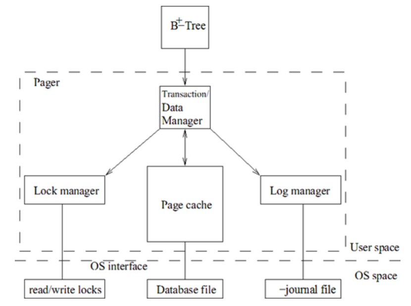

# 第三章 页缓存管理

Pager是进入数据库文件和日志文件的唯一模块(通过操作系统的本地IO API).但是它并不翻译数据库的内容,也不独立修改数据.(pager可能修改一些文件头信息,比如文件修改次数).Pager基于随机存取/字节导向的文件系统操作,然后将其抽象为随机存取/页导向的文件系统操作.它定义了易用的、文件系统无关的进入数据库文件页的接口.B+树模块总是使用页接口来进入数据库,而不直接进入任何数据库文件或者日志文件.它将数据库文件视为统一大小的页组成的数组.

数据库(除了内存数据库)通常以常规文件的形式被存储在外存设备上(例如硬盘).当SQLite需要一个数据项的时候,它将该数据项从数据库文件读取到内存中、在内存中对其进行操作、如果需要的话,将其写回文件.一般来说,数据库相比内存要大得多.由于内存资源的珍贵性,只有部分内存用来保存少量的来自数据库文件的数据,这部分内容通常被称为database cache或者data buffer.SQLite将其称为page cache.Pager就是页缓存管理器.

## 3.1 Pager 的主要任务

对于每个数据库文件,在文件和内存之间移动页是pager的基本功能.页的移动对于B+树模块和更高层的模块来说是透明的,pager是本地文件系统和其他功能模块的中间层.它的主要职责是保证数据库页的地址是可以查找的到的,从而使其他模块能获取页的内容.它也辅助将页写回数据库文件.Pager创建了一个抽象,使得整个数据库文件看起来以一个页数组的形式存储在内存中.

除了内存管理,pager还负责其他许多工作.它提供了事务处理系统的核心业务:事务管理、数据管理、日志管理、锁管理.作为一个事务管理器,pager通过并发控制和数据库文件恢复保证了事务级别的ACID特性,负责实现原子提交和事务回滚.作为数据管理器,通过页缓存辅助读写数据库文件页.作为日志管理器,决定是否将日志记录写入日志文件.作为锁管理器,确保事务在进入数据库页之前获得合适的数据库文件锁.简而言之,pager实现了存储的持久性和事务的原子性.Pager子模块之间的连接如下图所示:

**注意**

Pager之上的所有模块和底层的锁、日志管理是完全独立的.事实上,它们并不关心锁和日志行为.B+树模块通过事务进行操作,并不关心事务的ACID特性是如何实现的.Pager模块把事务行为分为锁、日志、读写数据库文件.B+树模块通过传递页号向pager申请一页.Pager返回一个指针,该指针指向页缓存中的一页.在修改一页之前,B+树模块通知pager,pager将相关数据写入日志文件,以备将来修复数据库用.然后pager请求获得合适的文件锁.B+树使用完页后会通知pager,如果该页被修改过了,pager负责将该页写回数据库文件.

## 3.2 Pager 接口结构

Pager模块实现了名为pager的数据结构.每个打开的数据库文件通过一个单独的pager实体管理,每个pager实体也有且只有一个相关联的数据库文件.如果B+树模块要使用一个数据库文件,它就需要创建一个新的pager实体,通过该实体实现pager级别的数据库文件操作.Pager可以跟踪到文件锁信息、日志文件信息、数据库状态信息、日志状态信息等.

## 3.3 缓存管理

SQLite为每个打开的数据库文件维护了一个page缓存.如果一个线程多次打开同一个数据库文件,只有在第一次打开文件的时候pager创建并初始化一个独立的页缓存.如果多个线程打开同一个文件,就会产生同一个文件的多个独立的页缓存.内存数据库也以文件的形式存储在内存中.所以对于任一种类型的数据库,B/B+树模块通过同样的接口访问数据库.

**注意**

页缓存存在于应用程序的内存空间中.操作系统本身也会创建一份页缓存.当应用程序从文件读取数据时,操作系统通常创建一份数据备份,然后应用程序创建自己的页缓存.SQLite页缓存的组织和管理和操作系统中的管理是独立的.

页缓存的管理对系统性能的影响非常大.接下来的小节将讨论pager如何组织和维护页缓存,以及缓存的使用者如何读取和修改缓存.

### 3.3.1 内存组织

为了加快内存搜索速度,内存能很好地组织当前持有的数据项.SQLite使用一个哈希表和页插槽来组织缓存页.插槽是通用的,即任意类型的插槽可以是通用的,即任意类型的插槽可以存放任意类型的页.随着页的增长,pager创建新的插槽并将它们添加到哈希表中.一个缓存可以含有最多的插槽的个数是限定的.(内存数据库没有这个限制,只要操作系统允许应用程序的内存空间增加)

上图描述了缓存层.哈希表中的每一页由一个PgHdr类型的实体表示.页的数据存储在PgHdr实体后面.页数据后面是一些私有信息,用来供B+树控制页缓存.(内存数据库没有日志文件,所以它们的恢复信息存储在内存实体中.指向这些实体的指针存储在上面提到的私有信息之后,只有pager能使用这些指针.)当pager把页拉到缓存中时,上述私有信息占用的空间被初始化为0.所有的page可以通过哈希表来访问,即pager中的aHash.哈希表的大小在SQLite库被编译后就是固定的了.哈希表中的每个元素指向一个page组成的桶,每个桶中的页通过一个双向链表组织起来.

PgHdr只对pager模块是可见的,对B+树模块和其他高层模块是不可见的.PgHdr的头部有很多控制变量.Pgno是页号.当一页已经被写入回滚日志时,injournal为真.如果在page写回数据库文件之前,日志需要被刷新到磁盘,那么needSync为真.如果页被修改,而且新值还没有被写回数据库文件,那么dirty为真.如果当前页在当前statement日志中,inStmt为真.nRef表示引用当前页的数量.如果nRef大于0,该页就是激活的,我们称该页被钉住;否则,该页就是未被钉住的,是自由的.PgHdr实体中有很多指针变量(上图并没有显示所有的指针变量).pNextHash和pPrevHash将同一个桶中的页连接起来.pNextStmt和pPrevStmt把在statement日志中的页连接起来(接下来我们将介绍statement日志).pNextFree和pPrevFree指针用来连接所有的自由页.缓存中所有的页(自由页或非自由页)通过pNextAll指针连接起来.pDirty指针连接所有的脏页.注意,自由页也可能是脏页.

### 3.3.2 读取缓存

缓存通过页号来搜索页.B+树模块向sqlite3pager_get函数传入页号来读取页.该API读取页的时候按照以下的步骤进行:

 1. 搜索缓存空间.

 	a. 使用哈希函数对页P进行处理,得到一个索引值.(SQLite使用很简单的哈希函数来确定索引值:页号对哈希数组的大小取模)
 	b. 使用索引在哈希表中查找,得到哈希值对应的桶.
 	c. 通过pNextHash指针搜索桶.如果找到P,页P被钉住(nRef增加1),返回页的地址.
 2. 如果没有找到页P,该函数寻找一个自由插槽来插入期望页.(如果插槽没有到达最大数量,创建一个新的插槽)
 3. 如果没有自由插槽也不能创建新的插槽,就按照内存置换算法找到一页,释放掉该页,重新使用这个插槽.这种插槽称为受害者插槽.
 4. 如果受害者页或者自由页是脏页,将该页写回数据库文件(遵循WAL原则,即在写回该页之前确保该页的日志信息已经刷新到磁盘).
 5. 从数据库文件读取页P到自由插槽,钉住该页(例如,将nRef赋值为1),返回页的地址.如果P大于当前文件的最大页数,不读取该页,转而初始化该页为0.当从文件读取页时,也初始化pgHdr底部的私有变量为0.

SQLite 严格执行按需获取的政策来保证获取 page 的逻辑非常简单.

### 3.3.3 写缓存

当某个页的地址被返回给B+树模块时,pager不知道使用者什么时候操作页.每个页遵循标准协议:使用者申请页,使用页,释放页.申请到页之后,使用者可以直接修改页的内容,但是在做任何修改之前必须调用sqlite3-pager_write.该函数返回后,使用者可以原地修改页.

当write函数第一次被调用时,pager把页的原始信息写入回滚日志中,并把injournal和needSync这两个标志位置为真.(SQLite遵循WAL原则:直到needSync标志位清零后,才将被修改过的页写回数据库文件)每当write函数操作一页时,dirty标志位被置为真,只有当pager把页写回数据库文件后,dirty标志位才被清零.因为pager不知道什么时候使用者会修改页,所以页并不会马上被刷新到数据库文件.Pager遵循延迟写回原则:页的刷新被延迟,直到pager进行强制刷新操作或者该页需要被回收以空出插槽供新的页使用(即该页是受害者页的情况).

### 3.3.4 页置换

当缓存已经满了的时候就会发生页置换,旧的页被去掉,为新页的加入腾出空间.就如在读取页小节中提到的,当申请的页不在缓存中而且没有可以取得的自由插槽时,pager选择一页作为受害者页,将其置换.之前我们也介绍过,所有的插槽都是通用的,所以新页可以存放在任意一个插槽中.SQLite使用近期最少使用算法(LRU)进行页的置换.

SQLite将自由页通过优先队列组织起来.当某个页是未被钉住(自由)的状态时,pager将该页添加到队列的末尾.一般选择队列开头的那页作为受害者页,但是纯粹的LRU算法并不总是选择队首的页作为受害者页.SQLite尝试从队首开始寻找这样一页:置换该页时不需要刷新该页到磁盘.(因为遵循WAL原则,刷新页到数据库文件之前要把页的内容刷新到日志文件中,刷新到磁盘是一个费时的操作,SQLite希望尽可能的推迟这个操作.)如果找到符合这个要求的受害者页,就将该页所在的插槽回收.否则,SQLite先刷新日志文件到磁盘,再刷新队首页到磁盘,最后回收队首插槽.

**NOTE**

页被钉住表示该页目前正在被使用,不能被回收.为了避免出现缓存中所有的页都被钉住的情况,SQLite需要保留一些插槽,对于SQLite3.3.6发行版,最少保留插槽个数是10个.

