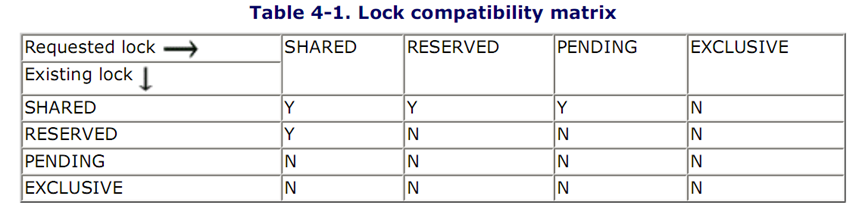
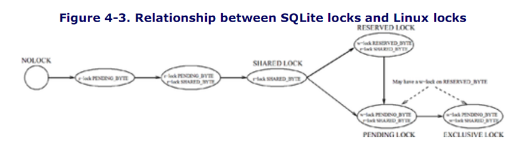
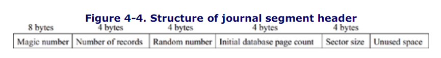
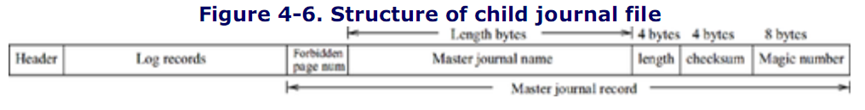

# 第四章  事务管理

事务管理是数据库能够并发的关键.SQLite依赖本地文件锁和页日志来保证ACID性质.SQLite只支持平面事务,没有鸟巢事务结构(nestting)或者保存点(savepoint)能力.
## 4.1 事务类型
SQLite在事务中执行每条SQL语句.支持读事务和写事务.应用程序不能通过读/写事务之外的方式读/写数据库.对于一个SELECT语句,SQLite创建一个读事务,然后将其转换为一个写事务.SQL语句执行完成后,事务自动提交.应用程序不知道事务具体的执行过程,它们只需要把SQL语句提交给SQLite,由SQLite负责剩下的工作.一个程序可以在同一个数据库连接上并行地执行SELECT语句(读事务),但是在同一个数据库连接上只能执行一个非SELECT语句(写事务).
对于一些应用程序,尤其是写入操作很频繁的程序来说,自动提交事务的成本非常高,因为对于每条非SELECT语句,SQLite需要执行:打开日志文件,写入,关闭日志文件三个操作.自动提交事务模式下,每次语句执行完毕后(包括SELECT语句),SQLite丢弃page缓存.缓存的重建导致磁盘的读取/写入操作,是一个很费资源的操作.另外,并发控制还需要频繁地获取和释放文件锁.这些问题会导致SQLite性能下降.解决方法是建立用户级别的事务(对应的,上面提到的是系统级别的事务):
```sql
BEGIN;
      INSERT INTO tablel values(100);
      INSERT INTO table2 values(20, 100);
      UPDATE tablel SET x=x+1 WHERE y> 10;
      INSERT INTO table3 VALUES (1,2,3);
COMMIT;
```
应用程序可以通过显式使用BEGIN命令手动创建一个事务.该事务是用户级别的事务.用户事务创建完成后,SQLite放弃自动提交模式,即每个SQLite语句结束后不自动执行提交(commit)或放弃(abort),也不会丢弃page缓存.接下来的SQL语句变成用户事务的一部分.当应用程序执行commit(或者rollback)命令的时候,SQLite commit(或者abort)事务.如果事务被abort或者执行失败,或者应用程序关闭了数据库连接,整个事务就会回滚.用户事务结束后,SQLite返回自动提交模式.
**NOTE**
SQLite只支持平面事务.应用程序不能对于同一个数据库连接在同一时刻创建多个用户事务.如果在用户事务中执行BEGIN命令,SQLite会返回错误.
用户进程又不仅仅是平面事务.每个非SELECT语句都是被一个单独的语句级别的子事务执行的.尽管并没有存储点功能,SQLite还是在当前语句级别的子事务中实现了存储点.如果当前事务执行失败,SQLite不会放弃(abort)用户事务,而是把数据库状态恢复到该事务执行之前的状态,接下来的事务从这里开始执行.执行失败的事务不会影响其他子事务执行的结果,SQLite帮助一个很长的用户事务实现了一定的容错能力.
在上面的例子中,每个SQL语句都是一个独立的子事务.如果UPDATE的第10列发生了严重的错误,UPDATE对前9列的修改都会回滚.但是三个INSERT子事务会被提交.

## 4.2 锁管理

SQLite为了保证事务的串行执行,使用文件锁策略来保证事务进入数据库的请求.SQLite严格遵守两相锁协议,即只有事务完成才释放锁.SQLite实行数据库级别的锁机制,而不是列、页或者表级别的锁机制,它锁住整个数据库文件,而不是数据库文件的一部分.
**NOTE**
子事务通过所属的用户事务申请锁.直到用户事务的子事务都提交或者放弃,锁才被释放.

### 4.2.1 锁的种类和兼容性

对于单个事务,数据库文件可以是以下五种锁状态中的一种:
**NOLOCK**
事务不会持有数据库文件的锁.该事务可以读/写数据库.只要其他事务的锁状态允许,其他事务也可以读/写数据库文件.事务初始化之后的默认状态就是无锁状态.

**SHARED**
SHARED LOCK只允许读数据库文件.任意数量的事务在同一时间可以获取同一个数据库文件的SHARED LOCK,所以可以有许多并发的读事务.当一个或者多个事务持有SHARED LOCK时,不允许事务写数据库文件.

**RESERVED LOCK**	
RESERVED LOCK允许从数据库文件读取数据.RESERVED LOCK意味着事务有写数据库文件的意图,但是该事务现在只是在读数据库文件.一个数据库文件最多只能有一个RESERVED LOCK,但是RESERVED LOCK可以和许多SHARED LOCK并存.RESERVED LOCK存在时,其他事务可以获得新的SHARED LOCK锁,但是不能获得新的其他类型的锁了.

**PENDING**
PENDING LOCK允许读数据库文件.PENDING LOCK意味着事务想要尽快写数据库文件.该事务只是在等待所有的读取锁释放,从而可以获得一个EXCLUSIVE LOCK.一个数据库文件最多只能有一个PENDING LOCK,PENDING LOCK可以和已经存在的SHARED LOCK并存,但是在这期间,其他事务不能获得新的锁.

**EXCLUSIVE**
EXCLUSIVE LOCK是唯一允许写操作的锁.一个文件只允许一个EXCLUSIVE LOCK锁存在,其他任何种类的锁都不能和EXCLUSIVE LOCK并存.
锁的兼容性表格如下表所示.列是一个事务已经拥有的锁的类型,行是另一个新请求的锁的类型,每个单元格表示两个锁的兼容性.



**NOTE**
对于SQLite这种数据库来说,EXCLUSIVE LOCK是必须的,其他类型的锁只是为了增加事务的并发性.如果只有EXCLUSIVE LOCK,SQLite可以串行地执行地事务.如果只有SHARED LOCK和EXCLUSIVE LOCK,SQLite可以执行读事务的并发.在实际中,一个事务在SHARED LOCK的保护下读数据库文件,修改数据项,申请EXCLUSIVE LOCK来把数据项写回数据库文件.如果两个事务同时进行上述的操作,就会有可能发生死锁.RESERVED LOCK和PENDING LOCK就是用来大幅降低这种死锁的可能性的.这两种锁也提高了事务的并发性,改善了写饥饿问题(读操作一直排挤写操作).

### 4.2.2 锁的申请原则
在读取数据库的页之前,事务申请一个该页的SHARED LOCK,表示该事务想要读取该页.在对页进行任何修改之前,事务需要申请一个RESERVED LOCK,表示该事务在不久的将来要对该页进行写操作.当持有一个RESERVED LOCK的时候,事务可以修改内存中的页.在将页写会数据库文件之前,事务需要获得一个EXCLUSIVE LOCK.锁的状态转换图如下所示.


一般的锁转换步骤是:SHARED LOCK--RESERVED LOCK--PENDING LOCK--EXCLUSIVE LOCK.直接从SHARED LOCK转化为PENDING LOCK只会在某个日志需要会滚的时候才会发生.但是一旦发生这种情况,其他事务都不能从SHARED LOCK转化为RESERVED LOCK.

**NOTE**
PENDING LOCK是一个内部锁,在锁管理系统之外是不可见的.pager不能通过锁管理器获取一个PENDING LOCK.pager可以申请一个EXCLUSIVE LOCK锁,但是在锁管理器内部总是现获取一个PENDING LOCK,然后转化为一个EXCLUSIVE LOCK.所以PENDING LOCK是获取EXCLUSIVE LOCK之前的一个暂时的步骤.获得PENDING LOCK之后,为了防止申请EXCLUSIVE LOCK失败,pager随后会发送一个EXCLUSIVE LOCK的请求,该请求将PENDING LOCK升级为EXCLUSIVE LOCK.

**NOTE**
尽管锁机制解决了并发控制问题,但是又导致了新的问题.假设两个事务持有一个数据库文件的SHARED LOCK.它们都申请RESERVED LOCK.其中一个得到了RESERVED LOCK,另一个进入等待状态.一会儿之后,拥有RESERVED LOCK的事务申请一个EXCLUSIVE LOCK,这样的话就需要处于等待状态的事务释放SHARED LOCK.但是SHARED LOCK永远不会被释放,因为拥有SHARED LOCK的事务处于等待状态.这种情况称之为死锁.
死锁是一个恼人的问题.解决死锁的方法有两种:1、预防;2、检测并去除.SQLite采取预防的方法.如果事务获取锁失败,该事务将进行有限次的尝试(尝试次数可以在主程序运行时设定,默认次数是1).如果所有的尝试都失败了,SQLite返回SQLITE_BUSY.主程序可以在稍候重试或者放弃事务.最终,系统中将不会出现死锁.无论如何,理论上,系统中会发生饥饿现象,即一个事务一直申请一个锁但是永远也获得不了这个锁.但是SQLite并不是一个企业级别的数据库,所以饥饿现象不是一个大问题.

### 4.2.3 锁的实现
SQLite使用操作系统提供的文件锁函数实现锁机制(文件锁的实现是依赖于操作系统的.本书使用Linux系统演示文件锁是如何实现的).Linux只有两种锁模式,即读取锁和写入锁,用来锁定文件的某一段连续的部分.为了避免术语混淆,接下来用读取锁代替SHARED LOCK,用写入锁代替EXCLUSIVE LOCK.Linux为进程和线程分配锁,为了避免混淆进程和线程,下文将一直使用线程.许多父辈线程或者同辈线程可能都持有文件某一段读读取锁,但是只有一个线程可能取得文件该段的写入锁.写入锁排斥其他所有的锁,包括读取锁和写入锁.在同一个文件中读取锁和写入锁可以并存,但是两种锁必须在文件的不同段.单独的线程在文件的某一段只能持有一种类型的锁.如果该线程要向一个已经有锁的段申请锁,那么这个锁将会变成新的锁.

+ SQLite使用操作系统提供的文件锁实现自己的四种锁模式:

+ SHARED LOCK是通过在数据库文件的某一段设置读取锁实现的.

+ EXCLUSIVE LOCK是通过在数据库文件的某一段设置写入锁实现的.

+ RESERVED LOCK是通过在数据库文件的某一个byte设置写入锁实现的(该byte在SHARED LOCK之外的范围),该byte被设计为RESERVED LOCK byte.

  

  PENDING LOCK是通过在数据库文件的某一个byte设置写入锁实现的(这个byte与RESERVED LOCK所在的byte不同,而且也在SHARED LOCK范围之外).下图表示了锁的分配.


SQLite保留510bytes(这个数值在源代码的头文件中被SHARED_SIZE宏定义)作为RESERVED LOCK byte.这个范围从SHARED_FIRST开始.PENDING_BYTE宏(0x40000000,第一个byte定义了锁byte的起始位置)被用来设定PENDING LOCK.RESERVED_BYTE宏用来设置PENDING_BYTE之后的byte.SHARED_FIRST用来设置PENDING_BYTE之后的第二个byte.所有的bytes都装在一页中,尽管这一页是最小的一页(512bytes).

**NOTE**
windows中的锁是强制性的,这意味着锁的有效范围是所有的进程,即使进程之间并不相关.被锁住的空间是被操作系统持有的.因此,SQLite实际上并不能在被锁住的空间中存储数据.所以,pager从不分配锁page(上一段提到的那个page).
为了获取一个数据库文件的SHARED LOCK,一个线程首先获取一个位于PENDING_BYTE上的读取锁来保证没有其他任何进程或者线程持有这个文件的PENDING LOCK.(上文提到过已经存在的PENDING LOCK和新创建的SHARED LOCK是不兼容的).如果操作成功,SHARED_SIZE所确定的范围就被读取锁锁住了,最后,PENDING_BYTE上的读取锁释放.

**NOTE**
windows的一些版本只支持写入锁.为了获取一个SHARED LOCK,特定bytes范围之内的一个byte被设计为写入锁.这个byte是随机选取的,所以有可能两个独立的读取者同时进入同一个数据库文件,除非它们很不巧地选中了同一个byte作为写入锁.在这种系统中,并发性受SHARED_SIZE大小的影响.
一个线程可能在获得一个SHARED LOCK之后又获得一个RESERVED LOCCK.为了获取SHARED LOCK,一个写入锁被获取(在RESERVED LOCK bytes范围内).注意到线程不会释放文件的RESERVED LOCK.(这保证了另一个线程不能获得这个文件的EXCLUSIVE LOCK)
一个线程可能在获得SHARED LOCK之后仅仅想要获得一个PENDING LOCK.为了获得PENDING LOCK,需要在PENDING_BYTE中获取一个写入锁.(这保证了没有新的SHARED LOCK可以被获取,但是已经存在的SHARED LOCK可以并存)注意线程并不释放自己的SHARED LOCK.(这保证了另一个线程不能获得EXCLUSIVE LOCK)

**NOTE**
一个线程在获取PENDING LOCK之前并不是必须获取一个RESERVED LOCK.当系统崩溃时,这条性质被SQLite用来回滚日志文件.如果线程通过SHARED--RESERVED--PENDING这样的顺序获取PENDING LOCK,它为了获取PENDING LOCK将不会释放前两个锁.
一个线程在获取PENDING LOCK之后可能只获取了一个EXCLUSIVE LOCK.为了获取EXCLUSIVE LOCK,首先要在shared byte range上获取一个写入锁.因为所有的SQLite锁都需要在shared byte range上获取读取锁(至少一个),这保证了当线程持有EXCLUSIVE LOCK的时候,没有其他的锁.
锁的状态转换如下图所示.下图展示了SQLite锁和本地锁的关系.PENDING LOCK和EXCLUSIVE LOCK的表示有些笨拙,它们在RESERVED_BYTE上有没有写入锁取决于SQLite是通过那条路径获取锁的.




## 4.3 日志管理

当事务或者子事务被撤销的时候,或者应用程序、系统崩溃的时候,可以通过日志存储的信息恢复数据库.SQLite为每个数据库维护一个日志文件.(SQLite不会为内存数据库维护日志文件.)SQLite假设恢复只负责事务的回滚,所以日志文件又叫做回滚日志.日志文件总是和数据库文件放在同一个路径下,并且有同样的名字,但是后缀是journal.

**NOTE**

SQLite同一时刻只允许一个写事务访问数据库文件,并且为每个写事务动态地创建日志文件,当事务完成后这个日志文件会被删除.

### 4.3.1 日志文件结构



SQLite把回滚日志分成许多大小不同的段.每个段有一个段头,之后是日志记录.段头的格式如上图所示.首先是一个8bytes的magic number:0xD9, 0xD5, 0x05, 0xF9, 0x20, 0xA1, 0x63, and 0xD7.magic number被用来进行日志文件完整性校验.日志条目的数量(nRec)表示在这个段中有多少个有效日志条目.Random number用来确定每个日志条目的校验值.不同的段可能有不同的Random number.initial database page count表示当前日志创建时,数据库文件中一共有多少页.sector size表示日志文件所在磁盘的扇道大小.段头占一个完整的扇道.段头中未使用的空间被保留.

**NOTE**
SQLite支持异步事务模式,这种模式比普通的事务模式快.SQLite不推荐使用异步模式,但是你可以通过预处理指令来开启这个功能.异步模式通常用在软件的开发阶段来缩短开发时间.该模式也适用于一些不需要测试数据库恢复的测试程序.异步模式既不会刷新日志到磁盘,也不会刷新数据库文件到磁盘.日志文件将只有一个日志段.nRec的值是-1,(例如:0xFFFFFFFF作为一个有符号数),实际值与文件的大小有关.
通常来说,回滚日志只有一个日志段.但是在一些情况下,日志文件会有很多日志段,SQLite多次写入段头(在接下来的缓存刷新小节里你会看到这种情况).每次写入段头都是从扇区边界开始的.在多日志段文件中,每个段的nRec都不能是0xFFFFFFFF.

### 4.3.2 日志记录结构

当前写事务中的非SELECT命令创建日志记录.SQLite使用旧值记录技术实现页级别的粗粒度日志控制.在第一次替换任何页之前,页的原始信息作为一个新的日志条目被写入日志文件.该条记录包含一个32-bit的校验值.校验值包含了页号信息和页中的数据的信息.段头的32-bit random number是生成校验值的依据.random number非常重要,因为文件尾部的垃圾数据可能是其他文件删除的数据.(垃圾数据会被识别出来,因为两个数据库文件的random number不一样,所以日志记录生成的校验值也就不一样).如果垃圾数据来自一个已经被删除的日志文件,那么垃圾数据的校验值有很小的可能是正确的.SQLite通过随机初始化为与其他数据库文件不同的校验值,最小化了这种可能.


### 4.3.3 多数据事务日志

应用程序可以使用ATTACH命令把数据库附加到一个已经打开的数据库连接上.如果一个事务修改多个数据库,每个数据库都会有自己的回滚日志,并且彼此之间并不知道对方的存在.为了打破这种隔阂,SQLite额外维护一个集合日志,叫做master journal.master journal不包含用于回滚的任何日志记录.它记录同一个事务下的所有回滚日志文件的名字.相对的,每个回滚日志文件也记录了master journal的名字.如果没有附加数据库,或者附加数据库没有加入当前事务(写事务),就不会有master journal被创建,并且普通的回滚日志文件不会记录master journal的名字.



master journal总是和主数据库文件在同一个路径下,并且和主数据库文件有同样的名字,但是带有-mj后缀,后面还会跟着8个随机的字母或数字.master journal总是暂时性的文件.当事务想要提交的时候,它被创建,提交完成后,它被删除.

### 4.3.4 Statement journal

在用户事务中,SQLite为最近的非SELECT命令维护一个Statement subjournal.当出现Statement fail后,这个日志可以用来修复数据库.Statement journal是一个独立的回滚日志文件,文件名字是随机确定的(前缀是sqlite_).该文件不是用于修复系统崩溃引起的数据库错误的,当出现statement撤销的时候,这个文件才会派上用场.当statement完成后,SQLite删除这个文件.该文件没有段头记录,nRec的值被保存在一个在内存中的数据结构里,这个数据结构还保存了statement执行前数据库文件的大小.这些日志记录没有校验信息.

### 4.3.5 日志协议

SQLite遵循WAL协议来保证数据库可恢复性.SQLite不会立刻强制把日志记录刷新到磁盘,在把下一页写回数据库文件的时候,SQLite才会刷新所有的日志.日志刷新保证了被写入日志的所有页都到达了磁盘.如果在日志刷新之前,数据库被修改了,然后发生了断电,未刷新的日志就会丢失,SQLite就不能回滚事务造成的影响,这会导致数据库崩溃.

### 4.3.6 提交协议

当应用程序提交事务时,SQLite确保所有的回滚日志都刷新到了磁盘.提交完成后,回滚日志被删除,事务执行完毕.如果在这之前发生了系统崩溃,事务提交失败,下次数据库被读取的时候数据库就会回滚.无论如何,在删除日志文件之前,所有的数据库修改都被写到了磁盘上.

**NOTE**

SQLite不会为异步事务提供回滚日志.所以,如果在异步模式下出现错误,数据库有可能崩溃.书写异步事务的人需要注意这一点.

## 4.4 事务的执行

和其他的数据库一样,SQLite的事务管理有两个组件:1)一般过程2)回滚过程.在一般过程中,pager把回滚信息存到日志文件,如果需要的话,使用回滚信息修复数据库.

一般过程包括以页的形式读/写数据库文件,并提交事务和子事务.另外,作为一般过程的一部分,pager把页缓存刷新到磁盘.

大多数事务和statement子事务提交自己.但是在一些情况下,有的事务或者子事务撤销自己.有时可能发生断电或者系统崩溃.无论这两种情况哪一种发生了,SQLite都需要对数据库进行回滚.如果只是撤销事务,内存中的信息就能帮助回滚,如果断电或者系统崩溃,数据库也可能崩溃,而且无法获取内存中的信息.

### 4.4.1 读操作

为了对数据库的页进行操作,B+树模块需要使用sqlite3pager_get函数.如果请求的页在数据库文件中不存在,pager会创建这个页.sqlite3pager_get函数首先取得一个SHARED LOCK,如果获取锁失败,就返回SQLITE_BUSY.否则,该函数执行一个内存读取操作,并把读取的页返回给调用者.读取内存的操作会把页钉住.

Pager第一次申请SHARED LOCK的时候,意味着pager开始了一个隐性的读事务,所以它会判读是否需要对数据进行恢复(回滚).如果数据库需要回滚,pager在返回读取页之前执行回滚操作.

### 4.4.2 写操作

修改一页之前,B+树模块必须把该页钉住(通过使用sqlite3pager_get函数).通过使用sqlite3pager_write,页会变成可写页.第一次sqlite3pager_write被用于页的时候,pager需要申请一个RESERVED LOCK.如果申请失败,pager返回SQLITE_BUSY.

Pager第一次申请RESERVED LOCK的时候,我们称它将读事务逐步升级为了写事务.同时,pager创建并打开回滚日志、初始化日志第一段的段头,记录下数据库文件的当前大小.

为了使一页变得可写,pager把该页的原始内容写入到回滚文件中(以一个新的日志条目的形式).一但页变得可写,用户可以任意次地修改该页,而不用通知pager,对该页的改动不会立即写回到数据库文件.

**NOTE**

一但一页的内容被复制到回滚日志中,该页就永远不会成为回滚日志文件的新的日志条目,即使当前事务多次对该页调用了写函数.这样做的好处是该页可以从日志文件中复制出来实现页的恢复.无论事务对该页做了一次修改还是多次修改,回滚后,该页的内容都是一样的,所以回滚不会产生任何的弥补日志记录.

SQLite从来不会把新创建的页(当前事务添加的数据库中的页)存储在日志文件中.因为数据库中没有该页的更旧的版本.日志文件转而记录数据库文件的当前大小,这样当事务回滚的时候,直接将数据库文件裁剪到原大小就可以了.

### 4.4.3 缓存刷新

缓存刷新是pager模块的内部操作,其他模块不能直接执行这个操作.如果内存满了需要进行页置换,或者事务准备好提交更新,pager就把页写回数据库文件.Pager按照下面的顺序执行:

1.如果事务不是异步的且新的数据已经写入到日志中,并且数据库不是一个临时数据库,那么pager会把内存中的日志信息刷新到日志文件中.Pager会先执行一个fsync调用,确保这之前的所有日志条目都已经被刷新到了日志文件(磁盘).日志文件刷新完成后,pager修改当前日志段头的nRec值,然后再进行一次刷新.上述操作不是原子性的,如果在第二次刷新之前系统崩溃,数据库可能面临一些风险.

2.尝试获取EXCLUSIVE LOCK,如果获取失败,返回SQLITE_BUSY.

3.把所有修改过的页写回数据库文件,这一过程是原地进行的,内存中的被修改的页会被清空.

如果是因为内存置换把页写回数据库文件,pager不会提交事务,而是继续执行事务.在所有的修改完成之前,上述的3步重复执行.

**NOTE**

Pager获取的EXCLUSIVE LOCK直到事务完成后才被释放.这意味着其他事务不能在此期间创建读/写事务.

### 4.4.4 提交操作

一个事务修改一个数据库或者修改多个数据库,这两种情况下SQLite的提交原则有一点不同.

#### 4.4.4.1 单数据库的情况

提交读事务非常简单.Pager释放SHARED LOCK,清除页缓存.提交写事务的话,pager执行以下的步骤:

1.获取EXCLUSIVE LOCK.(如果获取失败,返回SQLITE_BUSY.)把所有修改过的页写回数据库文件.

2.Pager执行一个fsync系统调用,把数据库文件刷新到磁盘上.

3.删除日志文件.

4.释放EXCLUSIVE LOCK,清空内存.

#### 4.4.4.2 多数据库的情况

相比之下提交协议有些复杂,多数据库系统中的事务提交是类似的.虚拟机模块实际操作提交过程.每个pager执行自己负负责的事务提交.对于读/写事务来说,该原则保证了对所有包含进来的数据库都进行提交,具体步骤如下:

1.释放相关所有数据库的SHARED LOCK.

2.申请相关所有数据库的EXCLUSIVE LOCK.

3.创建一个新的master journal文件,在该文件中写入所有的回滚文件,将master journal和所有的普通日志文件刷新到磁盘.(master journal中不包含临时数据库的名字)

4.把master journal文件的名字写入所有的普通日志文件中,刷新回滚日志到磁盘.(直到事务提交的时候,pager才会知道这是一个涉及多个数据库的事务.)

5.刷新每个数据库文件.

6.删除master journal文件,刷新日志目录.

7.释放所有数据库的EXCLUSIVE LOCK,清空所有页缓存.

**NOTE**

master journal被删除的时候系统就认为事务已经成功提交了,如果在这之前发生断电,就认为事务提交失败了.当下次读取这些数据库的时候,SQLite会对所有的数据库进行恢复.

如果主数据库是一个临时数据库或者一个内存数据库,SQLite不能保证多数据库事务操作的原子性.这也意味着全局恢复可能无法实现.SQLite不会创建master journal.虚拟机模块一个接一个单独执行事务提交操作.所以对于每个数据库来说,事务是原子性的.所以,如果多数据库事务提交失败,那么可能有些数据库会发生变化,有的不会.

### 4.4.5 子事务操作

子事务一般有三种操作,读、写、提交.接下来我们会一一讨论.

#### 4.4.5.1 读操作

用户事务对数据库文件进行页缓存,子事务通过用户事务创建的页缓存读取数据库文件,所有的读取规则和用户事务相同.

#### 4.4.5.2 写操作

写操作由两部分组成:锁操作和日志操作.子事务通过所属的用户事务获取锁.但是子事务的日志是一个单独的临时日志文件.SQLite在子事务日志文件中写入一部分日志记录,还有一部分相关的日志记录被写入主回滚日志.当一个子事务试图通过sqlite3pager_write使某页变得可写的时候,pager执行如下的两个动作(这两个动作是等价的):

1.如果该页不在主回滚日志中,就在主回滚日志中添加该页.

2.否则,在子事务的回滚日志中添加这一页.

pager永远不会刷新子事务日志,因为数据库恢复不需要子事务日志.如果数据库崩溃,主回滚日志会负责数据库的恢复.你可能会注意到内存中的页有可能既是主回滚日志页,又是子事务日志页,主回滚日志保存着页的内容的最近的版本.

#### 4.4.5.3 提交操作

子事务的提交非常简单,提交完成后,pager删除子事务日志.

### 4.4.6 事务撤销

事务撤销后,数据库的恢复非常简单.有的时候pager需要移除事务产生的影响,有的时候不需要.如果事务只持有一个RESERVED LOCK或者一个PENDING LOCK,这保证了数据库文件没有被修改,所以pager会删除所有的日志文件,放弃页内存中所有的脏页.否则的话,由于事务已经向数据库文件写入了一些页,pager将执行以下的回滚操作:

Pager从日志文件中读取记录,恢复日志中记录的页.(同一个事务只在日志文件中记录一次同一个页,该记录是该页的最近版本的镜像.)所以,恢复完成后,数据库恢复的事务执行之前的状态.如果事务扩展了数据库,pager就把数据库文件截断为事务开始之前的大小.然后pager刷新数据库文件,删除回滚日志文件,释放EXCLUSIVE LOCK,清空内存.

### 4.4.7 子事务撤销

就像在"子事务操作"小节中提到的,子事务有可能既向回滚日志中写入记录,也向子事务日志中写入记录.SQLite需要回滚所有的子事务日志,还需要回滚主回滚日志的一部分.当子事务在主回滚日志中写下第一条日志记录的时候,pager把这条记录的位置保存在内存的一个数据结构中.Pager从这些记录中恢复数据库,然后删除子事务日志文件,但是保持主回滚日志不变.当子事务开始的时候,pager也会记录数据库文件的大小,这样当子事务撤销的时候,pager截断数据库文件至初始大小.

### 4.4.8 从错误中恢复

当发生系统崩溃或者断电的时候,不一致的数据可能被留在数据库文件中.如果没有应用程序更新数据库,但是存在一个回滚日志文件,这意味着之前的事务可能执行失败了,数据库需要进行恢复操作.如果数据库文件未被锁住或者只有SHARED LOCK,这时我们称回滚日志文件是hot的.当写事务执行到一半并且发生失败的时候,我们称回滚日志文件是hot的.无论如何,如果回滚日志文件是多数据库事务产生的并且不存在master journal file,这意味着事务在执行失败之前已经成功提交了.一个处于hot状态的日志文件表示SQLite需要对数据库文件进行恢复操作.

**NOTE**

如果不存在master journal,存在一个回滚日志,并且数据库文件没有RESERVED LOCK或者更强的锁,那么这个回滚日志就是hot的.(持有RESERVED LOCK的事务创建回滚日志文件,这时日志文件不是hot的)如果回滚日志文件中出现了一个master journal的名字,并且master journal文件存在,并且数据库文件没有RESERVED LOCK,那么这个回滚日志文件就是hot的.

对于一般的数据库系统来说,数据库被打开的时候执行恢复操作.但是SQLite与它们不同,SQLite在第一次读取操作发生的时候进行数据库文件正确性检查并且决定是否进行恢复操作.

如果当前的应用对数据库文件只有读取的权限,而没有写入的权限,那么回滚操作就会失败,SQLite返回一个意外错误码.

在实际读取操作之前,SQLite执行如下的恢复操作步骤:

1.获取一个SHARED LOCK,如果获取失败,返回SQLITE_BUSY.

2.检查是否存在一个处于hot状态的日志.如果不存在一个hot日志,恢复操作结束.如果存在一个hot日志,数据库通过下面的步骤进行回滚.

3.申请一个EXCLUSIVE LOCK(通过PENDING LOCK).(pager不会申请RESERVED LOCK,因为这将会导致其他事务认为这个日志文件不是hot的并且读取数据库中的错误数据.因为回滚操作要想数据库文件中写入数据,所以需要一个EXCLUSIVE LOCK)如果申请失败,这意味着另一个pager正在尝试恢复操作.这种情况下,本pager放弃所有的锁,关闭数据库文件,返回SQLITE_BUSY.

4.从回滚日志读取所有的记录并撤销这些记录.这使数据库文件恢复到事务执行之前的状态.

5.刷新数据库文件,防止又一次发生断电或者系统崩溃.

6.删除回滚日志文件.

7.如果删除master journal是安全的,就删除master journal.(这一步是可选的.)

8.释放EXCLUSIVE LOCK(和PENDING LOCK),但是保留SHARED LOCK.(因为pager在sqlite3pager_get函数中执行回滚操作.)

如果上述的过程成功执行,数据库文件就恢复成功了,接下来从数据库文件中读取数据就是安全的.

**NOTE**

如果没有回滚日志文件指向master journal,那么这个master journal就是"陈腐"的.为了识别一个master journal是否是陈腐的,需要检查每个回滚日志.如果有一个回滚日志指向了master journal,那么master journal就不是陈腐的.如果不存在回滚日志,或者回滚日志指向其他的master journal,或者不指向master journal,那么这个master journal就是陈腐的,pager就会删除它.删除陈腐的master journal并不是必须的操作,删除它的唯一原因是释放磁盘空间.

### 4.4.9 存档点(check point)

为了减少恢复时的工作量,大多数数据库在运行间隙的时候会设置存档点.同一时刻对于同一个数据库文件SQLite只允许执行一个写事务,日志文件只包含这个事务的记录,事务完成后SQLite删除日志文件.所以SQLite不需要设置存档点.事务提交后到日志删除之前,SQLite已经确定所有的修改已经写入到数据库文件中了.