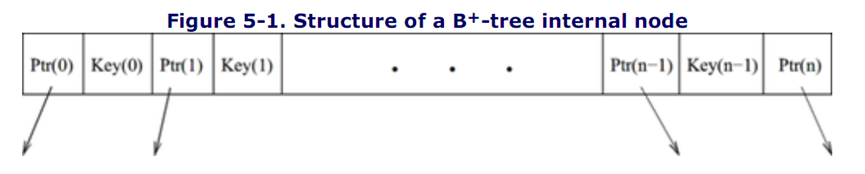
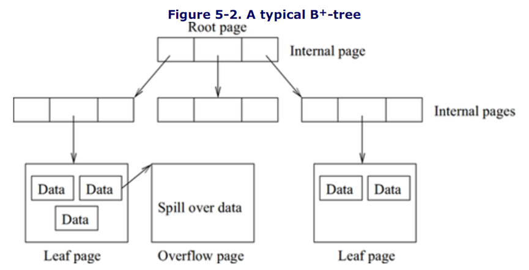
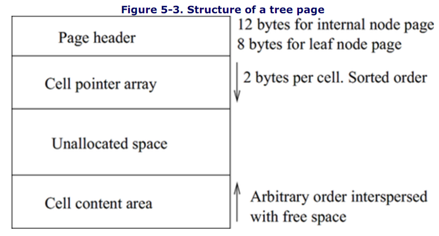
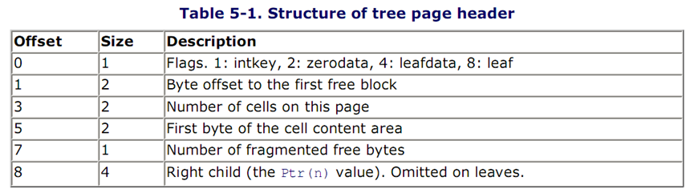
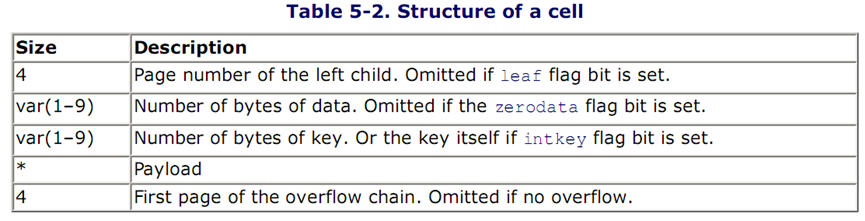
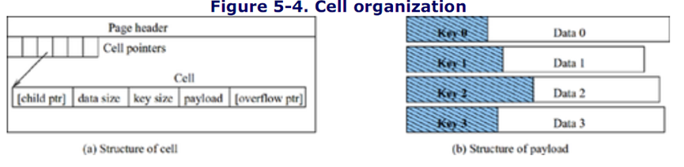

# 第五章 表和索引管理

之前已经讨论过了pager模块怎么把数据库文件抽象为基于页的文件.在这一节中,我们将讨论B+树模块如何在基于页的文件之上抽象出基于行的数据项.

表中的行可以通过很多种形式组织起来,例如输入顺序、相关性、哈希表、键值序列.SQLite使用B+树来组织一个表中所有的行,不同的表有不同的B+树.SQLite把索引视为一个表,并且把索引存储在一个B树里,不同的索引有不同的B树.B树和B+树很像,都是一种键值序列数据结构.SQLite不使用其他的组织行(数据项)的方法.所以,一个数据库就是一个B树和B+树的集合.所有的这些树都是基于数据库页的,它们相辅相成,不能被分开.但是,不能有数据库页存储来自两个不同表的行.B/B+树模块的职责是组织树中的页,使得可以有效地存储和读取数据项.

在接下来的小节中,主要介绍B+树.B+树模块实现了从树中读取、插入、删除数据项,也实现了树的创建和删除,它把数据项视为变长度的字节字符串.

## 5.1 B+树结构

对许多数据库来说,B树(B代表平衡)是最重要的索引结构.它可以按照键值有序地组织由相似数据项构成的数据集合.B树是一种特殊的高度平衡的树,所有的叶子节点都处于同一层.数据实体信息和搜索信息即存储在内部节点中,也存储在叶子节点中.对于一般的增删查改操作,B树的性能几乎是最优秀的.

B+树是B树的一个变体,B+树把所有的数据项都存储在叶子节点中.数据项(键值和数据)通过键值排序,内部节点只保存搜索信息(键值)和子节点指针.中间节点中的键值按照顺序存储,这些键值用来指示搜索的方向.

对于这两种树,内部节点可以包含指定范围内(存在上界和下界)的可变数量的子节点指针.下界通常大于或者等于上界的一半.根节点可以不遵守这条原则,它可以有任意数量的子节点指针(从0到上界).所有的叶子节点都在同一层(最底层),有时候叶子节点还通过一个链表组织起来.对于B+树来说,根节点永远是内部节点.

对于一个指定的上界n+1(n>1),在B+树中,每个内部节点最多包含n个键值和最多n+1个子节点指针.键值和指针的组织方式如下图所示.对于任何内部节点:

+ Ptr(0)指向的子树的所有键值都小于或者等于key(0)

+ Ptr(1)指向的子树的所有键值都小于或者等于key(1)且大于等于key(0),以此类推

+ Ptr(n)指向的子树的所有键值都大于或者等于key(n-1)

查找一个指定键值对应的数据的时间复杂度是O(logm),其中m是树中数据项的个数.

## 5.2 SQLite内的B+树

SQLite通过分配根节点页来创建一颗树.根节点页不会重复分配,通过根节点页的页号来识别每棵树.页号存储在master catalog table中,master catalog table的根存储在page1中.

一个页中只能存储一个节点(内部节点或者叶子节点),这个页就被视为节点页(内部节点页或者叶子节点页).对于每个节点,每个数据项的键值和数据合在一起作为负载(payload).固定数量的预先设置好的负载直接存储在页中.如果负载大于规定的数量,超过的字节存储到溢出页(overflow page):超过的负载按照顺序存储在溢出页链表中,内部节点也可以有溢出页.

## 5.3 页结构

数据库文件被分为固定大小的页,所有的页由B+树模块管理.每个页要么是树中的页(内部页或者叶子页),要么是溢出页,或者是自由页(自由页通过单链表组织起来).在本节中我们将要学习内部页、叶子页和溢出页的结构.

### 5.3.1 树中页的结构

树中的页(内部页和叶子页)被分成许多cell,一个cell包括一个(或者一部分)负载.Cell是已分配或者已释放的磁盘空间集合.树中的页的格式如下图所示:

每个页被分为4个部分:

1.页头

2.Cell指针数组

3.未分配空间

4.Cell内容

Cell指针数组从上向下增长,cell内容从下向上增长.Cell指针数组作为页内的一种目录,帮助把cell组织起来.

页头只包含本页的管理信息,并且总是存储在页的开头.(page1是一个例外:page1的前100个bytes是文件头)页头的结构如下表所示,前两列的单位是bytes.

偏移量是0的flags定义了页的格式.如果leaf bit为真,这意味着该页是一个叶子节点并且没有子节点.如果zerodata为真,那么该页只包含键值而没有任何数据.如果intkey为真,那么键值是一个整型变量,并且该键值被保存在cell头中而不是复杂区域(见之后的章节).如果leafdata为真,那么树只在叶子节点存储数据.对于内部节点页,页头也包含最右边的孩子节点指针(offset 8).

Cell被保存在页的最底部,向页开头的方向增长.Cell指针数组从页头之后的第一个byte开始,包含0个或者多个cell指针.每个cell指针是一个2byte整数,该整数指示了实际cell内容相对于页开头的偏移量.Cell指针按照相应的键值排序,尽管cell本身的存储不是按照顺序的.Cell指针数组的大小被存储在页头处偏移量为3的地方.

因为cell是被随机插入和删除的,存放cell的区域可能出现空闲空间.这些未被使用的空闲空间被一个链表收集起来,并且按照空间的地址升序排列.这个链表的头指针(一个2byte的偏移量)被保存在页头内偏移量为1的地方.每个空闲空间最小是4bytes,因为空闲空间的头4bytes是用来存储控制信息的:前两个bytes存储下一个空闲空间的偏移量(为0的话表示没有下一个空闲空间了),后两个bytes保存空闲空间的大小.因为空闲空间链表只能保存最小为4bytes的空间,所以小于4bytes的空间遗留在了cell部分的内部,这些空间被称为碎片.碎片的总大小记录在页头偏移量为7的地方(碎片总大小不能大于255,在碎片总大小达到最大值之前,会对页进行一次碎片整理).Cell部分的第一个byte(实际cell数据的起始位置)的位置存储在页头处偏移量为5的地方.该值作为未分配空间和cell部分的界限.

Cell是变长的字节字符串.一个cell保存了一个负载.Cell的结构如下图所示,size列的单位是byte.

对于内部节点,每个cell包含一个4byte的子节点指针;对于叶子节点,cell没有子节点指针.接下来是该cell存储的数据的大小(bytes)和存储的键值的大小(bytes)(如果页头中的intkey为真,那么存储键值大小的地方就直接存储键值本身的整型值,如果zerodata为真,那么数据部分不存在).下图展示了cell的结构,负载(payload)中可能不存储键值,或者不存储数据,或者两个都不存储.

SQLite使用变长整型数来表示整型数的大小(和整型键值).可变长整数由1~9个字节组成,每个字节的低7位有效,第8位是标志位.在组成可变长整数的各字节中,前面字节(整数的高位字节)的第8位置1,只有最低一个字节的第8位置0,表示整数结束.可变长整数可以不到9个字节,即使使用了全部9个字节,也可以将它转换为一个64-bit整数.当可变长整数达到9个字节,第9个字节的第8位置不再是标志位,其8位均有效.这就是霍夫曼编码.使用霍夫曼编码可以大大节省存储空间.

之前我们提到过SQLite限制了每页中负载的数量.负载有可能不会把自身的全部存储在同一页中,尽管可能该页有足够大的空间.每页能够存储的最大单个负载由该页可用空间(可以被内部节点的单个cell使用)的总大小决定.这个限制值在文件头内偏移量21处(见数据库文件格式一节).如果内部节点中的cell的负载大于最大负载限制,超出的部分就被分割并存储到溢出页链表中.一但分配了一个溢出页,要把尽可能多的字节转移到溢出页中,只要不导致cell的大小低于最小负载限制(该值存储在文件头内偏移量22处)就行.对于叶子节点,最小负载限制存储在文件头内偏移量23处,但是最大负载限制总是100%,并且不会在文件头给出.

### 5.3.2 溢出页结构

一个cell的溢出页是一个单链表,每个溢出页(除了最后一个页)被填满数据,数据长度等于可用空间除以4bytes:头4个bytes存储下一个溢出页的页号,最后一个溢出页可以小到只有1byte数据.不能在同一个溢出页存储来自两个cell的内容.

## 5.4 模块职能

本模块帮助虚拟机把所有的表和索引通过B/B+树的形式组织起来:为每个表分配一个B+树,为每个索引分配一个B树.每个树由一个或者多个页组成.虚拟机可以存储或者读取树中变长度的数据项,也可以在任何时间从树中删除一个数据项,并且拓展空间或者重用自由空间.对于一个含有m个数据项的树,本模块帮助虚拟机实现O(logm)的查找时间复杂度.

### 5.4.1 空间管理

本模块接受来自虚拟机的插入或者删除cell的请求.插入操作需要对树上的页(和溢出页)分配空间,相对的,删除操作释放空间.每页自由空间的管理对于数据库有效利用空间是很关键的.

#### 5.4.1.1 自由页的管理

当一页从树中移除的时候,该页被添加到自由页链表中,为稍后的重复使用做准备.当树需要扩展的时候,从自由页链表中取出一页添加到树上.如果自由页链表为空,就从本地文件系统中取出一页.(从本地文件系统取出的页总是添加在数据库文件的末尾.)

#### 5.4.1.2 页内空间管理

树上的页有三种类型的自由空间:

1.Cell指针数组到cell实体之间的空间(称为未分配空间).(可分配)

2.cell实体间的自由空间块(可分配)(通过一个自由空间块链表组织起来)

3.Cell间的碎片空间(不可分配)

每次分配和释放空间后,造成的自由空间变化遵循以下的原则:

**为cell分配空间**

空间分配器不会分配小于4bytes的空间,如果有小于4bytes的申请,那么空间分配器分配4bytes的空间.假设某页有nFree bytes的空间,对于该页有nRequired bytes(nRequired>=4)的申请,nRequired <= nFree,那么空间分配器按照以下的步骤分配空间:

1.遍历自由空间块链表,寻找是否有足够大的自由空间块,如果找到了,按照如下原则继续执行:

a.如果自由空间块的大小小于nRequired + 4,就把该空间块从自由空间块链表中取出来,用从空间块开头算起的nRequired bytes满足申请,剩下的空间(<=3 bytes)就成了碎片空间.

b.否则,用从空间块末尾算起的nRequired bytes满足申请,剩下的自由空间依旧作为自由空间块存储于自由空间块链表中.

2.如果没找到足够大的自由空间块,而且需要分配的空间超过了未分配空间,或者该页有太多的碎片空间,那么本模块就对该页进行碎片整理.通过执行压缩算法把碎片集合成更大的自由空间,并放到Cell指针数组与cell实体之间.在压缩过程中,需要一个接一个地把已经存在的cell移动到页的底部.

3.从未分配空间的底部开始,分配nRequired bytes的空间.

**释放cell占有的空间**

假设有一个释放nFree(>=4 bytes)(这nFree之前被分配器分配过)的请求.分配器创建一个新的大小为nFree bytes的自由空间块,把这块自由空间插入到自由空间块链表中合适的位置.然后尝试将该块和周围的空间块合并.如果两个空间块之间有碎片,这些碎片也会被合并.如果cell指针数组和cell实体之间有未分配空间,那么将释放的空间和未分配空间合并.
