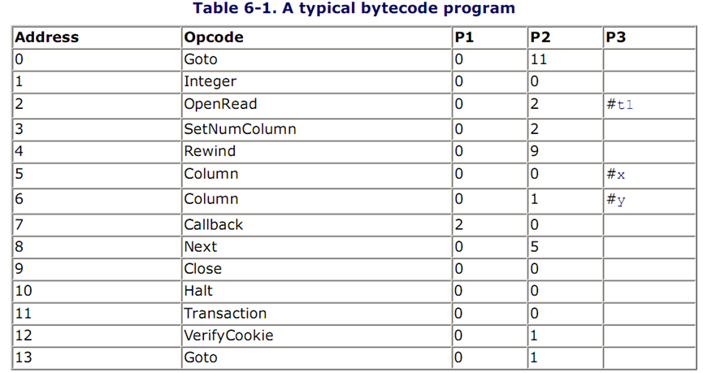
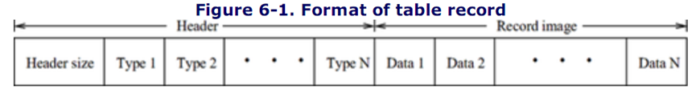
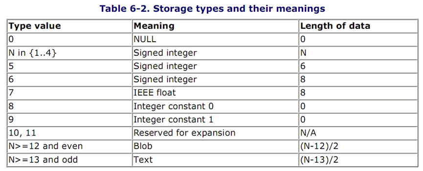
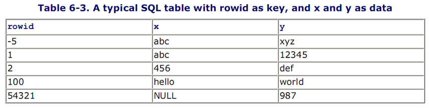
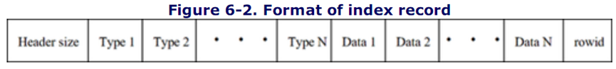
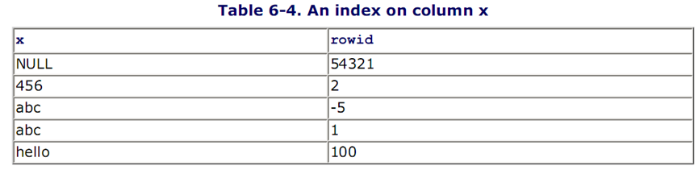
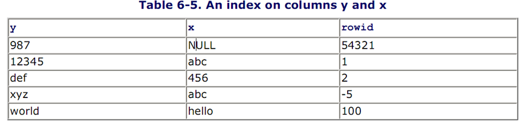
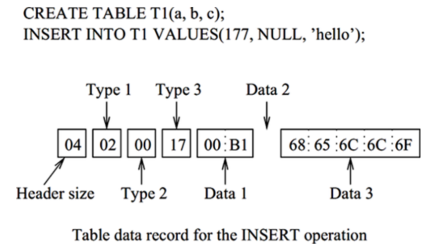
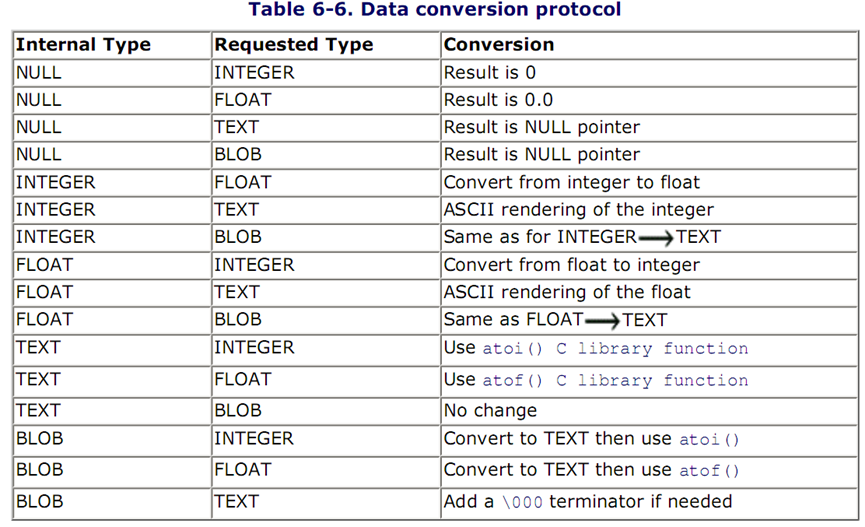

# 第六章  SQLite引擎

后台系统的顶层模块是虚拟机.虚拟机是SQLite的核心,也是前后台系统的交互接口,核心信息处理在其中完成.虚拟机在本地操作系统上又抽象出一个机器,用来执行SQLite内部的字节码语言写成的程序.虚拟机接收前台生成的字节码程序(字节码程序就是预处理过的SQL命令),利用B+树模块执行该程序,产生输出.

虚拟机不知道字节码程序执行了什么操作,它只是在必要时刻把数据从一种类型转换为另一种类型.动态数据转换是虚拟机的主要任务,其他事情由字节码程序控制.

字节码程序被sqlite3_stmt(内部叫做Vdbe)类型的内存实体包裹.运行字节码程序和取回结果的API有:sqlite3_bind_\*, sqlite3_step, sqlite3_column\_\*, sqlite3_finalize.

一个Vdbe实体的内部状态包括:

+ 一个字节码程序

+ 所有结果列的名字和数据类型

+ 绑定到输入参数上的值

+ 一个程序计数器

+ 一个操作数的执行栈

+ 不定数量的编号过的内存单元

+ 其他运行时状态信息(例如B树实体、排序器、链表、集合)

## 6.1 字节码编程语言

SQLite定义了一种内部编程语言来预处理字节码程序,这种语言类似汇编语言,它会定义字节码的结构:<opcode, P1, P2, P3>.Opcode指明了一个确定的操作,p1,p2,p3是该操作的操作数.P1是一个32位有符号整型变量.P2是一个31位非负整型变量,对于可能导致跳转的操作,p2总是存储跳转的目的地址.P3是一个指向无结尾的字符串,或者指向结构体,或者指向NULL.一些操作码使用这3个操作数,一些只使用一个或两个操作数,甚至不使用操作数.

**NOTE**

操作码是虚拟机内部操作的名字,并不是SQLite接口规格的一部分.所以,不同的版本操作码的语义可能不一样.SQLite开发小组不推荐用户自己书写字节码.

下表展示了等价于SELECT * FROM t1的一个字节码程序.表t1有两列:x,y.表的第一行不是程序的一部分,所有其他行都是字节码指令.



虚拟机是一个翻译器,以下是它的结构:

```c
for (; pc < nOp && rc == SQLITE_OK; pc++){
   switch (aOp[pc].opcode){
   case OP_Add:
      /* Implementation of the ADD operation here */
      break;
   case OP_Goto:
      pc = op[pc].p2-1;
      break;
   case OP_Halt:
      pc = nOp;
      break;
   /* other cases for other opcodes */
   }
}
```

翻译器是一个简单的循环,包括了大量的switch语句.每个case语句实现一个字节码指令.(操作码以OP_为前缀)在每次迭代中,虚拟机从字节码程序中取到下一个字节码指令,例如,使用pc作为索引从aOp数组中取得(pc和aOp都是Vdbe实体的成员).虚拟机对指令进行解码并且执行该指令.虚拟机从指令编号为0的字节码程序开始执行.

虚拟机通过一个游标进入数据库,游标是指向单个B+树(表)或者B树(索引)的指针.游标可以通过键值查找数据,也可以遍历整个树.虚拟机通过游标执行数据项的插入、读取、删除操作.

虚拟机使用操作数栈和一定数量的编号过的内存空间来保存中间结果.操作码使用栈中的操作数,计算结果也存储在栈中.

虚拟机依次执行字节码程序直到遇到halt指令或者发生错误(在翻译器程序中,rc变量保存了指令执行的状态),或者程序计数器已经超过的最后一条指令的编号.如果是错误导致的执行终止,虚拟机会终止事务或者子事务,去除事务(子事务)对数据库的影响.

## 6.2 记录格式

虚拟机把数据项存储在B/B+树中,每个数据项由键值和数据组成.只有虚拟机负责维护键值和数据的内部结构(尽管B+树模块可能把数据项分割到溢出页中,虚拟机把数据项视为逻辑上连续的字节字符串).对于表和索引,SQLite使用两种相似但是不同的数据项格式.

有两种方法格式化数据项:固定长度的和变长度的.对于固定长度的格式,所有的数据项都使用相同的存储空间(无论是表还是索引),每个固定储存空间的大小在表(或索引)创建的时候就确定了.对于变长度的格式,存储空间的大小可能各不相同.变长度格式可以大大缩减数据库文件的大小,因为内存和磁盘之间需要迁移的数据变小了,所以整个系统运行地更加快速.另外,变长度数据项的使用使得SQLite可以支持动态类型.

### 6.2.1 动态类型

每个存储在数据库的原始数据值都有一个指定的格式.大多数关系型数据库使用静态格式:每列只有一种数据格式,只有符合这种格式的数据才允许存储在该列中.SQLite通过使用动态数据类型放松了这条限制.在动态类型中,数据类型变成了数据本身的一个特性,而不是列或者存储数据的变量的特性.SQLite使用动态类型(尽管SQLite规格中称之为静态类型),数据类型作为数据的一部分一起被存储.SQLite允许用户在任何列中存储任何类型的数据,无论该列声明的是什么类型.(但是有一个例外:整型主键列只能存储整型数据)

### 6.2.2 表数据项格式



表的数据格式(行数据)如上图所示,数据项由数据头和数据体组成.数据头依次存储了大小(从数据项开头到data1之前,该变量是一个经过哈夫曼编码的64bit的变长度整型),数据类型(变长度无符号整型,最大值是2的64次方).之后是数据本体,数据类型和数据本体一一对应.

虚拟机支持五种存储类型:有符号整型,有符号浮点型,字符串,二进制大对象,NULL.有些数据可能有多种类型,例如123可以是一个整数,或者一个浮点数,或者一个字符串.二进制大对象和NULL不可能有多种类型.SQLite必须对数据类型进行隐式转换.

这种数据类型的编码形式如下表所示,这种编码方式的好处是数据长度变成了数据类型编码的一部分.



NULL类型就是SQL NULL.对于整型,数据值是有符号整型数,根据数据的大小分别存储在1,2,3,4,6,8bytes中.浮点型数据按照IEEE浮点数标准存储在8bytes中.类型编码8和9代表整型常数0和1.对于TEXT类型,使用默认的字符编码格式(UTF-8,UTF-16BE,UTF16-LE)存储在数据库文件中,对于UTF-16BE和UTF16-LE编码格式,分别是大端存储和小端存储的.(每个数据库文件只能存储同一种UTF格式)对于二进制大对象(BLOB),数据值是一个二进制块,按照输入原样存储.

### 6.2.3 表的键值格式

在SQLite中,每个B+树必须有一个主键.尽管定义一个关联表不能包含同样的行,事实上,用户可能在关联表中存储数据项的副本.数据库系统必须把数据项和它的副本区分开,即系统必须能够处理附加的用于区分的信息.这意味着系统要为关联表提供一个新的主键.所以,在内部,每个表都有一个独一无二的主键,该键值要么是表的创建者定义的,要么是被SQLite创建的.

对于每个表,SQLite指定一个列作为行号(rowid,一个–2^63到2^63-1的整型数),该列中的值唯一地确定一行.行号是表的隐式主键,是B+树的唯一搜索键值.如果有一列被声明为整型主键列,该列就被视为所在表的行号列.所以,对于每个表,无论有没有声明一个整型主键列,都有一个唯一的整型值,即行号.对于后一种情况,行号在内部被视为表的整型主键.

下表展示了表的内容,该表是通过`create table t1(x ,y)`命令创建的.行号列是通过SQLite添加的.行号值通常是由SQLite设定的.然而,你可以向行号列添加任何整型数,例如:`insert into t1(rowid, x, y) values(100, 'hello', 'world')`.



**NOTE**

如果行号列是自定的(例如声明为整型主键),数据库使用者负责管理列的值.如果行号列是SQLite添加的,那么SQLite负责生成行号值并保证它们的唯一性.当插入新行的时候,SQLite访问B+树并找到一个未使用的整数来做为行号.

当行号作为数据的一部分被存储的时候,行号有一个内部整数类型.当作为一个键值存储的时候,行号是一个变长的哈夫曼编码.负数行号是允许的,但是需要用9bytes存储它们,所以并不推荐使用负数行号.SQLite添加的行号总是非负的,尽管你可以显式声明负数行号,上面的-5就是一个例子.

### 6.2.4 索引值格式

在前面的章节中,我们已经介绍了每个B+树的键值是一个整数,数据是表中的一行.索引刚好相反.对于一个索引,键值是该行索引的所有列的组合,数据是该行的行号.为了进入索引表中的一行,SQLite首先搜索索引表来找到相关的整数值,然后使用这个值来在B+树中查找完整的数据.



SQLite把索引视为一种表,并把索引存储在B树中.它把搜索键映射为一个行号,排序函数可以对索引进行排序.每个索引记录包含索引列值(索引到的行号后面的列)的拷贝.索引记录的格式如上图所示.整个记录作为B树的键值,没有数据部分.索引记录的编码格式和表的编码格式相同,除了行号是后添加的,行号的类型不会出现在记录头中,因为该类型总是有符号整型并且经过哈弗曼编码.(其他数据的值和存储格式都是从表中拷贝出来的.)列x的一个索引如下表所示:



SQLite也支持多列索引.下表表示了包含y和x的一个索引.索引中的内容按照他们第一列的值排序.



索引主要用于加快数据库的搜索速度.例如,对于查询请求:`SELECT y FROM t1 WHERE x=456`,SQLite对t1(x)进行一次索引查找,然后找到所有的x=456的行号,在表t1中搜索所有的行号来获取相应的y值.

## 6.3 数据类型管理

SQLite数据处理发生在虚拟机模块中.虚拟机是唯一对数据进行操作的模块,具体操作由它执行的字节码程序来控制,字节码程序决定把数据存储到哪里,或者从哪里读取数据.为数据分配合适的存储类型,做一些必要的类型转换,这两者是虚拟机的主要任务.有三处数据交换的地方可能发生类型转换:从应用程序到虚拟机引擎,从引擎到应用程序,从引擎到引擎.对于前两种情况,虚拟机为用户数据指定类型.虚拟机会尝试把用户数据转化为SQL类型,或者反过来,把SQL类型转换为用户数据类型.对于最后一种情况,数据转换要求进行表达式求值.接下来的小节中会详细讨论这三种数据转换问题.

### 6.3.1 为用户数据指定类型

6.2节已经介绍了表和索引的存储格式,每个数据都会有一个存储类型.任何输入给SQLite的值,无论是SQL命令中的字面量,或者是绑定在预处理命令上的值,都会在命令执行之前被分配一个存储类型.该类型被用于对数据进行合适的编码.虚拟机通过3步来决定给定列的输入值的存储格式:首先决定输入值的存储类型,然后决定列的SQL类型,最后,如果需要的话,进行类型转换.对于接下来描述的情况,SQLite可能在数字存储类型(整型和浮点型)和文本存储类型之间转换.

#### 6.3.1.1 输入数据类型

SQL命令的部分字面量被分配如下的存储格式:

+ TEXT,如果值是被单引号或者双引号括起来的

+ INTEGER,如果值未被括起来且没有小数点或者指数符号

+ REAL,如果未被括起来且有小数点或者指数符号

+ BLOB,如果该值使用了X’ABCD’说明

否则,输入值被拒绝,查询请求失败.使用 `sqlite3_bind_*` 绑定的SQL参数值会被分配一个和绑定类型最符合的存储类型(例如: `sqlite3_bind_blob` 绑定的参数会被分配为BLOB类型).

一个值的存储类型依赖于表达式的最终运算符.用户定义的函数可能返回任何存储类型的值.一般来说,在SQL命令预处理的时候是无法决定表达式结果的类型的.虚拟机在运行时为获得的值指定类型.

#### 6.3.1.2 列之间的联系

尽管列(除了整型主键列)可以存储任意类型的值,该值可能和所在列的SQL类型有一定关联.为了最大化SQLite和其他静态类型的数据库之间的兼容性,SQLite支持类型关联的概念.一个列的关联类型就是该列的推荐存储类型,这只是一种推荐,而不是强制要求,该列仍然可以存储任何类型.也就是说存储的时候会优先考虑关联类型,然后才是其他类型.

**NOTE**

SQLite是弱类型的,例如:没有域限制.它允许在任何列中存储任何类型的数据,无论该列声明的是什么类型.(行号列是例外,该列只存储整型数,拒绝存储其他数.)这可以让你在使用create table命令的时候省略SQL类型声明.例如: `create table T1(a, b, c)` 是一个合法的命令.

列的优先声明类型称为关联类型.列的类型是5种类型之一:TEXT, NUMERIC, INTEGER, REAL, 和NONE.("text," "integer," 和 "real"同时也是存储类型,这可能导致命名冲突,可以通过上下文决定类型,这样就能解决了)列的关联类型依赖于CREATE TABLE命令为该列声明的类型,关联类型的推断依据如下原则:

1.如果SQL类型包含子字符串INT,那么该列的关联类型是整型

2.如果SQL类型包含子字符串CHAR,CLOB, 或者TEXT,该列的关联类型就是TEXT.(SQL类型VARCHAR包含字符串CHAR,所以它的关联类型是TEXT)

3.如果SQL类型包含子字符串BLOB,或者未指明任何类型,那么该列没有关联类型.

4.如果SQL类型包含子字符串REAL, FLOA, 或者DOUB,那么该列的关联类型是REAL.

5.否则,关联类型是NUMERIC.

虚拟机对上面的规则依序进行评估.模式匹配是大小写不敏感的.例如:如果某列声明的SQL类型是BLOBINT,关联类型就是INTERGER,而不是NONE.如果一个SQL表是使用`create table table1 as select...`命令创建的,那么所有的列都没有SQL类型,它们的关联变量是NONE.隐式行号总是整型的.

#### 6.3.1.3 类型转换

存储类型和关联类型之间存在一种关系.如果一个用户输入的值不满足该关系,该值要么被拒绝要么被转换为合适的格式.当一个值被插入列中的时候,虚拟机首先指定最适合的存储类型(见6.3.1.1),然后尝试把数据类型转换为该列的关联类型,转换规则如下所示:

1.一个关联类型是TEXT的列存储NULL,TEXT,或者BLOB存储类型的数据.如果一个数字值(整型或者浮点型)被插入到该列,那么数据就会转换为文本格式,最终的存储类型也变为TEXT.

2.一个关联类型是NUMERIC的列可能包含所有的5中存储类型.当一个文本格式的值被插入到NUMERIC列的时候,首先尝试把该值转换为整型或者浮点型.如果转换成功,就使用INTEGER或者REAL存储类型来存储这个值.如果转换失败,该值按照TEXT存储类型存储.不会去尝试把数据转换为NULL或者BLOB.

3.一个关联类型是INTEGER的列和关联类型是NUMERIC的列一样,唯一例外的地方是:如果插入一个没有小数点的浮点型数据(或者一个被转换成没有小数点的浮点型数据的文本数据),该值被转换为整型,并且使用INTEGER存储类型存储.

4.一个关联类型是REAL的列和关联类型是NUMERIC的列相似,唯一例外的地方是:它会强制把整型数据转换为浮点型.(SQLite对此做了优化,整型数以整型的形式存储在磁盘上,这样节省了空间,只有被读取的时候才会转换为浮点数)

5.关联类型是NONE的列没有优先转换类型,虚拟机不会进行任何转换尝试.

**NOTE**

所有的关系型数据库都有类型转换,它们拒绝接收不能转换为期望类型的数据.SQLite与之不同,即使格式转换是不可能的,也会存储这个数据.例如:如果有一个列的类型是INTEGER,想要在其中插入一个string,虚拟机将检查string是否看起来像一个数字.如果是的话,该string就被转换为一个数字,并以REAL或者INTEGER的类型存储.但是如果数据不是数字的话(例如"abc"),那么就使用TEXT存储类型来存储这个string.如果列的关联类型是TEXT,那么在存储数据之前会先尝试把数字转换成ASCII码文本的形式.但是BLOB不能以BLOB的形式存储在TEXT列,因为SQLite不能把BLOB转换为TEXT.SQLite允许把string插入到整型列中,这是一种特性,而不是一个bug.

#### 6.3.1.4 一个简单的例子



让我们通过一个简单的例子来更好地说明.一个写好的行如上图所示.a,b,c的初始类型是integer,null,text.所有列的关联类型都是NONE,虚拟机不会进行任何类型转换.在上面的例子中,该行(数据头加上数据本身)由11个bytes组成:(所有数字都是16进制的)

1.数据头是4bytes大小,第一个byte表示数据头本身的大小,随后的3个bytes表示3个动态类型.

2.type1是2(代表一个2bytes的有符号整型),被编码为0x02.

3.type2是0,代表NULL,被编码为0x00.

4.type3是23(代表文本格式,(23-13)/2=5bytes大小),被编码为0x17.

5.data1是一个2bytes的整型00B1,转化为十进制是177,注意不能用一个byte来编码177,因为B1是-79,而不是177.

6.data2是NULL,不占用数据项中的任何byte.

7.data3是一个5bytes的strng:68 65 6C 6C 6F,终止符"/0"被省略了.

### 6.3.2 把来自引擎的数据转换为用户数据

`sqlite3_column_*` 函数从SQLite引擎读取数据,并尝试把数据转换为合适的类型.例如,如果内部表示是FLOAT,需要读取的是文本格式的结果(sqlite3_column_text),那么在返回数据之前,虚拟机使用sprintf()库函数在内部进行转换.下表展示了数据转换的规则.



### 6.3.3 为表达式数据指定类型

在对内部数据进行比较或者表达式计算之前,虚拟机不能转换内部数据.它对内部数据使用如下的转换方法.

#### 6.3.3.1 处理NULL型数据

NULL型数据可以被存储在除了主键列之外的任何列中.NULL的存储类型就是NULL.SQL标准并没有特别说明如何处理列中的NULL型数据.例如:我们应该如何比较NULL和其他的NULL或者其他的数据？SQLite处理NULL的方法和其他许多数据库相同.对于SELECT

DISTINCT命令(UNION和GROUP BY都是复合SELECT命令)来说,NULL并不会被特殊处理.对于一个UNIQUE列,内建的SUM函数会按照SQL标准处理NULL.对NULL进行运算会得到NULL.

#### 6.3.3.2 表达式的类型

SQLite支持三种类型的表达式操作:

二进制比较操作符=,<,<=,>,>=,!=

集合成员操作符IN

三元比较操作符BETWEEN

比较的输出依赖于两个被比较的值的类型,根据如下的规则:

1.如果左侧值的存储类型是NULL,那么它就被认为比其他任何值都小(包括另外一个值是NULL的情况).

2.INTEGER和REAL类型的值要比TEXT和BLOB类型的值小.当INTEGER或者REAL和INTEGER或者REAL进行比较的时候,按照正常的数字比较方式比较.

3.TEXT值比BLOB值小.当两个TEXT进行比较的时候,使用标准c语言库函数memcmp决定那个大.无论如何,这可以被用户自己的函数重写.

4.当两个BLOB进行比较的时候,总是使用memcmp进行比较.

在应用这些规则之前,虚拟机的首要任务是决定比较操作的操作数的存储类型.它首先决定操作数的初步存储类型,然后(如果需要的话),依据关联类型转换数据,最后,使用上述的4条规则转换数据.

如果表达式是列,或者通过别名持有的列的引用,那么表达式的关联类型就是该列的关联类型.否则,表达式没有SQL类型,并且它的关联类型是NONE.在比较之前,SQLite会尝试在NUMERIC存储类型(INTEGER and REAL)和TEXT存储类型之间进行转换.对于二进制比较,这种转换会在下一个枚举量上进行.表达式指的是任何SQL标量表达式或者字面量,而不是一个列值.

当两个列值比较的时候,如果任一列有NUMERIC的关联类型,那么两个值的优先关联类型就是NUMERIC.这意味着在比较之前,虚拟机尝试把另一个值转换为NUMERIC.

当列与表达式的结果进行比较的时候,在比较之前,列的关联类型会被应用到表达式的结果上.

当两个表达式进行比较的时候,不会进行任何转换.比较会按照上面提到的4个原则进行,数字永远小于字符串.

在SQLite中,表达式a BETWEEN b AND c等价于`a >= b AND a <=c`,尽管这意味着对a应用了不同的比较关系,要求计算两个表达式.

使用上面枚举的三条关于二进制等于的规则处理`a IN (SELECT b ...)`这样的表达式.例如:如果b是一个列值,a是一个表达式,那么在进行比较之前,b的关联类型被应用到a上.SQLite把`a IN (x, y, z)`这样的表达式等价于`a = z OR a = y OR a = z`,尽管通过不同的相等表达式对a应用了不同的比较关系.

我们通过一些简单的例子来说明.假设有一个表t1 `CREATE TABLE t1(a TEXT, b NUMERIC, c BLOB)`创建的,通过`INSERT INTO t1 VALUES ('500', '500', '500')`向其中插入一行.a,b,c的最终存储格式是TEXT, INTEGER和TEXT.

在比较之前,`SELECT a < 60, a < 40 FROM t1`把60和40转换为"60"和"40".因为a的关联类型是TEXT.命令返回1|0,因为作为字符串,"500"小于"60",不小于"40".

`SELECT b < 60, b < 600 FROM t1`不会进行任何转换,按照正常比较数字的方法进行比较,返回值是0|1.

`SELECT c < 60, c < 600 from t1`不会转换60和600,因为c的关联类型是NONE.这两个值(存储类型是NUMERIC)比"500"(存储类型是TEXT)小,所以返回值是0|0.

#### 6.3.3.3 操作符类型

所有的算术操作符(除了异或操作符||)使用NUMERIC作为操作数的关联类型.如果有操作数不能转换为NUMERIC,那么操作的结果是NULL.对于异或操作符,两个操作数的关联类型是TEXT.如果有一个操作数不能转换为TEXT(因为它是NULL或者BLOB),那么异或操作的结果是NULL.

#### 6.3.3.4 ORDER BY中的类型

当数据通过ORDER BY进行排序的时候,排序之前不会发生任何存储类型转换.比较标准如下:先是存储类型为NULL的值,然后是INTEGER和REAL值(按照正常的数字排序方法排列),然后是TEXT值,一般是memcmp()排序,最后是BLOB值,也是通过memcmp()排序.通过重写memcmp()函数,可以自定义文本排序.

#### 6.3.3.5 GROUP BY中的类型

当通过GROUP BY把数据集合起来的时候,集合操作之前不进行任何类型转换.不同的存储类型会被区别对待,除了INTEGER和REAL值,如果按照数字比较这两个值是相等的,那么就认为它们是相等的.

#### 6.3.3.6 SELECT复合指令中的类型

SELECT复合操作(即UNION, INTERSECT和EXCEPT)在值之间进行隐式比较.在比较之前,关联类型可能被应用到每个值上.同样的关联类型会应用到所有的值上.被应用的关联类型是最左边的SELECT复合操作(在该处有一个列值,该列值不是其他类型的表达式)返回的列的关联类型.如果对于一个给定的SELECT复合操作,没有返回列值,那么在比较之前,不会有关联变量应用到值上.