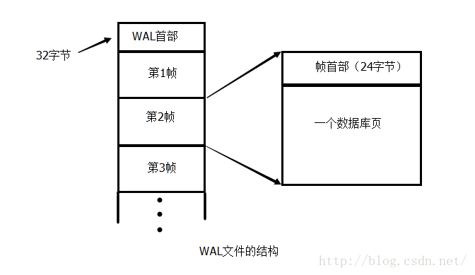
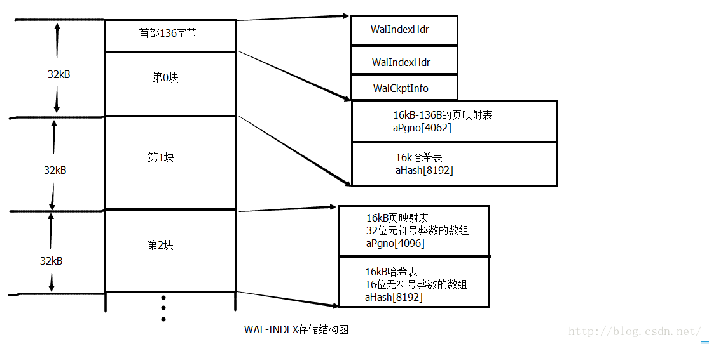
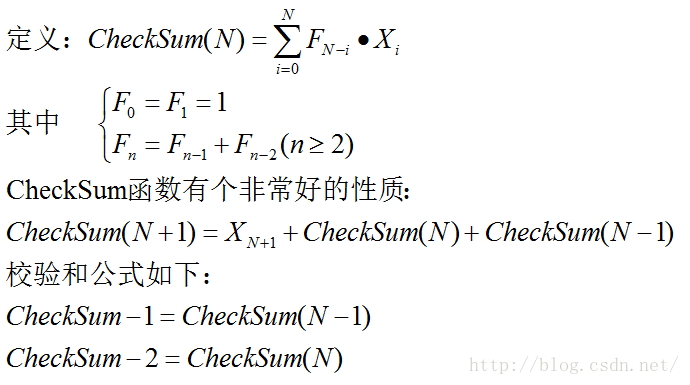
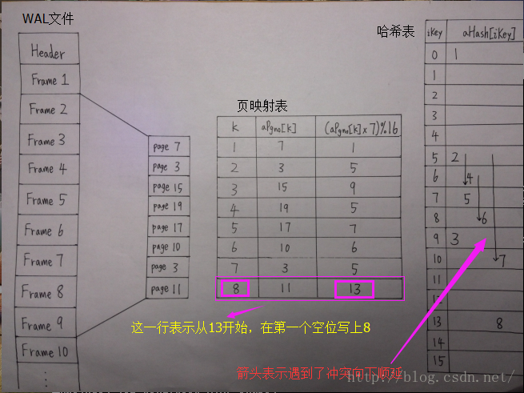
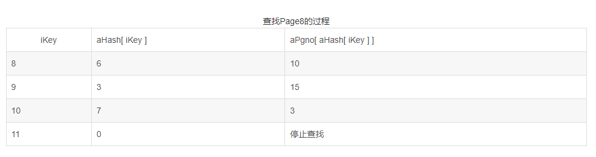
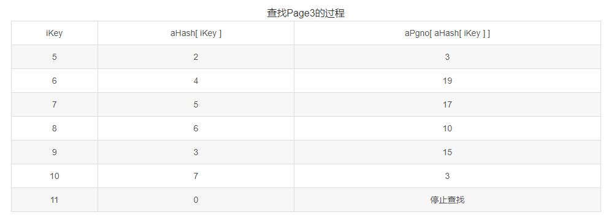

SQLite分析之WAL机制

# 一：WAL简介

Write Ahead Log 简称WAL，也就是预写日志。是实现事务原子提交的一种方法。

当事务对数据库进行修改时，将修改后的页面存入WAL文件中，而不写回原数据库。

WAL文件从数据库的第一个连接建立时创建，在最后一个连接释放时删除。


当事务要读取数据库内容时，先在WAL文件中找找有没有要读的那一页的最新版本，有的话就从WAL中读取。没有的话，就从数据库中读取。


由于写事务只是在WAL文件之后追加一些内容，而读事务只是在WAL文件中查找一些内容。


所以，读事务在开始的时候，记录WAL文件的最后一个有效帧（read mark），并在整个事务中忽略之后添加的新内容。这样可以做到读事务和写事务同时进行，提高了速度。


由于每个读事务都需要搜索整个WAL文件导致效率低下，在共享内存中建立了wal-index文件。每个读事务都利用wal-index来进行页面的快速查找，避免了对整个WAL文件的搜索。

但是由于使用了共享内存，所以所有的数据库连接都必须在同一台机器上（不然不能使用共享内存）。


当WAL文件过大时，会影响读事务的速度，所以程序会定期将WAL文件中的页面写入数据库，这个操作叫做Checkpoint,也叫backfill回填。


WAL定期将WAL的页面写入数据库的一个好处就是，假如WAL文件中包含某一页的多个副本，只需要将最新的那个版本写入数据库就行了。另一个好处是：这样可以按照页号从小到大写入数据库，按顺序访问磁盘，加快了速度。


为此程序中设立了一个迭代器，按页号从小到大返回每一页的最新版本的所在的帧号。


写事务在开始的时候，如果发现WAL全部被回填完毕了，就会从第一帧开始写入数据，而不是追加帧。回填的时候要注意，不能超过任何一个读者的read mark,否则可能导致错误。

举个例子：假如读事务A开始的时候，WAL文件中有5个帧(Frame)，且都不包含数据库第3页的内容。

A在开始的时候记下read mark，表示只能看到WAL文件的前5帧，之后的不管，然后搜索wal-index，发现前5帧里都没有第3页，

于是从数据库文件中去读取第3页的内容。如果这时，有一个写事务B，修改了第3页的内容，这时WAL文件的第六帧就是第3页的新内容，

如果这时候，回填程序超过了A的read mark，把第六帧（第三页）也同步到了数据库，那么事务A就会读到新修改的第3页，而它本应该读到原来的第3页。


这个条件也意味着，一个长时间存在的读者可能一直卡住backfiling导致WAL文件变得比较大。


参考代码的版本为3.11.01


# 二：文件格式

## 2.0 存储结构

在这里提一下一些本文中用到的概念。

数据库（数据单位为页）——》WAL文件（数据单位为帧）——》WAL-INDEX(数据单位为32k的块)

简单来说就是数据库是按页读和写的，数据库的修改之后的页会写在WAL文件的一帧中，在回填时写回数据库。然后WAL-INDEX的每个32k的块负责WAL文件中的4096帧的快速查询。


这里需要提的一点是字节序，分为大端存储(big-endian)和小端存储(little-endian)。

由于不同的机器是不一样的，为了在不同的机器下正常工作， WAL文件的首部的这些32位整数全部都是大端存储的。

相比之下，wal-index就完全不需要考虑大端还是小端了，因为wal-index是完全可以从WAL文件中重建出来的。

所以一般情况下，都是机器自己从WAL文件中重建出wal-index，所以只需要按照机器的本来的字节序就可以了。

## 2.1 WAL文件格式

WAL文件由一个32字节的首部，和若干个帧组成，每个帧由24字节的帧首部，和一页数据组成，见下图。




注意帧的编号是从1开始的，两个首部的具体内容见下面的表格。


32字节的WAL首部: 


WAL首部由8个大端存储(big-endian)的32位无符号整数组成，依次如下：


Magic number: 只有两个可能的取值：0x377f0682 和 0x377f0683,0x377f0682表示校验和(Checksum)中用小端（little-endian）,0x377f0683表示校验和(Checksum)中用大端（big-endian）

只对WAL文件的校验和有效，WAL-INDEX的校验和使用原始字节序

具体解释见附录一。


File format version: 取值为3007000。当程序中定义的文件版本与文件中的版本不一致时，程序会返回错误代号从而避免了程序处理了不同版本的文件导致错误。


Database page size: 数据库的页面大小。


Checkpoint sequence number: 每次Checkpoint 时+1.


Salt-1 和 Salt-2: 用于检查WAL文件中的帧是否有效，具体见帧首部的说明。每一次Checkpoint之后，Salt-1 增加1，Salt-2为一个的随机值。


Checksum-1 和 Checksum-2: 首部前24字节的校验和。校验和的计算见附录一。


24字节的帧首部

帧首部由6个大端存储(big-endian)的32位无符号整数组成，依次如下：


Page number: 数据页的页号


Commit mark: 对于提交的记录，存提交之后数据库的总页数。对于其他记录，取值为0。


Salt-1 和 Salt-2: 从首部复制过来的Salt-1和Salt-2。该帧有效的充要条件：

首先，Salt-1和Salt-2要跟首部的相同。其次，程序计算的Checksum-1和Checksum-2要和下面的Checksum-1 和 Checksum-2一致。


Checksum-1 和 Checksum-2: 校验的内容：32字节的WAL首部+这帧以及之前的所有帧的帧首部前8字节和数据。

计算校验和的方法见附录一。


## 2.2 WAL-INDEX 格式

WAL-INDEX的实际上的首部由两个一样的WalIndexHdr结构和一个WalCkptInfo结构组成（共136字节）。

WalIndexHdr有两个副本，是为了避免读入正在被修改的WAL-INDEX首部。

WAL-INDEX处于共享内存之中，是属于使用很频繁的结构，所以要注意避免冲突。


写头部的时候，先写第二个，再写第一个。

读头部的时候，先读第一个再读第二个。

如果读到的两个头部不一致，就表示有程序正在修改头部，所以就放弃本次的读取。



定义如下（它本来的注释其实比较清楚了）。

```c
struct WalIndexHdr {
  u32 iVersion;                   /* Wal-index version 版本号*/
  u32 unused;                     /* Unused (padding) field */
  u32 iChange;                    /* Counter incremented each transaction */
  u8 isInit;                      /* 1 when initialized */
  u8 bigEndCksum;                 /* True if checksums in WAL are big-endian */
  u16 szPage;                     /* Database page size in bytes. 1==64K */
  u32 mxFrame;                    /* Index of last valid frame in the WAL  最后一个有效帧的编号*/
  u32 nPage;                      /* Size of database in pages 数据库的页数*/
  u32 aFrameCksum[2];             /* Checksum of last frame in log 最后一帧的校验和*/
  u32 aSalt[2];                   /* Two salt values copied from WAL header */
  u32 aCksum[2];                  /* Checksum over all prior fields 前40字节的校验和 */
};
```


```c
struct WalCkptInfo {
  u32 nBackfill;                  /* Number of WAL frames backfilled into DB 已经回填至数据库的帧数*/
  u32 aReadMark[WAL_NREADER];     /* Reader marks 读者标记*/
  u8 aLock[SQLITE_SHM_NLOCK];     /* Reserved space for locks */
  u32 nBackfillAttempted;         /* WAL frames perhaps written, or maybe not 试图回填至数据库的帧数*/
  u32 notUsed0;                   /* Available for future enhancements */

};
```


WAL-INDEX由若干个32k的数据块组成，每一个数据块负责WAL文件中的4096帧的快速查找。


每一块的结构：16k的页映射表+16k的哈希表。页映射表本质上是一个32位整数的数组，第X项存的是WAL文件的第X帧对应的页号。


首部占用了第一个数据块的页映射表的前136个字节，所以第一块实际上对应4062帧。


哈希表是一个16位整数的数组，用于快速判断某页号P是否存在于本块对应的帧中。


具体用法见附录二。


# 三：读/写/回填

## 3.1 读


## 3.2 写


## 3.3 CheckPoint / Backfill   回填

首先解释一下wal-index首部的WalCkptInfo结构：


```c
struct WalCkptInfo {
  u32 nBackfill;                  /* 已经回填至数据库的帧数（回填成功后填写） */
  u32 aReadMark[WAL_NREADER];     /* Reader marks 读者标记*/
  u8 aLock[SQLITE_SHM_NLOCK];     /* 锁 */
  u32 nBackfillAttempted;         /* 试图回填至数据库的帧数（回填之前填写）*/
  u32 notUsed0;                   /* 保留给以后使用 */
};
```


还需要用到walIndexHdr结构中的 mxFrame：最后一个有效帧的编号。

回填大致流程：

1.如果nBackfill 小于 mxFrame 则继续操作，否则不需要回填。

2.初始化迭代器（关于迭代器的细节见附录三）

3.搜索一遍Reader marks，找到最大能够回填的帧号mxSafeFrame（必须小于等于所有的Reader marks）

4.将nBackfillAttempted修改成mxSafeFrame，将wal文件写进磁盘防止丢失数据。

5.利用迭代器按照数据库页从小到大的顺序输出所有页面（将处于nBackfill和mxSafeFrame之间的帧对应的数据页写入数据库）

6.令nBackfill = mxSafeFrame表示成功回填


接下来谈一点代码的细节：


来看看WalIterator结构的定义：


```c
struct WalIterator {
  int iPrior;                     /* 迭代器的上一个返回值 */
  int nSegment;                   /* wal-index的块数 */
  struct WalSegment {
    int iNext;                    /* 循环变量 */
    ht_slot *aIndex;              /* 按照页号排序后的块内偏移量 */
    u32 *aPgno;                   /* 页号数组（从块内便宜量得到页号） */
    int nEntry;                   /* aIndex的长度 */
   int iZero;                    /* 块内偏移量0所对应的帧号 */
  } aSegment[1];                  /* One for every 32KB page in the wal-index */

};
```


可以注意到的是aSegment[1]……，居然申请长度为1的数组，想了好久。

其实呢，它申请WalIterator的空间的时候，不只是申请了sizeof(WalIterator)个字节的空间。


我们来看看申请空间的代码：


```c
nByte = sizeof(WalIterator) + (nSegment-1)*sizeof(struct WalSegment) + iLast*sizeof(ht_slot);
p = (WalIterator *)sqlite3_malloc64(nByte);
```


总结来说就是，iPrior和nSegment的8个字节  +   nSegment个WalSegment结构 + iLast个16位整数（2字节）

其中iLast就是前面说的mxFrame,即总帧数，最后iLast的空间也就是给aIndex预留的空间。


aPgno是复用的wal-index的内容，并没有新申请空间。


这明显是越界，多申请了好多空间然后随便乱用……不过这样申请变长数组确实挺方便的。


# 附录一：校验和的计算

被校验的部分的字节数必须是8的倍数。在计算校验和的时候，将数据每4个字节分一组，看做多个32位无符号整数X[0]....X[N]。


这时，要看WAL文件的首部中的Magic Number的值。


若为0x377f0682，将一组的4个字节当做小端存储（little-endian）的整数。


若为0x377f0683，将一组的4个字节当做大端存储（big-endian）的整数。


由于wal-index对于每台电脑来说都是重新从WAL文件中构造出来的，所以wal-index全部使用电脑的原始字节序，包括wal-index中的检验。


所以Magic Number只对WAL文件的校验和有效。


大端与小端的区别见下图：


校验和计算公式见下图：




上面的递推式导致了计算校验和很简单，见下面代码。

```c

if (nativeCksum) {//判断是否是机器的字节序，如果不是就要转换大端和小端字节序*

  do {
      s1 += *aData++ + s2;
      s2 += *aData++ + s1;
    } while( aData<aEnd );
  } else{
    do {//BYTESWAP32这个宏定义是进行大端和小端的字节序转换*
      s1 += BYTESWAP32(aData[0]) + s2;
      s2 += BYTESWAP32(aData[1]) + s1;
      aData += 2;
    }while( aData<aEnd );

  }
```


# 附录二：WAL-INDEX的查询

WAL-INDEX的数据内容按32k来分块，每块分为16k的页映射表和16k的哈希表。


为了方便叙述和理解，见如下定义（源代码中并无此定义）：


```c
unsigned long int aPgno[4096+1]; //16k的页映射表，存**WAL**文件中4096帧的数据库页号。 下标从1开始*
unsigned short int aHash[8192]; //16k的哈希表，无论何时至少有一半以上空着。       下标从0开始*
unsigned long int iZero;        //帧编号偏移量，本块中第 I 帧在WAL中实际是第 iZero + I 帧*
```

假设这一块不是第一块或者最后一块（第一块的aPgno部分少了136字节，最后一块的aPgno不一定被全部使用）。


那么，这一块会对应WAL文件中的4096帧。这4096帧编号1至4096。


第 k 帧的对应的数据库页号存在aPgno[k] 中，对应WAL文件中的第 iZero + k 帧。


假设第 k 帧对应的页号为P （即aPgno[k] 的值为P）。


那么，将第 k 帧加入哈希表的过程如下：

1. 计算哈希值 H = (P*383)%8192

2. 从aHash下标为H的地方开始循环在数组中查找，找到第一个iKey使得aHash[iKey]为0.

3. 令aHash[iKey] =  k.


关于效率的问题，aHash有8192项，而最多往里面添加4096帧的数据，所以至少一半是空的。


所以在第二步的时候，找到iKey使得aHash[iKey]为0应该是很快的。


现在，假设4096帧的数据全部被按顺序加入了哈希表，此时哈希表刚好有一半的数据值为0（0表示未被使用，所以本段的帧号必须从1开始）。


下面开始讲查找页面。


给定页号 P ，需要找到P是否存在于这个块中，如果存在，需要找到帧编号最大的一个帧（页P的最新版本），

如果不存在，返回页号0，表示从原数据库中读取数据（又是因为0被使用了，所以WAL文件的帧号也是从1开始的）。


查找页面P过程如下：


1.计算哈希值 H = (P*383)%8192

2.从aHash下标为H的地方开始循环查找，直到第一个iKey使得aHash[iKey]为0.

3.在第二步中，将经过的所有的页都检查一遍，即检查aPgno[aHash[iKey]]是否等于P，


如果等于，就将iKey对应的WAL原始帧号记录到iRead变量中，即 iRead = iZero + aHash[iKey]; 


遇到多个符合条件的iKey的话，iRead中存的自然就是最新的一个版本（新版本一定在旧版本之后加入的）。


若直到第二步结束时iRead仍然为0，表示本块中无页号为P的帧。


框内内容第一次看时可忽略：

除了检查aPgno[aHash[iKey]]是否等于P以外，其实还需要检查其他的东西。    


令iFrame为iKey对应的WAL中的帧号，即iFrame = iZero + aHash[iKey]  


令iLast为本事务开始的时候记录的WAL文件中的最大帧号。                      


还需要检查iFrame <= iLast，因为其他的写事务可能在这个事务开始以后，


还继续增加了WAL文件的内容，也对应增加了WAL-INDEX的内容。


如果本来这块是最后一块，那么aHash可能被新的帧更新过了，而更新的帧是不能用的，


所以在这里就算页号一样也会被忽略。 


然而，代码中还检查了iFrame需要大于等于某个最小帧号minFrame                 


我猜是把已经回填至数据库的WAL帧忽略（弄清楚之后再补充）               


遗留的问题——第一块的处理：


前面提到第一块被首部占用了136字节，所以第一块的aPgno数组少了136字节。


所以第一块实际上只存了4062帧的信息，aHash部分大小不变。


这样做是为了保证wal-index文件是若干个32k的数据块。


遗留的问题——最后一块的处理：


最后一块需要面对的问题就是在事务开始以后，其它的写事务要是增加了WAL文件的帧数，那么


也会对应的修改wal-index文件，所以aHash数组中会有新页面存在。


解决办法就是在上面框中叙述的，多做一个检查，忽略之后添加的帧。


上面提到的是对一个32k数据块的查询，实际的查询过程是从最后一个数据块开始往前一块一块地查询。


如果查询到某一块找到了需要的帧号，就直接去取数据。如果搜索过了所有的块都没有查询到，就去数据库文件中读取。


讲了这么多，下面给个实际计算的例子方便理解。

前面讲的每块对应4096帧，例子中简化到8帧，哈希函数简化成H = (P * 7)%16 。

这时，aPgno是长度为8的32位整数数组，aHash是长度为16的16位整数数组。

在代码中，aPgno是用指针实现的，指向页映射表的首地址再减去4个字节。

所以aPgno下标从1开始，数组范围aPgno[1]~aPgno[8]，而不是多申请一个字节然后弃掉下标0不用。


数据见下图：




上面画的块结构是对应帧号2~9的8个帧的，并且假设这8个帧对应的数据库页号为7,3,15,19,17,10,3,11.

有个重要的变量叫iZero,这一块对应的iZero就等于1.表示本块对应的第一个帧的前一帧的帧号。iZero+块内偏移量 = WAL文件中的帧号。

然后页映射表也就是aPgno数组中就存的是这些页号，图上为了方便计算aHash值，多加了一列(P*7)%16。

然后从k=1到k=8，令H =（aPgno[k]*7)%16,然后从H开始找到第一个空位填上k,结果如图所示。
图中的向下的箭头表示整个寻找的路径，从H一直到第一个空位为止（遇到末尾时回到第一行）。


然后轮到查询了：


例子一：在本块中查找第8页。

首先求H=(8*7)%16 = 8 ,于是从aHash[8]开始看起。


由表格看出，在找到空位之前遇到的页号为10,15,3.没有第8页，说明本块中不存在第8页。

返回帧号0，表示从数据库中读取数据。


例子二：本块中查找第3页：



首先求H=(3*7)%16 = 5，于是从aHash[5]开始看起。由表格看出，在遇到空位之前，查找到的页号为3,19,17,10,15,3。

明显需要记录第二个3对应的aHash[iKey]，也就是记录块内偏移量为7.

然后返回值还要加上iZero , 于是返回值为 7+1 = 8。

表示从WAL文件的第8个帧中存的是最新的第3页的数据，应该从这里读取。

# 附录三： 迭代器

迭代器的作用就是按照页号从小到大的顺序，输出（页号，帧号）。
开始以为用了很神奇的数据结构，看了代码发现其实就是分块搜索而已。
只能说是整体上思路很简单，但是代码的具体实现特别奇怪，看了好久才懂。

迭代器的初始化： 

把wal-index一块一块地拿过来，把块内下标按照页号排了个序（每块都有一个有序数组）。
每一块都对应一个WalSegment结构，解释如下


```c
struct WalSegment {
    int iNext;                    /* 循环变量i */
    ht_slot *aIndex;              /* 按照页号排序之后的块内下标 如果 I < J 则 aPgno[aIndex[I]] < aPgno[aIndex[J]] */
    u32 *aPgno;                   /* 块内下标与页号对应表，这里用指针直接指向wal-index里的aPgno+1的位置（这里下标从0开始） */
    int nEntry;                   /* aInex的元素个数 */
    int iZero;                    /* Frame number associated with aPgno[0] */
  };                              /* One for every 32KB page in the wal-index */
```


依次读出每一个32KB数据块，然后对aIndex进行排序和去重复（不同的帧对应页号相同时，取帧号较大的）。

代码中用的是非递归的归并排序，以前只写过递归的归并排序，这个非递归看的云里雾里不过最终还是看懂了。


虽然代码中写的是mergesort但其实不是一般的归并排序。
一般的归并排序是将数组分成大致数量相等的两部分，而这里把数组按照二进制的方式切分，
分成了长度为2的指数的各个子数组，然后一级一级向上归并，特别神奇的写法，第一次见。
在电脑中测试了一下（不去除重复只是排序），比递归的二路归并排序慢那么一点点。

迭代器的Next操作：

WalIterator结构中有变量 iPrior 记录上一个输出的页号。

搜索所有的块，首先增加iNext直到aIndex[iNext]大于iPrior或者iNext等于nEntry. 此时，aIndex[iNext]就是这一块的备选答案。

找出所有块的备选答案中最小的一个作为结果输出。

每块内的aIndex是没有重复页号的，但是不同的块可能会有重复的页号，这时取较后的那块的帧，

所以搜索块的时候是从后往前搜索的，保证每个页号都得到的是最新的一帧。


而且必须搜索所有的块，不然不能保证页号最小。


所以迭代器每个Next都要搜索所有的块，在块数很多的时候效率会很低，这也是一个WAL文件不应该太大的原因之一。
————————————————

版权声明：本文为CSDN博主「岩之痕」的原创文章，遵循CC 4.0 BY-SA版权协议，转载请附上原文出处链接及本声明。

原文链接：https://blog.csdn.net/zearot/article/details/51039593